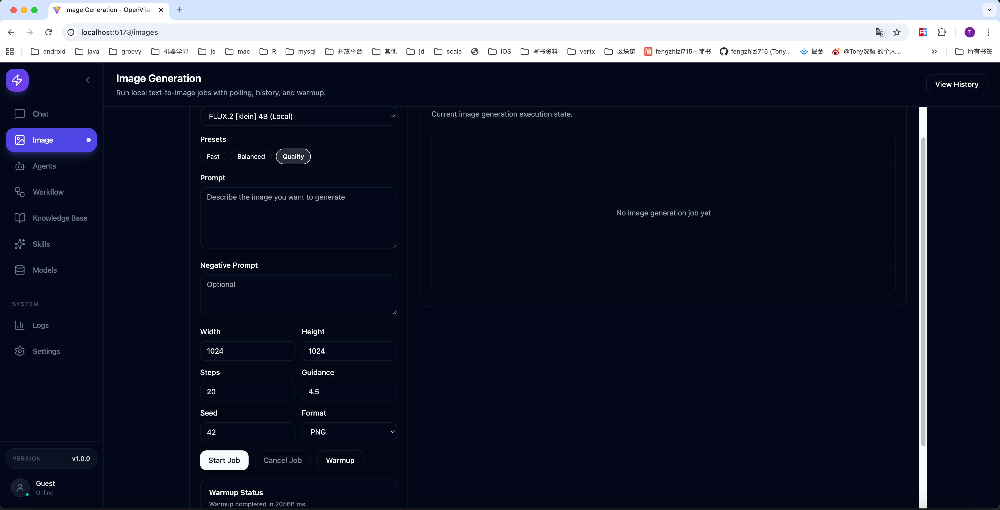
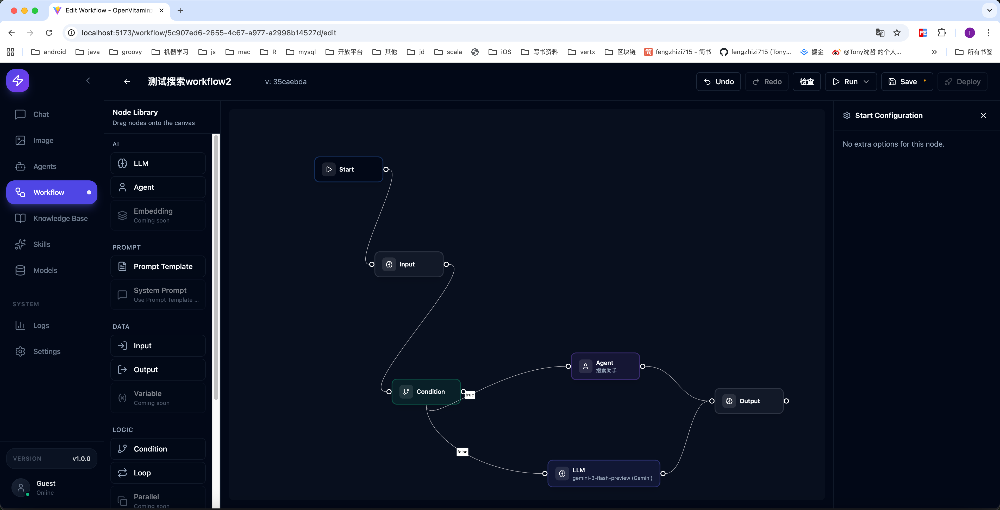
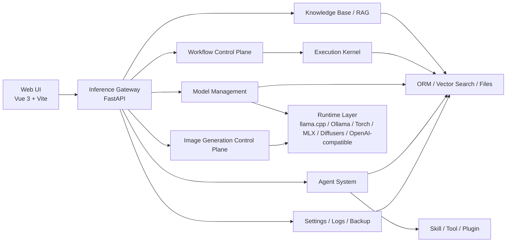
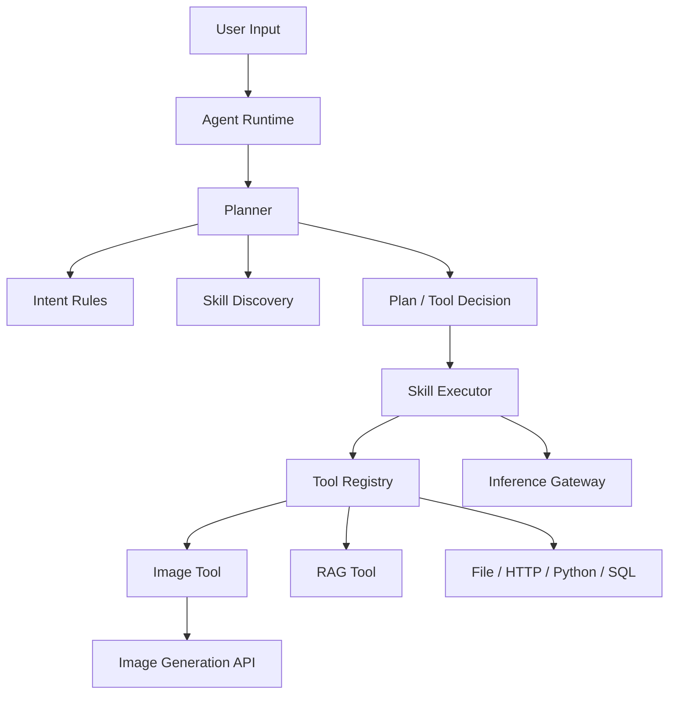
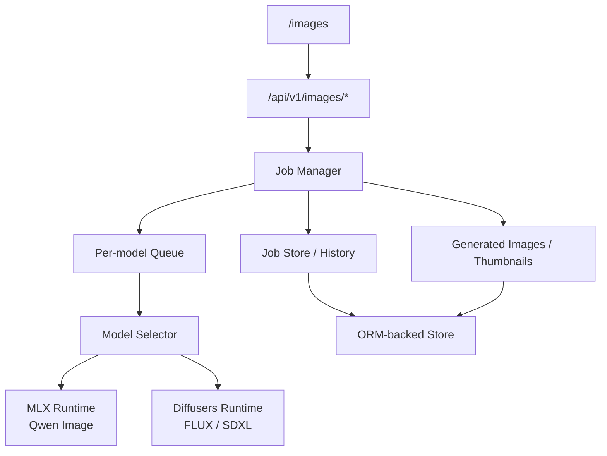

# perilla — 本地 AI 推理与工作流平台

**本地优先、网关中心化**：统一管理 LLM/VLM、文生图、Workflow、Agent 与知识库；前端只做控制台，所有模型与控制面调用经 FastAPI 推理网关出口。

[English README](README_EN.md)

---

## 仓库说明（Standalone）

当前目录即为可独立交付的完整工程：包含 `backend/`、`frontend/`、`docker/`、`scripts/`、`tutorials/`、`.github/workflows/` 等。**无需**并列其他源码树。下文「项目根目录」均指本仓库顶层。

---

## 目录导航

| 章节 | 内容 |
|------|------|
| [能力与场景](#能力与场景) | 功能概览与适用场景 |
| [架构与技术栈](#架构与技术栈) | 组件、mermaid、推理与智能体路径 |
| [治理与安全](#治理与安全摘要) | RBAC、租户、CSRF、审计 |
| [快速开始](#快速开始) | Conda 裸跑与 Docker |
| [Makefile](#makefile-可选) | 常用 `make` 目标 |
| [安全与运维摘要](#安全与运维摘要) | XSS/CSRF/RBAC、回归脚本、部署提示 |
| [前端与编排近期更新](#前端与编排近期更新2026) | UI、Workflow、队列、幂等、HITL |
| [目录结构](#后端目录概览) | 后端顶层布局 |
| [文档索引](#文档索引) | 教程与 `docs/` |
| [已知限制与联系](#已知限制) | |

---

## 能力与场景

**亮点**

- 统一推理：`LLM`、`VLM`、`Embedding`、`ASR`、`Image Generation`
- 本地与云端模型同一套控制面管理
- 文生图：异步任务、历史、缩略图、warmup、取消
- Agent：`Intent Rules`、Skill 发现、Tool Calling、直连工具结果
- Workflow：版本化、执行历史、分支/循环治理；持久化队列与审批闸门（见下文）
- 知识库 / RAG、记忆、备份、日志与系统设置
- 可选：[OpenClaw](docs/OPENCLAW_BACKEND_CONFIG.md) 后端接入，作为统一网关上游

**典型场景**：私有化部署、多模态对话、本地文生图、Agent + Workflow 编排、知识库与审计要求较高的团队环境。

---

## 截图







---

## 架构与技术栈

**分层**

| 层级 | 职责 |
|------|------|
| Web UI | Vue 3 + Vite + Tailwind — 控制台，不直连模型 |
| Inference Gateway | FastAPI — 路由、流式输出、审计与策略 |
| Agent / Plugin | 技能、工具、RAG、记忆等可插拔能力 |

**文生图路径摘要**

- `Qwen Image`：MLX
- `FLUX / FLUX.2 / SDXL`：Diffusers
- API：`POST /api/v1/images/generate`，以及任务查询、取消、下载、warmup、历史

**技术栈**

- 前端：Vue 3、TypeScript、Vite、Tailwind CSS、shadcn-vue
- 后端：Python 3.11+、FastAPI、SQLAlchemy ORM（默认 SQLite，可扩展 MySQL/PostgreSQL）
- 运行时示例：llama.cpp、Ollama、OpenAI-compatible、Torch、MLX、mflux、Diffusers

详细设计：[docs/architecture/ARCHITECTURE.md](docs/architecture/ARCHITECTURE.md)、[docs/architecture/AGENT_ARCHITECTURE.md](docs/architecture/AGENT_ARCHITECTURE.md)。

### 总体架构



### 推理路径


### 智能体执行路径



并行编排（Execution Kernel）：`execution_strategy` 可取 `serial` / `parallel_kernel`；`max_parallel_nodes` 限制并发；事件流可按实例与会话查询。详见主教程「Agent 并行编排与记忆」一节。

### 文生图控制面



---

## 治理与安全（摘要）

- 身份：`RBAC`（admin/operator/viewer）、API Key Scope
- 多租户：`X-Tenant-Id`、租户强制、Key 与租户绑定
- Web：前端 Markdown/DOMPurify/Mermaid 净化；后端 CSRF 双提交 Cookie
- 防滥用：按 Key/IP 的内存限流
- 可观测：`AuditLog`、`X-Request-Id` / `X-Trace-Id`
- 生产：`DEBUG=false` 下护栏收敛与高危配置阻断（见 `SECURITY_GUARDRAILS_STRICT`）

控制面域示例：Chat/Session/Memory、System/Events/Logs、Knowledge/RAG、Agents/Tools/Skills、VLM/ASR/Images、Workflows、Audit、Backup。

---

## 快速开始

任选其一：**裸进程（日常开发）** 或 **Docker（交付/一致环境）**。

### 环境要求

- Python 3.11+、Node.js 18+、Conda（与仓库脚本一致）

### 方式 A：Conda（推荐改代码时用）

根目录 `run-backend.sh` 使用环境名 **`ai-inference-platform`**（若改名需同步修改脚本）。

```bash
conda create -n ai-inference-platform python=3.11 -y
cd backend
conda run -n ai-inference-platform pip install -r requirements.txt
cd ../frontend && npm install && cd ..
```

在项目根目录启动：

```bash
./run-all.sh
# 或 ./run-backend.sh 与 ./run-frontend.sh 分开启动
```

默认：`http://localhost:5173`（前端）、`http://localhost:8000`（后端）。

### 方式 B：Docker

```bash
test -f backend/main.py && test -f frontend/package.json && echo OK
bash scripts/install.sh
# 或：make bootstrap
# 生产取向首次：make bootstrap-prod（doctor 更严；可用 DOCTOR_STRICT_WARNINGS=0 放宽告警）
```

常用运维：`bash scripts/status.sh`、`scripts/logs.sh`、`scripts/healthcheck.sh`、`scripts/doctor.sh`。编排见根目录 `docker-compose*.yml` 与 `docker/`；从 `.env.example` 复制 `.env` 后配置端口、`CORS_*`、`CSRF_*`、RBAC、租户策略等。GPU：`docker-compose.gpu.yml`；生产收紧：`docker-compose.prod.yml`。

### 首次体验路径

1. `/models` — 确认模型可用  
2. `/chat` — 对话 / 多模态  
3. `/images` — 文生图任务  
4. `/agents` — 工具型 Agent  
5. `/workflow` — 简单流程执行  

主要路由：`/chat`、`/images`、`/images/history`、`/agents`、`/workflow`、`/models`、`/knowledge`、`/settings`、`/logs`。

### 已验证环境

macOS（Apple Silicon）、Ubuntu、Conda；本地模型按 `model.json` 组织。Apple Silicon 上 MLX/MPS 与大体量模型共享统一内存，请按机器资源选型。

---

## Makefile（可选）

```bash
make help
```

| 目标 | 说明 |
|------|------|
| `bootstrap` | `env-init` → `doctor` → `install` |
| `bootstrap-prod` | `env-init` → 严格 `doctor` → `install-prod` |
| `env-init` | `.env.example` → `.env`（已存在则跳过） |
| `install` / `install-gpu` / `install-prod` | 对应 `scripts/install*.sh` |
| `install-prod-soft` | 生产 Compose + doctor 不因 warning 失败 |
| `up` / `up-gpu` / `up-prod` | 启动对应 profile |
| `down` / `down-gpu` / `down-prod` | 停止 |
| `status` / `logs` / `healthcheck` / `doctor` | 运维与自检 |
| `DOCTOR_STRICT_WARNINGS=1 make doctor` | 警告视为失败 |
| `reset` | 停止并移除容器与卷（**清空持久化**） |

---

## 安全与运维摘要

公网或共享主机部署前请阅读：[tutorials/security-review-hints.md](tutorials/security-review-hints.md)（中文）、[tutorials/security-review-hints-en.md](tutorials/security-review-hints-en.md)（英文摘要）。要点：无 Key 时角色回落到 `rbac_default_role`（默认可能非只读）；生产保持 `DEBUG=false` 与 `SECURITY_GUARDRAILS_STRICT=true`；显式配置 `CORS_ALLOWED_ORIGINS`、收紧 `FILE_READ_ALLOWED_ROOTS`、HTTP 工具主机白名单等。

**本地安全回归（推荐）**

```bash
backend/scripts/test_tenant_security_regression.sh
scripts/acceptance/run_security_regression.sh
```

可选慢批次阈值（秒）：`SECURITY_SLOW_THRESHOLD_SECONDS`、`TENANT_SECURITY_SLOW_THRESHOLD_SECONDS`。报告：`backend/test-reports/tenant-security-summary.md`、`test-reports/security-regression-summary.md`。

**CI**：`.github/workflows/tenant-security-regression.yml`、`.github/workflows/security-regression.yml`；支持 `workflow_dispatch` 与 `slow_threshold_seconds`。

---

## 前端与编排近期更新（2026）

- **安全与插件**：插件执行前显式权限判定；生产护栏与 CI 门禁延续  
- **Agent**：`POST /api/v1/agents/{id}/run` 支持幂等键；冲突返回 `409`  
- **Workflow**：执行队列持久化与 lease、重启回收；`approval` 节点 HITL；审批列表新格式 + `legacy=true` 兼容  
- **前端**：Workflow 选择器搜索、知识库文档分页（>50）、大图节点优化（>50）、错误文案映射；Vitest/Cypress 与 Vite 配置拆分  

---

## 后端目录概览

```text
backend/
├── api/                    # 路由层
├── middleware/
├── core/                   # 业务核心（inference、agents、workflows、knowledge、plugins …）
├── execution_kernel/       # DAG 执行引擎
├── alembic/
├── config/
├── data/                   # 运行数据（platform.db、generated_images …）
├── scripts/
└── tests/
```

更细的模块说明见 [docs/DEVELOPMENT_GUIDE.md](docs/DEVELOPMENT_GUIDE.md)。

---

## 文档索引

| 读者 | 文档 |
|------|------|
| 新手 / PM / QA | [tutorials/tutorial-quickstart.md](tutorials/tutorial-quickstart.md)、[tutorials/tutorial-index.md](tutorials/tutorial-index.md)、[docs/DEPLOYMENT.md](docs/DEPLOYMENT.md) |
| 研发 | [tutorials/tutorial.md](tutorials/tutorial.md)、[docs/architecture/ARCHITECTURE.md](docs/architecture/ARCHITECTURE.md)、[docs/DEVELOPMENT_GUIDE.md](docs/DEVELOPMENT_GUIDE.md)、[AGENTS.md](AGENTS.md) |
| 安全 / 运维 | [tutorials/tutorial-security-baseline.md](tutorials/tutorial-security-baseline.md)、[tutorials/tutorial-ops-checklist.md](tutorials/tutorial-ops-checklist.md)、[tutorials/tutorial-incident-runbook.md](tutorials/tutorial-incident-runbook.md)、security-review-hints（见上） |
| API / 模型 | [docs/api/API_DOCUMENTATION.md](docs/api/API_DOCUMENTATION.md)、[docs/local_model/LOCAL_MODEL_DEPLOYMENT.md](docs/local_model/LOCAL_MODEL_DEPLOYMENT.md)、[docs/OPENCLAW_BACKEND_CONFIG.md](docs/OPENCLAW_BACKEND_CONFIG.md) |
| 术语表 | [tutorials/tutorial-glossary-zh-en.md](tutorials/tutorial-glossary-zh-en.md)、[tutorials/tutorial-glossary-product.md](tutorials/tutorial-glossary-product.md)、[tutorials/tutorial-glossary-engineering.md](tutorials/tutorial-glossary-engineering.md) |

---

## 已知限制

- Apple Silicon 上大 LLM 与大文生图模型可能争用内存  
- 文生图首次加载与首帧可能较慢  
- 高级 Agent/Workflow 能力持续演进  
- 本地模型目录与运行时依赖需按 `model.json` 配置  
- 开源版本相对商业版本可能存在功能滞后或限制；商业合作见下方联系  

---

## 联系方式

微信：fengzhizi715，virus_gene  

邮箱：fengzhizi715@126.com，yaolisi@hotmail.com  

<div style="display: flex; justify-content: space-between;">
    
    
</div>

---

## 贡献与许可证

贡献指南：[CONTRIBUTING.md](CONTRIBUTING.md)。  

计划采用 **Apache License 2.0**。
