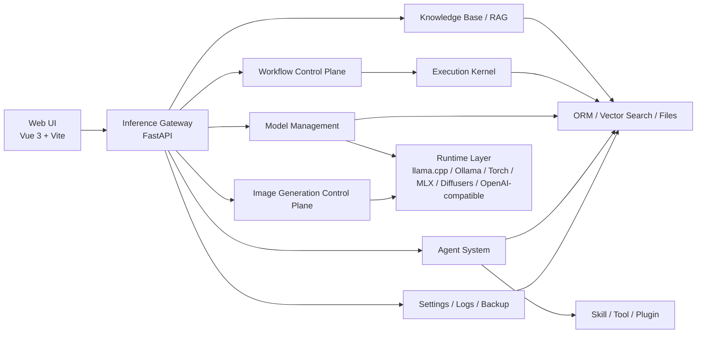
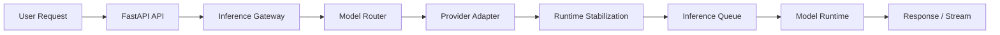
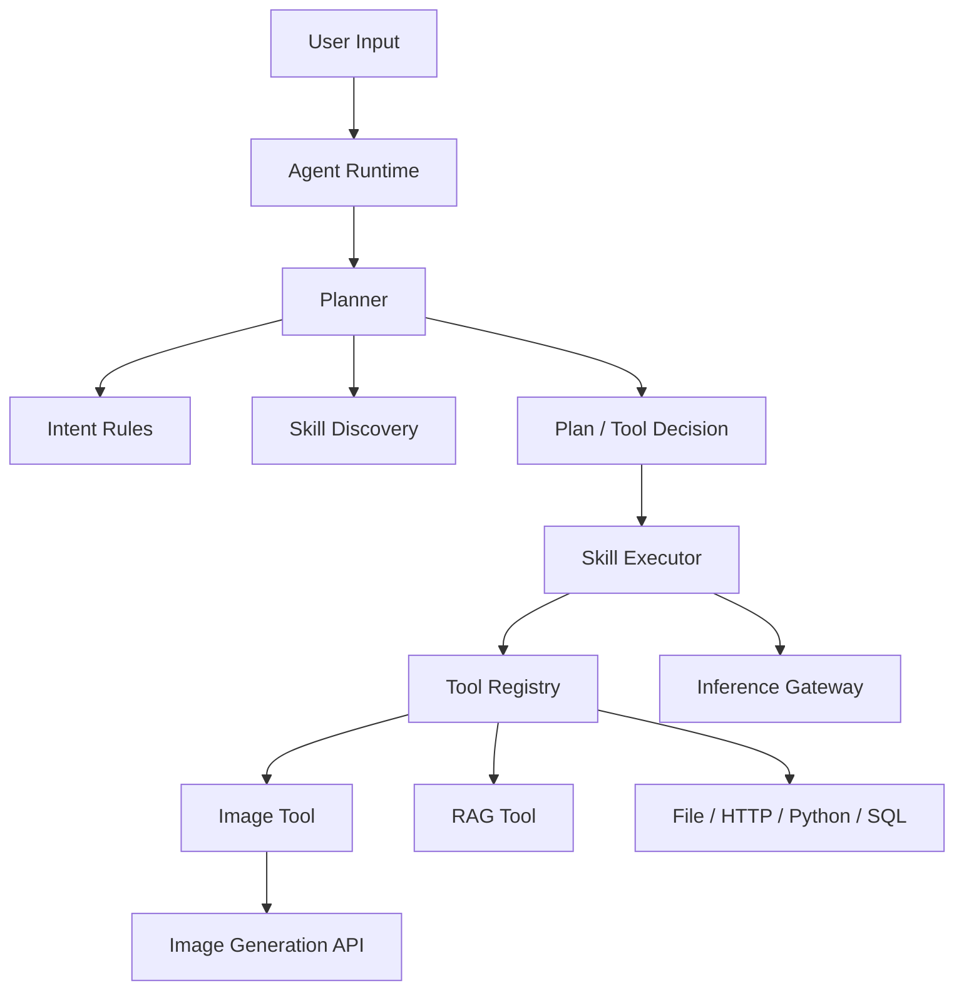
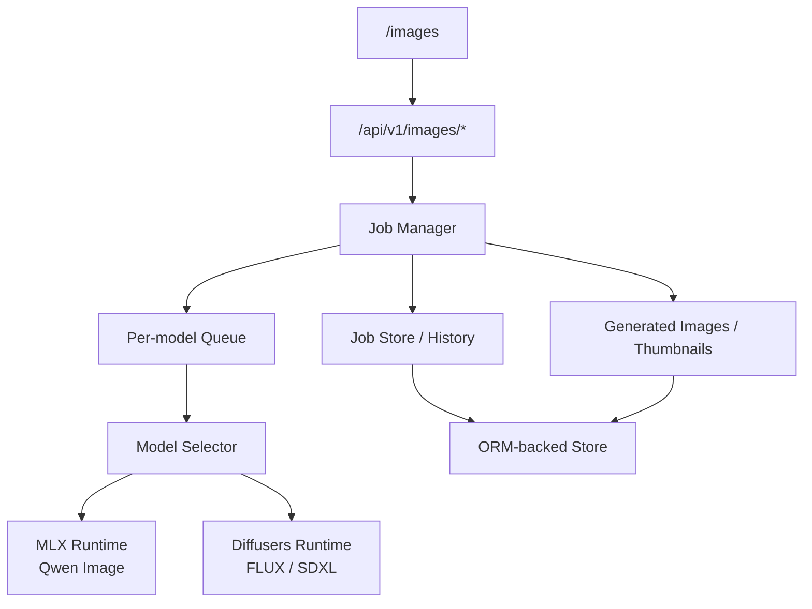

# OpenVitamin 大模型与智能体应用平台

> 本地优先的 AI 平台，统一承载模型推理、图片生成、工作流编排与智能体能力组合。

[English README](README_EN.md)

---

## Standalone 分发包

本目录是可独立迁移、交付的 **完整工程**：内含 `backend/`、`frontend/`、`docker/` 编排、`scripts/`、`tutorial*.md`、`.github/workflows/` 等与主线增强版对齐的内容；**不需要**并列 `openvitamin_enhanced` 等其他源码树。下文凡提到「项目根目录」，均指你当前克隆/解压的这一层目录。

---

## 快速目录

- [Standalone 分发包](#standalone-分发包)
- [项目简介](#项目简介)
- [亮点](#亮点)
- [核心能力](#核心能力)
- [治理与安全能力（完整链路）](#治理与安全能力完整链路)
- [控制面 API 能力覆盖（按域）](#控制面-api-能力覆盖按域)
- [系统架构](#系统架构)
- [快速开始](#快速开始)
- [Makefile 速查](#makefile-速查)
- [安全增强（2026）](#安全增强2026)
- [部署与安全审查提示](#部署与安全审查提示)
- [本地安全回归（推荐）](#本地安全回归推荐)
- [CI 安全工作流](#ci-安全工作流)
- [文档索引](#文档索引)

## 项目简介

**本地优先、隐私优先**：面向个人与团队的可私有部署推理平台，统一承载模型推理、工作流执行与智能体能力编排，强调可观测、可审计、可扩展。

**技术架构**：采用 **Vue 前端 + FastAPI 推理网关**。网关统一接入多种推理后端（如 Ollama、LM Studio、本地 GGUF、OpenAI 兼容 API 等），并支持与 OpenClaw 进行后端集成；前端不直连模型与工具，所有调用通过网关统一出口。

**分层角色**：
- **Web UI**：控制台，负责界面与交互
- **推理网关**：中枢，负责模型路由、请求编排与执行策略
- **Agent / Plugin**：能力模块，以插件形式扩展（Skill、Tool、RAG、记忆等）

## 亮点

- 统一推理网关，覆盖 `LLM`、`VLM`、`Embedding`、`ASR` 与 `Image Generation`
- 本地模型与云端模型统一纳入一个控制面管理
- 文生图工作台支持异步任务、历史记录、缩略图、warmup 与取消
- 智能体系统支持 `Intent Rules`、`Skill Discovery`、`Tool Calling` 与 `Direct Tool Result`
- Workflow Control Plane 支持版本化、执行历史与分支 / 循环治理
- 内置知识库、RAG、记忆、日志、设置与备份能力
- 支持 OpenClaw 后端集成，可作为统一模型入口接入现有 Agent 运行环境

## 截图


## 适用场景

- 统一管理本地模型与云端模型
- 搭建多模态聊天与视觉能力
- 用 Agent + Skill + Tool 组织能力
- 用 Workflow 编排多步 AI 流程
- 管理知识库、RAG 与长期记忆
- 运行本地文生图模型并管理生成任务
- 将 OpenClaw 作为上游模型后端接入统一推理网关

## 核心能力

- 统一推理 API：LLM / VLM / Embedding / ASR / Image Generation
- 多后端模型管理：本地与云端统一接入
- 多模态聊天：文本、图像、视觉感知
- 文生图工作台：异步任务、历史、缩略图、取消、warmup、详情页
- Agent 系统：Plan-Based 执行、Skill 语义发现、Intent Rules、Tool 调用
- Workflow Control Plane：版本化、执行记录、节点级状态、分支/循环治理
- 知识库与 RAG
- 备份与恢复：数据库备份、`model.json` 备份
- 系统设置、日志、监控与运行时治理

## 治理与安全能力（完整链路）

当前版本的治理与安全能力包括：

- 身份与权限：RBAC（admin/operator/viewer）、API Key Scope 校验
- 多租户隔离：Tenant 上下文、Tenant 强制、API Key-Tenant 绑定
- Web 安全：前端 XSS 净化 + 后端 CSRF 双提交 Cookie 校验
- 防滥用：内存限流中间件（按 API Key/IP）
- 审计与追踪：AuditLog、Request Trace（`X-Request-Id` / `X-Trace-Id`）
- 生产护栏：`debug=false` 下关键安全开关自动收敛 + 高危配置阻断启动

## 控制面 API 能力覆盖（按域）

后端当前已挂载以下能力域（统一由 FastAPI 网关承载）：

- Chat / Session / Memory
- System / Events / Logs
- Knowledge Base / RAG Trace
- Agents / Agent Sessions
- Tools / Skills
- VLM / ASR / Images
- Workflows（定义、版本、执行、治理）
- Audit（按租户过滤查询）
- Backup / Model Backups

## 文生图支持

- `Qwen Image`：MLX 路径
- `FLUX / FLUX.2 / SDXL`：Diffusers 路径

当前文生图控制面已支持：
- `POST /api/v1/images/generate`
- job 查询 / 取消 / 删除
- 原图下载 / 缩略图
- warmup
- 历史记录与详情页

## 技术栈

**前端**
- Vue 3
- TypeScript
- Vite
- Tailwind CSS

**后端**
- Python 3.11+
- FastAPI
- SQLAlchemy / ORM 抽象（默认使用 SQLite，可扩展至 MySQL / PostgreSQL）

**运行时 / 模型侧**
- llama.cpp
- Ollama
- OpenAI-compatible API
- OpenClaw backend integration
- Torch
- MLX / mflux
- Diffusers

说明：
- 开源版本当前默认使用 SQLite
- 数据层按 ORM 抽象设计，后续可扩展到 MySQL / PostgreSQL 等关系型后端

## 系统架构

核心组件：
- Web UI：控制台
- Inference Gateway：统一推理入口
- Runtime Stabilization：模型实例、并发队列、资源治理
- Agent System：Planner / Skill / Tool / RAG
- Workflow Control Plane：定义、版本、执行、治理
- Image Generation Control Plane：图片任务、历史、文件落盘、warmup

详细设计见：
- [docs/architecture/ARCHITECTURE.md](docs/architecture/ARCHITECTURE.md)
- [docs/architecture/AGENT_ARCHITECTURE.md](docs/architecture/AGENT_ARCHITECTURE.md)

### 整体架构



### 推理路径



### 智能体执行路径



### 文生图控制面



## 快速开始

可选两种方式：**裸进程（日常开发）**与 **Docker（交付/一致环境）**。任选其一即可。

### 裸进程开发（Conda，推荐日常改代码）

#### 环境要求

- Python 3.11+
- Node.js 18+
- Conda

#### 1. 创建 Conda 环境

根目录 `run-backend.sh` 使用 `conda run -n ai-inference-platform` 启动后端，**环境名须为 `ai-inference-platform`**。若你使用其他名称，需自行改脚本，否则启动时仍指向该环境名。

```bash
conda create -n ai-inference-platform python=3.11 -y
```

#### 2. 安装后端依赖

推荐在**未**执行 `conda activate` 的情况下，用与启动脚本相同的方式安装依赖（避免 “未配置 conda activate” 类问题）：

```bash
cd backend
conda run -n ai-inference-platform pip install -r requirements.txt
cd ..
```

若你已在当前 shell 中 `conda activate ai-inference-platform`，也可直接 `pip install -r requirements.txt`。若 `conda activate` 报错，请先执行 `conda init zsh`（或 `bash`）并重新打开终端，或一直使用上面的 `conda run` 方式。

#### 3. 安装前端依赖

```bash
cd frontend
npm install
cd ..
```

#### 4. 启动服务

在项目根目录执行：

```bash
./run-all.sh
```

或分别启动：

```bash
./run-backend.sh
./run-frontend.sh
```

默认地址：
- 前端：[http://localhost:5173](http://localhost:5173)
- 后端：[http://localhost:8000](http://localhost:8000)

### Docker 部署（推荐交付与演示）

自检（解压或克隆后应能通过）：

```bash
test -f backend/main.py && test -f frontend/package.json && echo "源码目录齐全"
```

一键安装并启动（会先运行 `scripts/doctor.sh`）：

```bash
bash scripts/install.sh
```

或使用 Makefile（首次推荐）：

```bash
make bootstrap
```

生产类似环境首次可用：

```bash
make bootstrap-prod
```

说明：`install-prod.sh` / `make install-prod` 默认启用更严格的 `doctor`；可用 `DOCTOR_STRICT_WARNINGS=0` 放宽。启动成功后通常访问：

- 前端：`http://localhost:5173`（Nginx 同源反代 `/api/` 等到后端）
- 后端：若映射了端口，可为 `http://localhost:8000`

常用运维命令：

```bash
bash scripts/status.sh
bash scripts/logs.sh
bash scripts/healthcheck.sh
bash scripts/doctor.sh
```

编排与镜像定义见根目录 `docker-compose*.yml` 与 `docker/`。配置从 `.env.example` 复制为 `.env` 后按需调整（端口、`CORS_ALLOWED_ORIGINS`、`CSRF_*`、RBAC、租户策略等）。GPU 见 `docker-compose.gpu.yml`；生产收紧默认见 `docker-compose.prod.yml`。

更多脚本说明见上文 [Standalone 分发包](#standalone-分发包) 所列目录；教程入口见 [文档索引](#文档索引)。

<a id="makefile-速查"></a>

#### Makefile 速查（可选）

根目录 `Makefile` 等价于封装 `scripts/*.sh`；完整说明见：

```bash
make help
```

| 目标 | 作用 |
|------|------|
| `make bootstrap` | `env-init` → `doctor` → `install`（首次常用） |
| `make bootstrap-prod` | `env-init` → **严格** `doctor` → `install-prod` |
| `make env-init` | 从 `.env.example` 生成 `.env`（已存在则不覆盖） |
| `make install` / `install-gpu` / `install-prod` | 对应 `scripts/install.sh` / `install-gpu.sh` / `install-prod.sh` |
| `make install-prod-soft` | 生产 Compose，但 `doctor` 不因 warning 失败 |
| `make up` / `up-gpu` / `up-prod` | 启动对应 Compose profile |
| `make down` / `down-gpu` / `down-prod` | 停止对应 profile |
| `make status` | 汇总各 profile 视角的 Compose 状态 |
| `make logs` | 跟随容器日志 |
| `make healthcheck` | 一键健康检查 |
| `make doctor` | 环境与配置自检 |
| `DOCTOR_STRICT_WARNINGS=1 make doctor` | 警告也视为失败 |
| `make reset` | 停止并移除容器与卷（清空持久化需注意） |

## 快速体验

建议按以下路径快速体验：

1. 打开 `/models`，确认模型已扫描或已接入云端模型
2. 打开 `/chat`，验证基础聊天或多模态聊天
3. 打开 `/images`，提交一次文生图任务
4. 打开 `/agents`，创建并运行一个工具型 Agent
5. 打开 `/workflow`，执行一个简单工作流

## 已验证环境

当前项目已在以下环境中验证可运行：
- macOS + Apple Silicon
- Ubuntu Linux
- Conda 管理 Python 环境
- 本地模型目录按 `model.json` 规范组织

运行说明：
- macOS + Apple Silicon 下，`MLX` 与 `MPS` / 本地大模型会共享统一内存
- Ubuntu 下可正常运行，文生图与推理路径更适合使用 `Torch / Diffusers` 等 Linux 常见运行时
- 同时加载大 LLM 与大文生图模型时，仍可能出现显存或内存压力
- 平台已实现图片模型切换时的资源回收，但仍建议根据机器资源选择合适模型规模

## 主要页面

- `/chat`：聊天与多模态对话
- `/images`：文生图工作台
- `/images/history`：图片任务历史
- `/agents`：智能体管理与运行
- `/workflow`：工作流列表、编辑、运行
- `/models`：模型管理
- `/knowledge`：知识库
- `/settings`：系统设置
- `/logs`：系统日志

## 安全增强（2026）

当前版本已补齐一条“前端渲染 + 后端写操作 + CI 门禁”的安全链路：

- **前端 XSS 防护**
  - `markdown-it` 已禁用原生 HTML 渲染（`html: false`）
  - 渲染结果统一经 DOMPurify 净化
  - Mermaid SVG 渲染采用 `securityLevel: 'strict'` 并进行净化
- **后端 CSRF 防护**
  - 双提交 Cookie（`csrf_token` + `X-CSRF-Token`）校验写请求
  - 非安全方法（POST/PUT/PATCH/DELETE）缺失或不匹配 token 会返回 `403`
- **权限与隔离增强**
  - RBAC（admin/operator/viewer）+ API Key scope
  - Tenant 强制与 API Key-tenant 绑定
- **安全回归门禁**
  - tenant/security 双工作流 CI
  - Step Summary + Artifact 报告
  - 慢批次阈值告警（支持手动覆盖）

## 部署与安全审查提示

本项目默认面向 **本地/内网可信环境**；面向 **公网或多租户共享主机** 前，请先阅读下列归档提示（与 `tutorials/tutorial-security-baseline.md` 中 MUST 基线互补）：

- **[tutorials/security-review-hints.md](tutorials/security-review-hints.md)**（中文全文）

**摘要（务必知晓）**：

- **RBAC**：未带 `X-Api-Key` 时角色回落到 `rbac_default_role`（默认 `operator`），不等价于「匿名只读」；公网场景宜将默认角色设为 **viewer** 并通过 Key 授予管理权限。
- **生产护栏**：依赖 **`DEBUG=false`** 与 **`SECURITY_GUARDRAILS_STRICT=true`**（默认建议）；关闭 strict 或长期 `DEBUG=true` 会使高危默认值与自动收敛**失效或减弱**。
- **配置收敛**：生产须显式配置 `CORS_ALLOWED_ORIGINS`、收紧 `FILE_READ_ALLOWED_ROOTS`、并为 HTTP 类工具配置 `TOOL_NET_HTTP_ALLOWED_HOSTS`（详见安全基线文档）。
- **租户**：`X-Tenant-Id` 由客户端提供，隔离依赖 **租户强制 + Key 绑定 + 存储层过滤**；需持续防跨租户 IDOR。
- **前端头**：`X-User-Id` 等**不得**作为唯一授权依据。
- **控制面一致性**：对 `system` 下偏调试的接口（如目录浏览类能力）应按部署面限制暴露。

英文摘要：[tutorials/security-review-hints-en.md](tutorials/security-review-hints-en.md)。

## 本地安全回归（推荐）

在项目根目录执行：

```bash
backend/scripts/test_tenant_security_regression.sh
scripts/acceptance/run_security_regression.sh
```

可选：设置慢批次阈值（秒）：

```bash
SECURITY_SLOW_THRESHOLD_SECONDS=20 scripts/acceptance/run_security_regression.sh
TENANT_SECURITY_SLOW_THRESHOLD_SECONDS=20 backend/scripts/test_tenant_security_regression.sh
```

报告输出：

- `backend/test-reports/tenant-security-summary.md`
- `test-reports/security-regression-summary.md`

## CI 安全工作流

- `.github/workflows/tenant-security-regression.yml`
  - 聚焦租户隔离回归
- `.github/workflows/security-regression.yml`
  - 聚焦 RBAC/Audit/Trace/CSRF/XSS 回归

两条工作流均支持：

- `workflow_dispatch` 手动触发
- 输入参数 `slow_threshold_seconds`（正整数，非法会 fail-fast）
- PR 默认阈值 20 秒，main/master 默认 30 秒
- Step Summary 直接查看结果，Artifact 下载详细报告

## 项目结构

详细目录与架构说明见 `docs/`，这里仅保留后端高层概览。

后端目录概览：

```text
backend/                         # 后端服务根目录（FastAPI + 核心引擎）
├── api/                         # API 路由层（chat / vlm / asr / images / agents / workflows / system ...）
├── middleware/                  # 请求中间件（用户上下文、通用拦截）
├── core/                        # 核心业务层
│   ├── agent_runtime/           # Agent 运行时（legacy / plan_based）
│   ├── workflows/               # Workflow Control Plane
│   │   ├── models/              # Workflow / Version / Execution 领域模型
│   │   ├── repository/          # 工作流 ORM 仓储层
│   │   ├── services/            # 工作流应用服务
│   │   ├── runtime/             # 工作流运行时与图适配
│   │   └── governance/          # 并发、队列、配额治理
│   ├── inference/               # Inference Gateway
│   │   ├── client/              # 统一推理客户端入口
│   │   ├── gateway/             # 推理网关编排中枢
│   │   ├── router/              # 模型路由与选择
│   │   ├── providers/           # Provider 适配层
│   │   ├── registry/            # 模型别名与注册索引
│   │   ├── models/              # 推理请求 / 响应模型
│   │   ├── stats/               # 推理指标与统计
│   │   └── streaming/           # 流式输出抽象
│   ├── runtime/                 # Runtime Stabilization（实例管理 / 并发队列 / 运行指标）
│   ├── runtimes/                # 各推理后端运行时（llama.cpp / ollama / torch / mlx / diffusers / openai-compatible）
│   ├── models/                  # 模型扫描、注册、选择、Manifest 解析
│   ├── skills/                  # Skill 注册、发现、执行
│   ├── tools/                   # Tool 抽象与实现
│   ├── plugins/                 # 插件体系（builtin / rag / skills / tools）
│   ├── data/                    # ORM、DB 会话、向量检索抽象
│   ├── conversation/            # 会话历史与上下文管理
│   ├── memory/                  # 长期记忆模块
│   ├── knowledge/               # 知识库、切分、索引与状态管理
│   ├── rag/                     # RAG 检索与 trace 相关
│   ├── backup/                  # 数据库与 model.json 备份模块
│   ├── system/                  # 系统设置与运行参数
│   ├── plan_contract/           # Plan Contract 模型与校验
│   └── utils/                   # 核心层通用工具
├── execution_kernel/            # DAG 执行引擎
│   ├── engine/                  # 调度器、执行器、状态机
│   ├── models/                  # 图定义与运行时模型
│   ├── persistence/             # 图与执行状态持久化
│   ├── events/                  # 事件存储与事件类型
│   ├── replay/                  # 回放与状态重建
│   ├── optimization/            # 优化策略与快照
│   ├── analytics/               # 执行分析与效果统计
│   └── cache/                   # 节点级缓存
├── alembic/                     # 数据库迁移
├── config/                      # 配置定义（settings）
├── data/                        # 运行数据目录（platform.db、workspaces、backups、generated_images ...）
├── log/                         # 结构化日志模块
├── scripts/                     # 维护与运维脚本
├── tests/                       # 后端测试
└── utils/                       # 辅助工具
```

## 文档索引

按场景推荐：

**🚀 5 分钟上手（推荐角色：PM / QA / 新成员）**
- [tutorial-quickstart.md](tutorials/tutorial-quickstart.md)
- [tutorial-quickstart-en.md](tutorials/tutorial-quickstart-en.md)
- [tutorial-index.md](tutorials/tutorial-index.md)
- [docs/DEPLOYMENT.md](docs/DEPLOYMENT.md)

**🧠 深入架构与实现（推荐角色：Dev）**
- [docs/architecture/ARCHITECTURE.md](docs/architecture/ARCHITECTURE.md)
- [docs/architecture/AGENT_ARCHITECTURE.md](docs/architecture/AGENT_ARCHITECTURE.md)
- [docs/DEVELOPMENT_STATUS.md](docs/DEVELOPMENT_STATUS.md)
- [docs/DEVELOPMENT_GUIDE.md](docs/DEVELOPMENT_GUIDE.md)
- [AGENTS.md](AGENTS.md)

**🛡️ 安全治理与运维（推荐角色：SRE / 安全 / 运维 / PM）**
- [tutorial-security-baseline.md](tutorials/tutorial-security-baseline.md)
- [tutorials/security-review-hints.md](tutorials/security-review-hints.md)（架构审查与威胁模型提示）
- [tutorial-ops-checklist.md](tutorials/tutorial-ops-checklist.md)
- [tutorial-incident-runbook.md](tutorials/tutorial-incident-runbook.md)
- [tutorial-glossary-zh-en.md](tutorials/tutorial-glossary-zh-en.md)
- [tutorial-glossary-product.md](tutorials/tutorial-glossary-product.md)
- [tutorial-glossary-engineering.md](tutorials/tutorial-glossary-engineering.md)

**🔁 CI 回归与接口参考（推荐角色：Dev / QA / SRE）**
- [docs/api/API_DOCUMENTATION.md](docs/api/API_DOCUMENTATION.md)
- [docs/local_model/LOCAL_MODEL_DEPLOYMENT.md](docs/local_model/LOCAL_MODEL_DEPLOYMENT.md)
- [docs/OPENCLAW_BACKEND_CONFIG.md](docs/OPENCLAW_BACKEND_CONFIG.md)

## 已知限制

- Apple Silicon 上，本地大 LLM 与大文生图模型会争夺统一内存
- 图片模型首次加载和首次生成可能较慢
- 某些高级 Agent / Workflow 能力仍在持续演进中
- 不同本地模型的目录规范与运行时依赖并不完全相同，需要按 `model.json` 配置
- `开源版本会落后商业版本2-4周，或者有部分功能会有限制，需要商业版可以联系我们`

## 联系方式
wechat：fengzhizi715，virus_gene

Email：fengzhizi715@126.com, yaolisi@hotmail.com

<div style="display: flex; justify-content: space-between;">
    
    
</div>


## 贡献

欢迎提交 Issue 与 Pull Request。贡献方式、开发约束与提交建议见：

- [CONTRIBUTING.md](CONTRIBUTING.md)

## 许可证

本项目计划采用 **Apache License 2.0**。
