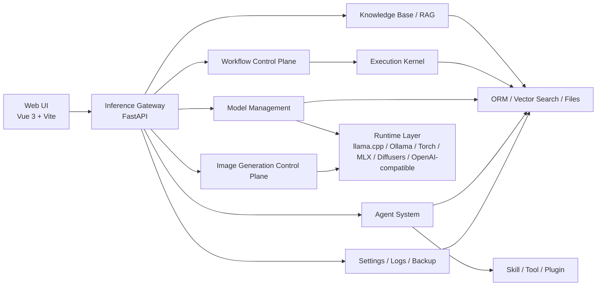
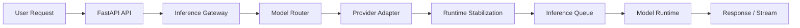
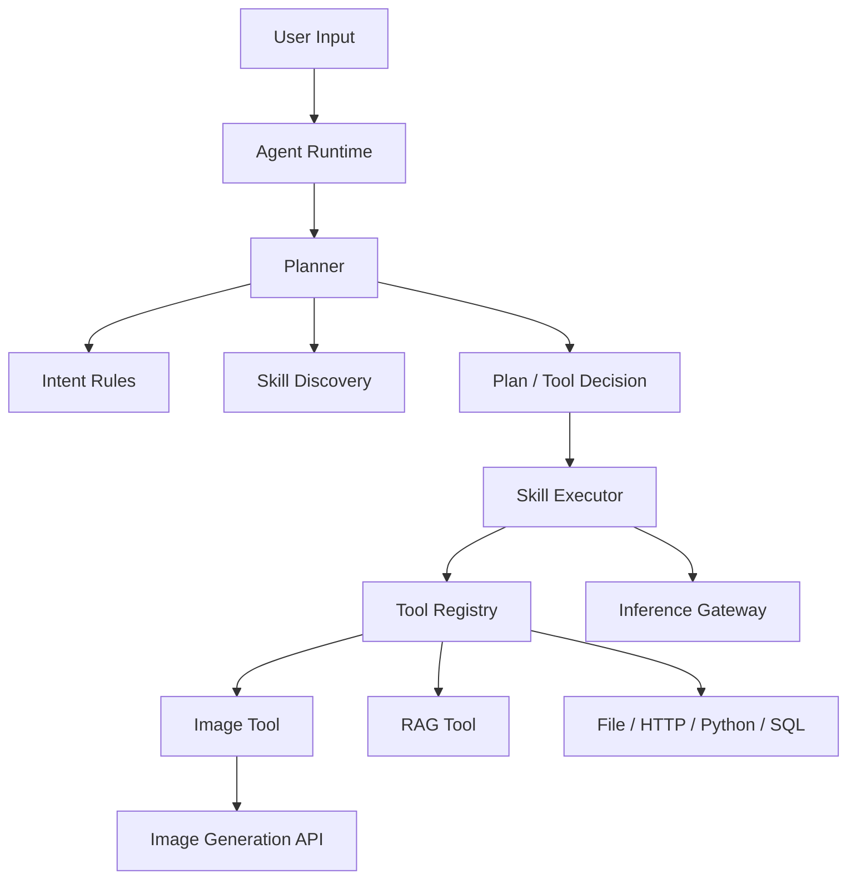
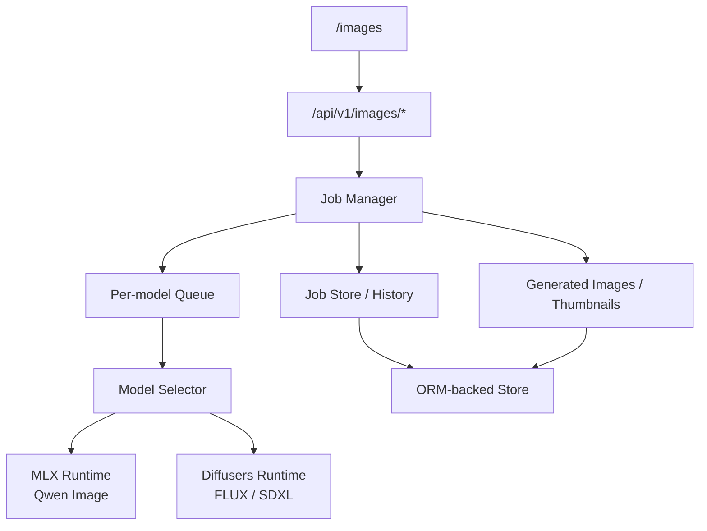

# OpenVitamin — Local AI Inference and Workflow Platform

**Local-first, gateway-centric**: one console for LLM/VLM, image generation, workflows, agents, and knowledge bases. The Vue UI never talks to models directly; all traffic goes through the FastAPI inference gateway.

[中文 README](README.md)

---

## Repository layout (standalone)

This repository root is a **self-contained deliverable**: `backend/`, `frontend/`, `docker/`, `scripts/`, `tutorials/`, `.github/workflows/`, etc. You do **not** need a sibling source tree. “Project root” means this directory.

---

## Table of contents

| Section | Topics |
|---------|--------|
| [Capabilities](#capabilities-and-use-cases) | Features and scenarios |
| [Architecture](#architecture-and-tech-stack) | Components, diagrams, inference and agent flows |
| [Governance and security](#governance-and-security-summary) | RBAC, tenant isolation, CSRF, audit |
| [Quick start](#quick-start) | Conda vs Docker |
| [Makefile](#makefile-optional) | Common `make` targets |
| [Security and operations](#security-and-operations-summary) | Deployment hints, regression scripts, CI |
| [Recent updates](#recent-updates-2026) | UI, workflow queue, idempotency, HITL |
| [Backend layout](#backend-layout) | Top-level backend folders |
| [Documentation index](#documentation-index) | Tutorials and `docs/` |
| [Limitations and contact](#known-limitations) | |

---

## Capabilities and use cases

**Highlights**

- Unified inference: `LLM`, `VLM`, `Embedding`, `ASR`, `Image Generation`
- One control plane for local and cloud models
- Image generation: async jobs, history, thumbnails, warmup, cancellation
- Agents: intent rules, skill discovery, tool calling, direct tool results
- Workflows: versioning, execution history, branch/loop governance; durable queue and approvals (see below)
- Knowledge / RAG, memory, backups, logs, settings
- Optional [OpenClaw](docs/OPENCLAW_BACKEND_CONFIG.md) backend integration behind the unified gateway

**Typical uses**: private deployment, multimodal chat, local text-to-image, agent + workflow orchestration, audited environments.

---

## Screenshots


---

## Architecture and tech stack

**Layers**

| Layer | Role |
|-------|------|
| Web UI | Vue 3 + Vite + Tailwind — console only |
| Inference Gateway | FastAPI — routing, streaming, audit, policy |
| Agents / plugins | Skills, tools, RAG, memory |

**Image generation**

- `Qwen Image`: MLX
- `FLUX / FLUX.2 / SDXL`: Diffusers
- APIs: `POST /api/v1/images/generate`, job lifecycle, downloads, warmup, history

**Stack**

- Frontend: Vue 3, TypeScript, Vite, Tailwind CSS, shadcn-vue
- Backend: Python 3.11+, FastAPI, SQLAlchemy ORM (SQLite by default; MySQL/PostgreSQL possible)
- Runtimes (examples): llama.cpp, Ollama, OpenAI-compatible, Torch, MLX, mflux, Diffusers

Deep dives: [docs/architecture/ARCHITECTURE.md](docs/architecture/ARCHITECTURE.md), [docs/architecture/AGENT_ARCHITECTURE.md](docs/architecture/AGENT_ARCHITECTURE.md).

### Overall architecture



### Inference path



### Agent execution path



Parallel orchestration uses `execution_strategy` (`serial` / `parallel_kernel`) and `max_parallel_nodes`. Event APIs support instance replay and session aggregation. Details are in `tutorials/tutorial.md` (Chinese): search for **Agent 并行编排与记忆** (`## 16.2`).

### Image generation control plane



---

## Governance and security (summary)

- Identity: RBAC (admin/operator/viewer), API key scopes
- Multi-tenant: `X-Tenant-Id`, enforcement, key–tenant binding
- Web: XSS sanitization for markdown/Mermaid; CSRF double-submit cookies
- Abuse control: in-memory rate limiting by key/IP
- Observability: audit log, `X-Request-Id` / `X-Trace-Id`
- Production: guardrail convergence when `DEBUG=false`; unsafe defaults blocked when `SECURITY_GUARDRAILS_STRICT` is enabled (recommended)

Example API domains: Chat/Session/Memory, System/Events/Logs, Knowledge/RAG, Agents/Tools/Skills, VLM/ASR/Images, Workflows, Audit, Backup.

---

## Quick start

Choose **one** path: bare-metal development or **Docker**.

### Requirements

- Python 3.11+, Node.js 18+, Conda (matches repo scripts)

### Option A: Conda (recommended for daily dev)

`run-backend.sh` expects conda env **`ai-inference-platform`** (change the script if you rename it).

```bash
conda create -n ai-inference-platform python=3.11 -y
cd backend
conda run -n ai-inference-platform pip install -r requirements.txt
cd ../frontend && npm install && cd ..
```

From the repository root:

```bash
./run-all.sh
# or ./run-backend.sh and ./run-frontend.sh in separate terminals
```

Defaults: `http://localhost:5173` (frontend), `http://localhost:8000` (backend).

### Option B: Docker

```bash
test -f backend/main.py && test -f frontend/package.json && echo OK
bash scripts/install.sh
# or: make bootstrap
# production-like first install: make bootstrap-prod (stricter doctor; set DOCTOR_STRICT_WARNINGS=0 to allow warnings)
```

Operations: `bash scripts/status.sh`, `scripts/logs.sh`, `scripts/healthcheck.sh`, `scripts/doctor.sh`. Compose files at repo root (`docker-compose*.yml`); Dockerfiles under `docker/`. Copy `.env.example` to `.env` and tune ports, `CORS_*`, `CSRF_*`, RBAC, tenant policy. GPU: `docker-compose.gpu.yml`. Stricter prod defaults: `docker-compose.prod.yml`.

### First-time UI walkthrough

1. `/models` — models available  
2. `/chat` — chat / multimodal  
3. `/images` — image job  
4. `/agents` — tool-oriented agent  
5. `/workflow` — run a simple graph  

Main routes: `/chat`, `/images`, `/images/history`, `/agents`, `/workflow`, `/models`, `/knowledge`, `/settings`, `/logs`.

### Verified environments

macOS (Apple Silicon), Ubuntu, Conda; local models via `model.json`. On Apple Silicon, MLX/MPS and large models share unified memory—size models to your hardware.

---

## Makefile (optional)

```bash
make help
```

| Target | Purpose |
|--------|---------|
| `bootstrap` | `env-init` → `doctor` → `install` |
| `bootstrap-prod` | `env-init` → strict `doctor` → `install-prod` |
| `env-init` | `.env.example` → `.env` if missing |
| `install` / `install-gpu` / `install-prod` | `scripts/install*.sh` |
| `install-prod-soft` | Prod compose; doctor warnings non-fatal |
| `up` / `up-gpu` / `up-prod` | Start profile |
| `down` / `down-gpu` / `down-prod` | Stop profile |
| `status` / `logs` / `healthcheck` / `doctor` | Ops and diagnostics |
| `DOCTOR_STRICT_WARNINGS=1 make doctor` | Warnings fail the run |
| `reset` | Remove containers and volumes (**data loss**) |

---

## Security and operations summary

Before internet or shared hosting, read [tutorials/security-review-hints.md](tutorials/security-review-hints.md) (Chinese full notes) and [tutorials/security-review-hints-en.md](tutorials/security-review-hints-en.md) (English summary). Key points: requests without `X-Api-Key` fall back to `rbac_default_role` (not implicitly read-only); keep `DEBUG=false` and `SECURITY_GUARDRAILS_STRICT=true`; set `CORS_ALLOWED_ORIGINS`, narrow `FILE_READ_ALLOWED_ROOTS`, configure HTTP tool allowlists when HTTP tools are enabled.

**Local security regression (recommended)**

```bash
backend/scripts/test_tenant_security_regression.sh
scripts/acceptance/run_security_regression.sh
```

Optional thresholds: `SECURITY_SLOW_THRESHOLD_SECONDS`, `TENANT_SECURITY_SLOW_THRESHOLD_SECONDS`. Reports: `backend/test-reports/tenant-security-summary.md`, `test-reports/security-regression-summary.md`.

**CI**: `.github/workflows/tenant-security-regression.yml`, `.github/workflows/security-regression.yml`; `workflow_dispatch` and `slow_threshold_seconds`.

---

## Recent updates (2026)

- **Security / plugins**: explicit permission checks before plugin execution; guardrails and CI gates  
- **Agents**: idempotent `POST /api/v1/agents/{id}/run`; `409` on conflicting reuse  
- **Workflows**: durable queue + leases; `approval` HITL; structured approvals API + `legacy=true`  
- **Frontend**: searchable selectors in workflow editor; KB pagination (>50 docs); canvas optimization (>50 nodes); mapped error strings; Vitest/Cypress; split Vite configs  

---

## Backend layout

```text
backend/
├── api/                    # HTTP routes
├── middleware/
├── core/                   # Inference, agents, workflows, knowledge, plugins, …
├── execution_kernel/       # DAG execution engine
├── alembic/
├── config/
├── data/                   # Runtime data (platform.db, generated_images, …)
├── scripts/
└── tests/
```

See [docs/DEVELOPMENT_GUIDE.md](docs/DEVELOPMENT_GUIDE.md) for module-level detail.

---

## Documentation index

| Audience | Documents |
|----------|-----------|
| New users / PM / QA | [tutorials/tutorial-quickstart.md](tutorials/tutorial-quickstart.md), [tutorials/tutorial-index.md](tutorials/tutorial-index.md), [docs/DEPLOYMENT.md](docs/DEPLOYMENT.md) |
| Developers | [tutorials/tutorial.md](tutorials/tutorial.md), [docs/architecture/ARCHITECTURE.md](docs/architecture/ARCHITECTURE.md), [docs/DEVELOPMENT_GUIDE.md](docs/DEVELOPMENT_GUIDE.md), [AGENTS.md](AGENTS.md) |
| Security / ops | [tutorials/tutorial-security-baseline.md](tutorials/tutorial-security-baseline.md), [tutorials/tutorial-ops-checklist.md](tutorials/tutorial-ops-checklist.md), [tutorials/tutorial-incident-runbook.md](tutorials/tutorial-incident-runbook.md), security-review-hints (above) |
| API / models | [docs/api/API_DOCUMENTATION.md](docs/api/API_DOCUMENTATION.md), [docs/local_model/LOCAL_MODEL_DEPLOYMENT.md](docs/local_model/LOCAL_MODEL_DEPLOYMENT.md), [docs/OPENCLAW_BACKEND_CONFIG.md](docs/OPENCLAW_BACKEND_CONFIG.md) |
| Glossaries | [tutorials/tutorial-glossary-zh-en.md](tutorials/tutorial-glossary-zh-en.md), [tutorials/tutorial-glossary-product.md](tutorials/tutorial-glossary-product.md), [tutorials/tutorial-glossary-engineering.md](tutorials/tutorial-glossary-engineering.md) |

---

## Known limitations

- Large LLMs and large image models may contend for memory on Apple Silicon  
- First load and first image generation can be slow  
- Advanced agent/workflow features still evolving  
- Local model layout depends on `model.json` and runtime-specific requirements  
- The open-source edition may lag the commercial edition or omit some features; contact us for commercial options  

---

## Contact

WeChat: fengzhizi715, virus_gene  

Email: fengzhizi715@126.com, yaolisi@hotmail.com  

<div style="display: flex; justify-content: space-between;">
    
    
</div>

---

## Contributing and license

See [CONTRIBUTING.md](CONTRIBUTING.md).  

Planned license: **Apache License 2.0**.
