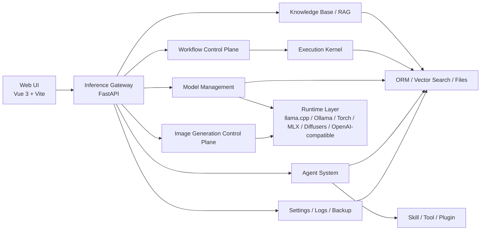
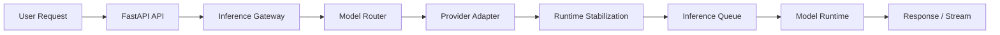
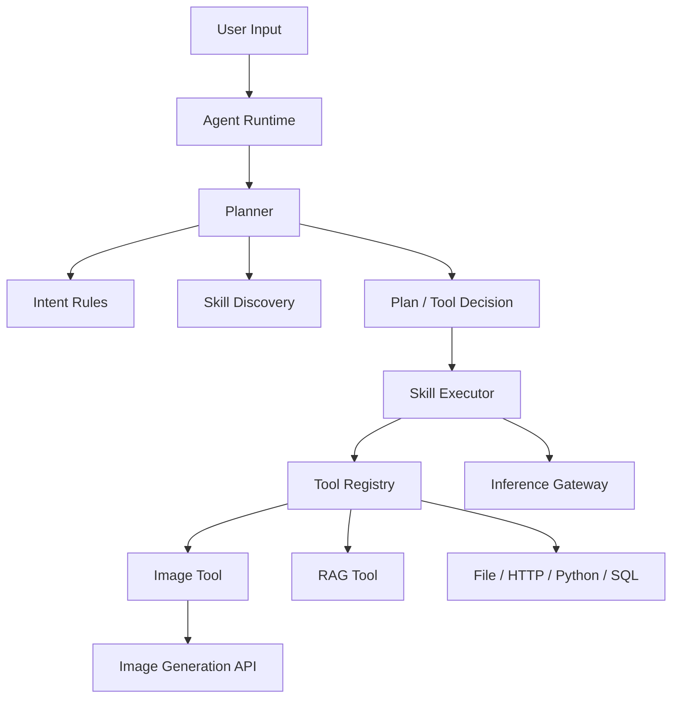
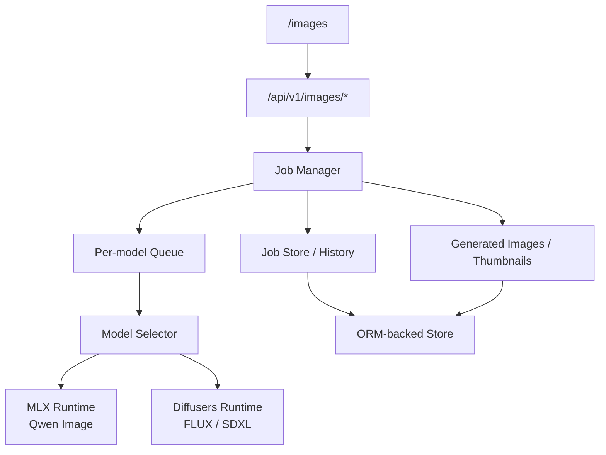

# OpenVitamin AI and Agent Platform

> A local-first AI platform for model inference, image generation, workflow orchestration, and agent-based capability composition.

[中文 README](README.md)

---

## Standalone distribution pack

This repository root is a **self-contained, full-featured deliverable**: it includes `backend/`, `frontend/`, Docker Compose files under `docker/` and the repository root, `scripts/`, `tutorial*.md`, `.github/workflows/`, and other assets aligned with the enhanced mainline. You do **not** need a sibling `openvitamin_enhanced` source tree. Whenever this document says “project root”, it means this directory.

---

## Quick TOC

- [Standalone distribution pack](#standalone-distribution-pack)
- [Project Overview](#project-overview)
- [Highlights](#highlights)
- [Core Capabilities](#core-capabilities)
- [Governance and Security (End-to-End)](#governance-and-security-end-to-end)
- [Control Plane API Coverage (by Domain)](#control-plane-api-coverage-by-domain)
- [Architecture](#architecture)
- [Quick Start](#quick-start)
- [Security Enhancements (2026)](#security-enhancements-2026)
- [Deployment & Security Review Hints](#deployment--security-review-hints)
- [Local Security Regression (Recommended)](#local-security-regression-recommended)
- [CI Security Workflows](#ci-security-workflows)
- [Documentation Index](#documentation-index)

## Project Overview

**Local-first, privacy-first**: OpenVitamin is a privately deployable inference platform for individuals and teams. It unifies model inference, workflow execution, and agent capability orchestration, with a strong focus on observability, auditability, and extensibility.

**Technical architecture**: the platform uses a **Vue frontend + FastAPI inference gateway**. The gateway integrates multiple inference backends such as Ollama, LM Studio, local GGUF runtimes, OpenAI-compatible APIs, and OpenClaw backend integration. The frontend does not connect directly to models or tools; all requests go through the gateway.

**Layered roles**:
- **Web UI**: console and interaction layer
- **Inference Gateway**: central control plane for routing, execution, and request orchestration
- **Agent / Plugin**: capability modules that extend the platform with Skills, Tools, RAG, memory, and workflows

## Highlights

- Unified inference gateway covering `LLM`, `VLM`, `Embedding`, `ASR`, and `Image Generation`
- One control plane for both local and cloud models
- Image generation workspace with async jobs, history, thumbnails, warmup, and cancellation
- Agent system with `Intent Rules`, `Skill Discovery`, `Tool Calling`, and `Direct Tool Result`
- Workflow Control Plane with versioning, execution history, and branch / loop governance
- Built-in support for knowledge base, RAG, memory, logs, settings, and backups
- OpenClaw backend integration for connecting existing agent/model environments through the unified gateway

## Screenshots


## Use Cases

- Manage local and cloud models in one place
- Build multimodal chat and vision capabilities
- Compose capabilities with Agent + Skill + Tool
- Orchestrate multi-step AI pipelines with Workflow
- Manage knowledge bases, RAG, and long-term memory
- Run local text-to-image models and manage generation jobs
- Connect OpenClaw as an upstream model backend behind the unified gateway

## Core Capabilities

- Unified inference APIs for `LLM / VLM / Embedding / ASR / Image Generation`
- Multi-backend model management across local and cloud runtimes
- Multimodal chat with text, image, and perception capabilities
- Image generation workspace with async jobs, history, thumbnails, cancellation, warmup, and detail pages
- Agent system with plan-based execution, skill discovery, intent rules, and tool calling
- Workflow Control Plane with versioning, execution records, node-level state, and branch / loop governance
- Knowledge base and RAG support
- Backup and recovery for database state and `model.json`
- System settings, logs, monitoring, and runtime governance

## Governance and Security (End-to-End)

The current release includes a full governance and security chain:

- Identity and authorization: RBAC (admin/operator/viewer) + API key scope checks
- Multi-tenant isolation: tenant context, tenant enforcement, and API key-tenant binding
- Web security: frontend XSS sanitization + backend CSRF double-submit cookie validation
- Abuse protection: in-memory rate limiting by API key/IP
- Audit and tracing: audit logging + request trace headers (`X-Request-Id`, `X-Trace-Id`)
- Production guardrails: auto-hardening in `debug=false` and fail-fast on high-risk settings

## Control Plane API Coverage (by Domain)

The FastAPI gateway currently mounts these capability domains:

- Chat / Session / Memory
- System / Events / Logs
- Knowledge Base / RAG Trace
- Agents / Agent Sessions
- Tools / Skills
- VLM / ASR / Images
- Workflows (definition, versioning, execution, governance)
- Audit (tenant-filtered query)
- Backup / Model Backups

## Image Generation Support

- `Qwen Image`: MLX path
- `FLUX / FLUX.2 / SDXL`: Diffusers path

The image generation control plane currently supports:
- `POST /api/v1/images/generate`
- job query / cancellation / deletion
- original file download / thumbnail download
- warmup
- history and detail pages

## Tech Stack

**Frontend**
- Vue 3
- TypeScript
- Vite
- Tailwind CSS

**Backend**
- Python 3.11+
- FastAPI
- SQLAlchemy / ORM abstraction (SQLite by default, extensible to MySQL / PostgreSQL)

**Runtime and model backends**
- llama.cpp
- Ollama
- OpenAI-compatible API
- OpenClaw backend integration
- Torch
- MLX / mflux
- Diffusers

Notes:
- The open-source edition currently uses SQLite by default
- The data layer is designed around ORM abstractions and can be extended to MySQL / PostgreSQL later

## Architecture

Core components:
- Web UI: console
- Inference Gateway: unified inference entrypoint
- Runtime Stabilization: model instances, concurrency queues, and resource governance
- Agent System: Planner / Skill / Tool / RAG
- Workflow Control Plane: definition, versioning, execution, and governance
- Image Generation Control Plane: image jobs, history, file persistence, and warmup

Detailed design:
- [docs/architecture/ARCHITECTURE.md](docs/architecture/ARCHITECTURE.md)
- [docs/architecture/AGENT_ARCHITECTURE.md](docs/architecture/AGENT_ARCHITECTURE.md)

### Overall Architecture



### Inference Path



### Agent Execution Path



### Image Generation Control Plane



## Quick Start

Pick **one** path: bare-metal development (daily coding) or **Docker** (delivery / reproducible environments).

### Bare-metal development (Conda)

#### Requirements

- Python 3.11+
- Node.js 18+
- Conda

#### 1. Create the Conda environment

The repo’s `run-backend.sh` starts the backend with `conda run -n ai-inference-platform`. The environment **must** be named `ai-inference-platform` unless you change the script accordingly.

```bash
conda create -n ai-inference-platform python=3.11 -y
```

#### 2. Install backend dependencies

Prefer installing into that env with `conda run` (same mechanism as `run-backend.sh`; works even when `conda activate` is not configured):

```bash
cd backend
conda run -n ai-inference-platform pip install -r requirements.txt
cd ..
```

If you already ran `conda activate ai-inference-platform`, plain `pip install -r requirements.txt` is fine. If `conda activate` fails, run `conda init zsh` (or `bash`) and reopen the terminal, or keep using `conda run` as above.

#### 3. Install frontend dependencies

```bash
cd frontend
npm install
cd ..
```

#### 4. Start the services

From the repository root:

```bash
./run-all.sh
```

Or start them separately:

```bash
./run-backend.sh
./run-frontend.sh
```

Default URLs:
- Frontend: [http://localhost:5173](http://localhost:5173)
- Backend: [http://localhost:8000](http://localhost:8000)

### Docker deployment (recommended for delivery)

Sanity check:

```bash
test -f backend/main.py && test -f frontend/package.json && echo "sources present"
```

Install and start (runs `scripts/doctor.sh` first):

```bash
bash scripts/install.sh
```

Or use Make:

```bash
make bootstrap
```

Production-like first install:

```bash
make bootstrap-prod
```

Notes: `install-prod.sh` / `make install-prod` defaults to stricter doctor checks; set `DOCTOR_STRICT_WARNINGS=0` to treat warnings as non-fatal.

After startup, usually:

- Frontend: `http://localhost:5173` (Nginx proxies `/api/` to the backend on the same origin)
- Backend: `http://localhost:8000` when the backend port is published

Common operations:

```bash
bash scripts/status.sh
bash scripts/logs.sh
bash scripts/healthcheck.sh
bash scripts/doctor.sh
```

Compose files live in the repo root (`docker-compose*.yml`); Dockerfiles under `docker/`. Copy `.env.example` to `.env` and adjust ports, `CORS_ALLOWED_ORIGINS`, `CSRF_*`, RBAC, and tenant policies. GPU: `docker-compose.gpu.yml`. Stricter production defaults: `docker-compose.prod.yml`.

For a full tutorial index and role-based commands, see [Documentation Index](#documentation-index).

#### Makefile cheat sheet (optional)

The repo-root `Makefile` wraps `scripts/*.sh`. Full list:

```bash
make help
```

| Target | What it does |
|--------|----------------|
| `make bootstrap` | `env-init` → `doctor` → `install` (common first-time setup) |
| `make bootstrap-prod` | `env-init` → **strict** `doctor` → `install-prod` |
| `make env-init` | Copy `.env.example` → `.env` when missing |
| `make install` / `install-gpu` / `install-prod` | Calls `scripts/install.sh` / `install-gpu.sh` / `install-prod.sh` |
| `make install-prod-soft` | Prod compose with relaxed doctor (warnings OK) |
| `make up` / `up-gpu` / `up-prod` | Start matching compose profile |
| `make down` / `down-gpu` / `down-prod` | Stop matching profile |
| `make status` | Compose status across profiles |
| `make logs` | Tail container logs |
| `make healthcheck` | End-to-end probes |
| `make doctor` | Diagnostics |
| `DOCTOR_STRICT_WARNINGS=1 make doctor` | Treat warnings as failures |
| `make reset` | Remove containers + volumes (**data loss risk**) |

## Quick Demo

Recommended first-run path:

1. Open `/models` and verify that local or cloud models are available
2. Open `/chat` and test basic or multimodal chat
3. Open `/images` and submit one image generation job
4. Open `/agents` and run a tool-oriented agent
5. Open `/workflow` and execute a simple workflow

## Verified Environments

The project has been verified in the following environments:
- macOS + Apple Silicon
- Ubuntu Linux
- Conda-managed Python environment
- Local model directories organized with `model.json`

Runtime notes:
- On macOS + Apple Silicon, `MLX`, `MPS`, and large local models share unified memory
- On Ubuntu, the platform runs normally and image generation is better aligned with common Linux runtimes such as `Torch / Diffusers`
- Running large LLMs and large image generation models at the same time may still cause memory pressure
- The platform releases resources when switching image models, but model size should still match available hardware

## Main Pages

- `/chat`: chat and multimodal conversation
- `/images`: image generation workspace
- `/images/history`: image generation history
- `/agents`: agent management and execution
- `/workflow`: workflow list, editor, and execution
- `/models`: model management
- `/knowledge`: knowledge base
- `/settings`: system settings
- `/logs`: system logs

## Security Enhancements (2026)

The current version includes an end-to-end security chain across frontend rendering, backend write protection, and CI gatekeeping:

- **Frontend XSS protection**
  - raw HTML rendering is disabled in markdown (`html: false`)
  - rendered output is sanitized with DOMPurify
  - Mermaid SVG uses `securityLevel: 'strict'` and is sanitized before rendering
- **Backend CSRF protection**
  - double-submit cookie validation (`csrf_token` cookie + `X-CSRF-Token` header)
  - mutating methods (POST/PUT/PATCH/DELETE) return `403` on missing/mismatched token
- **Authorization and isolation hardening**
  - RBAC (admin/operator/viewer) + API key scope checks
  - tenant enforcement + API key to tenant binding
- **Security regression gate**
  - dual CI workflows for tenant and security regression
  - Step Summary + artifact reports
  - slow-batch threshold warnings with manual override

## Deployment & Security Review Hints

The platform defaults to **local / trusted-network** deployments. Before exposing it to the **internet** or **shared multi-tenant hosts**, read the archived hints (they complement `tutorials/tutorial-security-baseline.md` MUST rules):

- **[tutorials/security-review-hints.md](tutorials/security-review-hints.md)** (Chinese)
- **[tutorials/security-review-hints-en.md](tutorials/security-review-hints-en.md)** (English)

**Summary**:

- **RBAC**: requests without `X-Api-Key` fall back to **`rbac_default_role` (default `operator`)**—not read-only; consider **`viewer`** as the default on public-adjacent deployments.
- **Guardrails**: rely on **`DEBUG=false`** and **`SECURITY_GUARDRAILS_STRICT=true`**; weakening either increases risk from developer-friendly defaults.
- **Config**: set `CORS_ALLOWED_ORIGINS`, narrow `FILE_READ_ALLOWED_ROOTS`, configure `TOOL_NET_HTTP_ALLOWED_HOSTS` when HTTP tools are enabled.
- **Tenancy**: `X-Tenant-Id` is client-supplied; enforce binding + tenant-scoped data access.
- **Frontend headers**: do not treat `X-User-Id` as proof of identity.
- **Control plane**: restrict exposure of debug-style `system` endpoints as appropriate.

## Local Security Regression (Recommended)

Run from project root:

```bash
backend/scripts/test_tenant_security_regression.sh
scripts/acceptance/run_security_regression.sh
```

Optional: set slow-batch thresholds (seconds):

```bash
SECURITY_SLOW_THRESHOLD_SECONDS=20 scripts/acceptance/run_security_regression.sh
TENANT_SECURITY_SLOW_THRESHOLD_SECONDS=20 backend/scripts/test_tenant_security_regression.sh
```

Report outputs:

- `backend/test-reports/tenant-security-summary.md`
- `test-reports/security-regression-summary.md`

## CI Security Workflows

- `.github/workflows/tenant-security-regression.yml`
  - focused on tenant isolation regression
- `.github/workflows/security-regression.yml`
  - focused on RBAC/Audit/Trace/CSRF/XSS regression

Both workflows support:

- manual trigger via `workflow_dispatch`
- `slow_threshold_seconds` input (positive integer, invalid values fail fast)
- default threshold: 20s for pull requests, 30s for main/master pushes
- direct result view in Step Summary + downloadable artifacts

## Project Structure

Detailed directory and architecture descriptions are available under `docs/`. This section only keeps a high-level backend overview.

```text
backend/                         # Backend service root (FastAPI + core engine)
├── api/                         # API routes (chat / vlm / asr / images / agents / workflows / system ...)
├── middleware/                  # Request middleware (user context, common interception)
├── core/                        # Core business layer
│   ├── agent_runtime/           # Agent runtime (legacy / plan_based)
│   ├── workflows/               # Workflow Control Plane
│   │   ├── models/              # Workflow / Version / Execution domain models
│   │   ├── repository/          # Workflow ORM repository layer
│   │   ├── services/            # Workflow application services
│   │   ├── runtime/             # Workflow runtime and graph adaptation
│   │   └── governance/          # Concurrency, queue, and quota governance
│   ├── inference/               # Inference Gateway
│   │   ├── client/              # Unified inference client entrypoint
│   │   ├── gateway/             # Gateway orchestration core
│   │   ├── router/              # Model routing and selection
│   │   ├── providers/           # Provider adapter layer
│   │   ├── registry/            # Model alias and registration index
│   │   ├── models/              # Inference request / response models
│   │   ├── stats/               # Inference metrics and stats
│   │   └── streaming/           # Streaming abstractions
│   ├── runtime/                 # Runtime Stabilization (instance management / queues / runtime metrics)
│   ├── runtimes/                # Provider runtimes (llama.cpp / ollama / torch / mlx / diffusers / openai-compatible)
│   ├── models/                  # Model scanning, registration, selection, manifest parsing
│   ├── skills/                  # Skill registration, discovery, execution
│   ├── tools/                   # Tool abstractions and implementations
│   ├── plugins/                 # Plugin system (builtin / rag / skills / tools)
│   ├── data/                    # ORM, DB sessions, vector search abstractions
│   ├── conversation/            # Conversation history and context management
│   ├── memory/                  # Long-term memory modules
│   ├── knowledge/               # Knowledge base, chunking, indexing, and state management
│   ├── rag/                     # RAG retrieval and trace-related modules
│   ├── backup/                  # Database and model.json backup modules
│   ├── system/                  # System settings and runtime parameters
│   ├── plan_contract/           # Plan Contract models and validation
│   └── utils/                   # Core-layer shared utilities
├── execution_kernel/            # DAG execution engine
│   ├── engine/                  # Scheduler, executor, state machine
│   ├── models/                  # Graph definitions and runtime models
│   ├── persistence/             # Graph and execution state persistence
│   ├── events/                  # Event storage and event types
│   ├── replay/                  # Replay and state rebuilding
│   ├── optimization/            # Optimization strategies and snapshots
│   ├── analytics/               # Execution analytics and impact statistics
│   └── cache/                   # Node-level cache
├── alembic/                     # Database migrations
├── config/                      # Configuration definitions (settings)
├── data/                        # Runtime data (platform.db, workspaces, backups, generated_images ...)
├── log/                         # Structured logging module
├── scripts/                     # Maintenance and operations scripts
├── tests/                       # Backend tests
└── utils/                       # Utility helpers
```

## Documentation Index

Recommended by scenario:

**🚀 5-Minute Onboarding (Recommended roles: PM / QA / New Joiners)**
- [tutorial-quickstart.md](tutorials/tutorial-quickstart.md)
- [tutorial-quickstart-en.md](tutorials/tutorial-quickstart-en.md)
- [tutorial-index.md](tutorials/tutorial-index.md)
- [docs/DEPLOYMENT.md](docs/DEPLOYMENT.md)

**🧠 Architecture and Implementation Deep Dive (Recommended roles: Dev)**
- [docs/architecture/ARCHITECTURE.md](docs/architecture/ARCHITECTURE.md)
- [docs/architecture/AGENT_ARCHITECTURE.md](docs/architecture/AGENT_ARCHITECTURE.md)
- [docs/DEVELOPMENT_STATUS.md](docs/DEVELOPMENT_STATUS.md)
- [docs/DEVELOPMENT_GUIDE.md](docs/DEVELOPMENT_GUIDE.md)
- [AGENTS.md](AGENTS.md)

**🛡️ Security Governance and Operations (Recommended roles: SRE / Security / Ops / PM)**
- [tutorial-security-baseline.md](tutorials/tutorial-security-baseline.md)
- [tutorials/security-review-hints-en.md](tutorials/security-review-hints-en.md) (architecture / threat-model hints)
- [tutorial-ops-checklist.md](tutorials/tutorial-ops-checklist.md)
- [tutorial-incident-runbook.md](tutorials/tutorial-incident-runbook.md)
- [tutorial-glossary-zh-en.md](tutorials/tutorial-glossary-zh-en.md)
- [tutorial-glossary-product.md](tutorials/tutorial-glossary-product.md)
- [tutorial-glossary-engineering.md](tutorials/tutorial-glossary-engineering.md)

**🔁 CI Regression and API Reference (Recommended roles: Dev / QA / SRE)**
- [docs/api/API_DOCUMENTATION.md](docs/api/API_DOCUMENTATION.md)
- [docs/local_model/LOCAL_MODEL_DEPLOYMENT.md](docs/local_model/LOCAL_MODEL_DEPLOYMENT.md)
- [docs/OPENCLAW_BACKEND_CONFIG.md](docs/OPENCLAW_BACKEND_CONFIG.md)

## Known Limitations

- On Apple Silicon, large local LLMs and large image generation models compete for unified memory
- Initial image model loading and first-generation latency can be high
- Some advanced Agent / Workflow capabilities are still evolving
- Local model directory conventions and runtime dependencies are not fully uniform and still rely on `model.json`
- `The open-source version will lag behind the commercial version by 2-4 weeks, or some features may be limited. Please contact us if you require the commercial version.`

## Contact information
wechat：fengzhizi715,virus_gene

Email：fengzhizi715@126.com,yaolisi@hotmail.com

<div style="display: flex; justify-content: space-between;">
    
    
</div>

## Contributing

Issues and Pull Requests are welcome. For contribution guidelines, development constraints, and submission expectations, see:

- [CONTRIBUTING.md](CONTRIBUTING.md)

## License

The project is planned to use **Apache License 2.0**.
