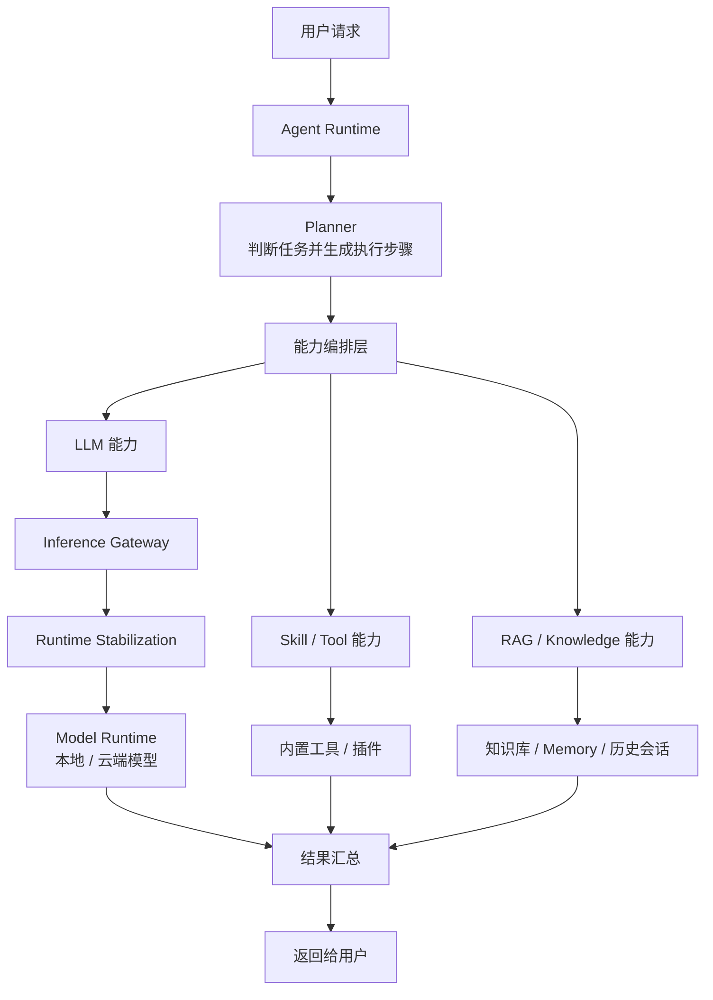
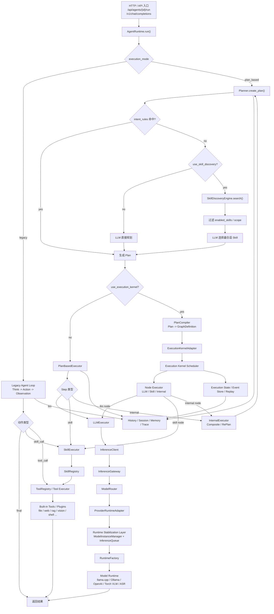
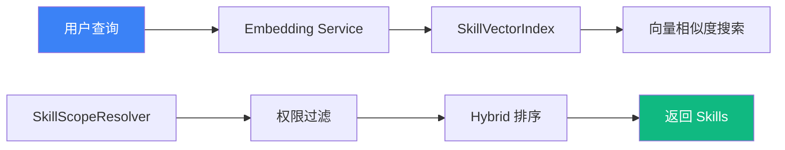
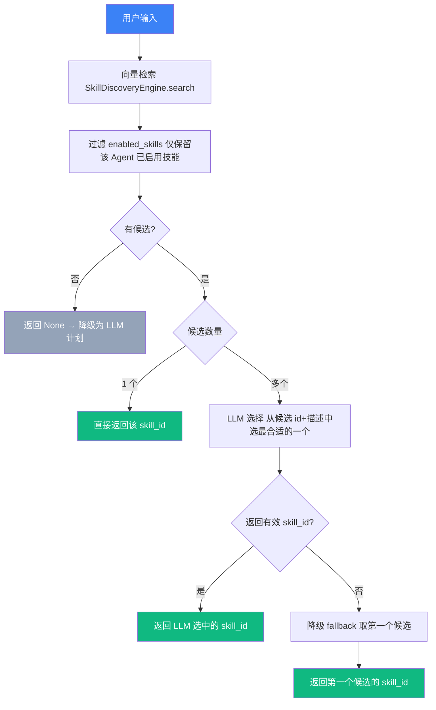
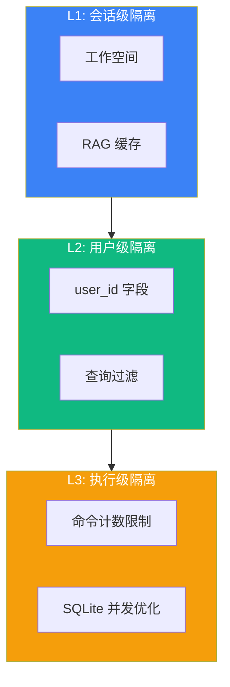
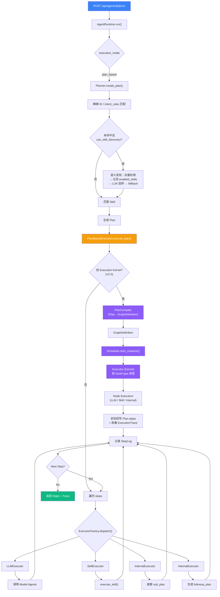
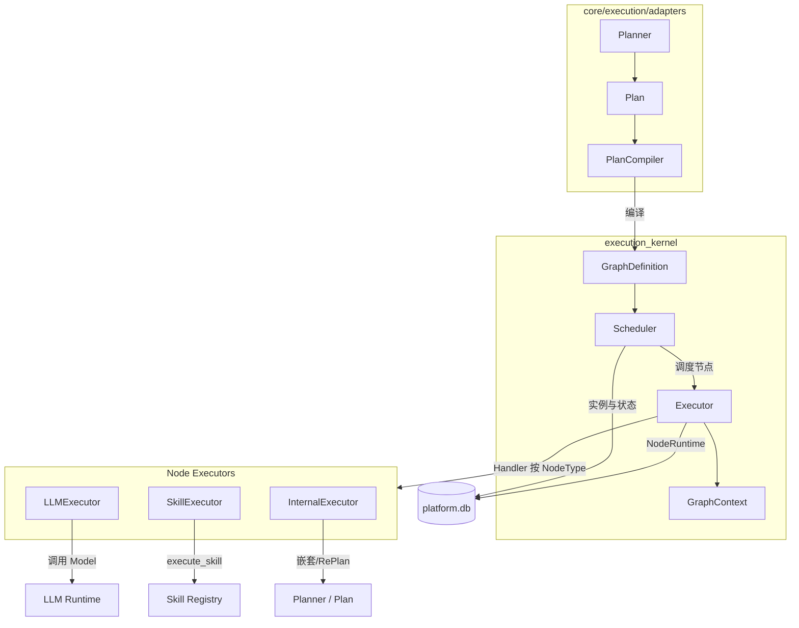
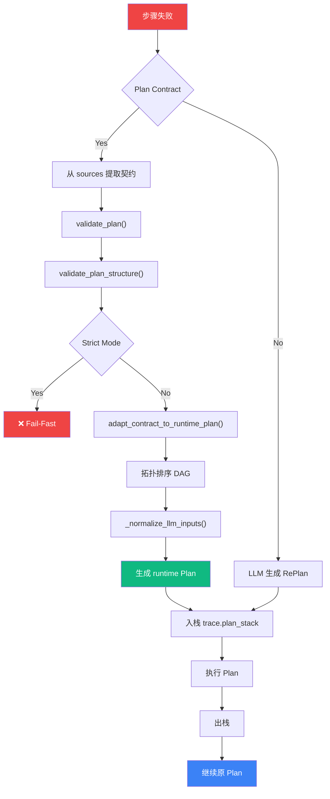
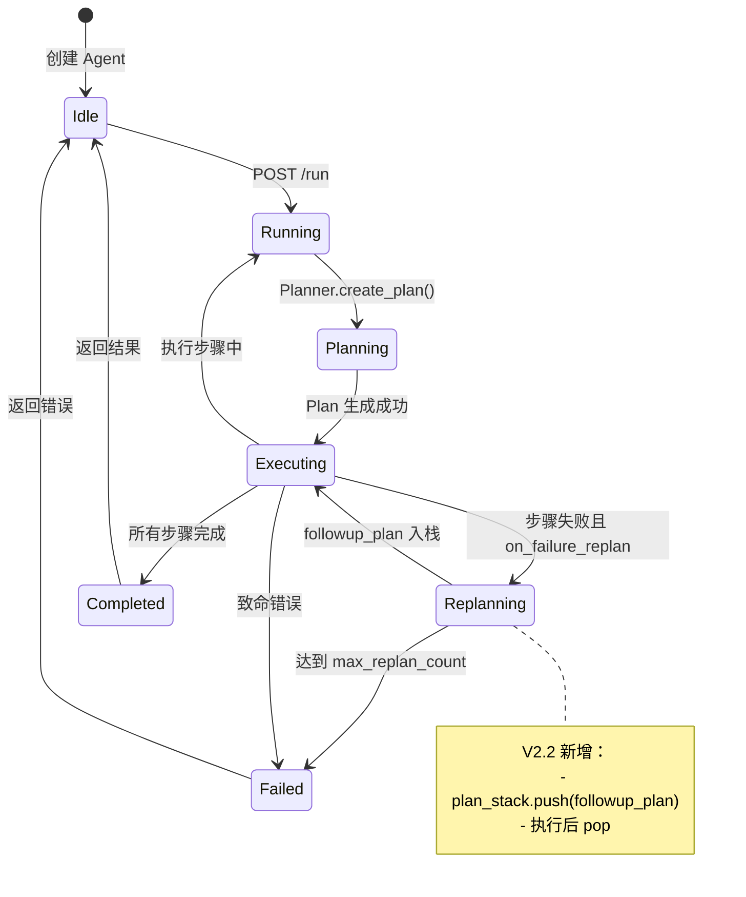
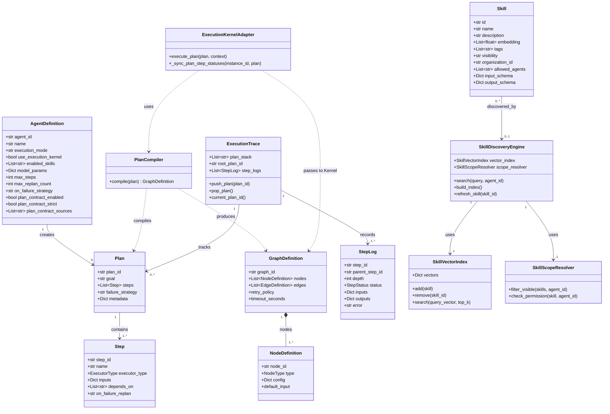

# Agent 架构设计文档

> **版本**：v3.0 
> **最后更新**：2026-03  
> **适用范围**：本地 AI 推理平台 Agent Runtime 系统

本文聚焦 **Agent Runtime 自身的架构演进与执行机制**，主要回答：
- Agent 如何从 legacy 演进到 plan_based、Execution Kernel、Inference Gateway 与 Runtime Stabilization
- 当前 Agent Runtime 的核心组件如何分工
- Planner、Skill Discovery、PlanBasedExecutor、Execution Kernel 如何协作

本文不展开平台级控制面、数据层总架构与文生图控制面的整体设计；这些内容请参考 `ARCHITECTURE.md`。

---

## 一、Agent 架构演进

本章按版本主线说明 Agent Runtime 如何从顺序循环执行，逐步演进为带有图调度、事件流、优化层、统一推理网关与运行时稳定层的系统。

### 1.0 演进总览

| 版本 | 关键词 | 关键变化 |
|------|--------|----------|
| **v1.5** | legacy loop | Think → Action → Observation 顺序执行，Skill 驱动 |
| **v2.x** | plan_based | 引入 Planner、PlanBasedExecutor、RePlan、Plan Contract |
| **v2.5** | Execution Kernel | Plan 可编译为 GraphDefinition，由 DAG 引擎调度 |
| **v2.6** | Event-Sourced Runtime | 事件流持久化、状态重建、回放与校验 |
| **v2.7** | Optimization Layer | 旁路优化层，不改变图结构，仅优化调度与恢复 |
| **v2.8** | Inference Gateway | LLM / Embedding / ASR 统一通过 InferenceClient 入口 |
| **v2.9** | Runtime Stabilization | 模型实例管理、并发队列、运行指标 |
| **v3.0** | Workflow Control Plane | 在 Agent 基础能力之上形成工作流产品层 |

### 1.1 Agent v1.5（legacy 模式）

**核心特点**：
- **单 Agent 顺序执行**：Think → Action → Observation 循环
- **Skill 驱动**：通过 enabled_skills 配置可见能力
- **自然语言解析**：parser.parse_llm_output() 识别 skill_call / final
- **简单重试机制**：云端 429/503 时有限次重试与退避

**适用场景**：
- 简单对话任务
- 单次工具调用
- 快速原型验证

**局限性**：
- 缺乏长期规划能力
- 失败后无自动恢复机制
- 无法追踪复杂执行路径

---

### 1.2 Agent v2.x（plan_based 模式）

**核心特点**：
- **Plan-Based 执行**：Planner 生成 Plan，PlanBasedExecutor 按步骤执行
- **层级追踪**：StepLog 支持 parent_step_id 和 depth
- **动态重规划**：步骤失败时自动触发 RePlan
- **结构化契约**：支持 Plan Contract 校验与转换
- **配置驱动**：execution_mode、intent_rules 等字段控制行为

**适用场景**：
- 复杂多步骤任务（如项目开发、数据分析）
- 需要失败恢复的场景
- 需要审计执行过程的场景

---

### 1.3 Agent v2.5（Execution Kernel 执行引擎）

**核心特点**：
- **DAG 执行引擎**：Plan 编译为 GraphDefinition，由独立 Execution Kernel 调度执行
- **确定性、可恢复、可持久化**：图实例与节点状态落库（统一 platform.db），支持断点与审计
- **适配层解耦**：`core/execution/adapters` 负责 Plan→Graph 编译、Kernel 调用、Node Executor 桥接
- **Node Executors**：LLMExecutor、SkillExecutor、InternalExecutor 在 Kernel 内执行，与既有 Agent 能力对接
- **控制流图化（Phase C）**：支持 condition/loop 节点与边触发语义，RePlan 可经 Graph Patch 动态扩图（Phase B），Composite 支持嵌套子图（Phase A）

**与 v2.x 关系**：
- plan_based 模式下，PlanBasedExecutor 可通过 ExecutionKernelAdapter 将 Plan 交给 Kernel 执行
- 保留原有「遍历 steps + ExecutorFactory.dispatch」路径，Kernel 为可选增强；Kernel 异常时自动回退到 PlanBasedExecutor

**使用 Execution Kernel 的意义**：

| 维度 | 说明 |
|------|------|
| **确定性执行** | 图结构不可变、节点按 DAG 依赖调度，执行顺序可复现，便于调试与问题定位。 |
| **可审计与可观测** | 图实例、节点状态、执行指针落库 platform.db，Trace 与 step 状态回写 Plan，便于按会话/步骤审计与统计（如 `/api/system/kernel/stats`）。 |
| **状态持久化与恢复** | 支持崩溃恢复（`recover_from_crash`）、执行指针（ExecutionPointer）与图版本（graph_version），断点后可按版本恢复图并继续调度。 |
| **并发与资源控制** | Scheduler 使用 Semaphore 限制并发节点数，单节点超时与重试策略可配置，避免无界并发与雪崩。 |
| **动态扩图与 RePlan** | Phase B 支持运行中应用 Graph Patch（增节点/边、禁用节点），RePlan 生成的 followup_plan 可编译为 Patch 并入当前图，版本递增、指针迁移一致。 |
| **为演进打基础** | 与未来 Workflow Graph 编排、分布式节点执行、更细粒度重试与熔断等能力对齐，便于在统一图模型上扩展。 |
| **可选启用、平滑回退** | 通过全局 `USE_EXECUTION_KERNEL` 或 Agent 级 `use_execution_kernel` 控制；Kernel 异常时自动回退到 PlanBasedExecutor，不影响既有 plan_based 行为。 |

**适用场景**：
- 需要执行状态持久化、重试与恢复的场景
- 需要严格并发控制与超时管理的多步骤任务
- 希望按图版本与执行指针做审计或故障恢复
- 与未来 Workflow Graph 编排、分布式执行等能力对齐

---

### 1.4 Agent v2.6（Deterministic Event-Sourced Runtime，可重建系统）

**定位升级**：在 v2.5 Execution Kernel 基础上，从「可运行引擎」升级为「可重建系统」——任意一次 Kernel 执行除可被调度运行外，还可通过持久化事件流在事后完整重建状态与决策序列，支持回放、校验与离线分析。

**核心特点**：
- **事件模型**：`ExecutionEvent` 不可变、顺序编号；覆盖 Graph/Node/Scheduler/State/Patch/Recovery 等生命周期；`EventStore` 仅追加写入，fire-and-forget，不阻塞主流程。
- **可复现性**：Scheduler 决策（如 NODE_SCHEDULED、executable_nodes 顺序）与节点起止、补丁应用、崩溃恢复均落事件流；同一 instance 的 replay 可得到确定性的 `RebuiltGraphState`。
- **离线能力**：`StateRebuilder` 从事件流重建图状态与节点结果；`ReplayEngine` 支持 replay_to_point（断点式回放）与流完整性校验；`MetricsCalculator` 提供执行耗时与事件统计。
- **API 与 Debug**：`GET /api/events/instance/{instance_id}`（事件列表）、`replay`、`validate`、`metrics` 等接口；前端 Debug UI（EventStreamViewer）基于 `kernel_instance_id` 展示事件流、指标、校验结果与重建状态，支持按序列号回放到指定点。
- **会话关联**：Agent 会话持久化 `kernel_instance_id`，执行页可跳转查看该次运行的 Event Stream 与 Replay。

**与 v2.5 关系**：v2.6 在 Kernel 执行路径上增加事件发射与存储，不改变调度与节点执行逻辑；未启用 Kernel 的 Agent 无事件流。

---

### 1.5 Agent v2.7（Optimization Layer，旁路优化层）

**定位**：在**不改变** Execution Kernel 图结构与运行实例的前提下，引入可插拔的优化能力，仅影响**调度策略**、**执行排序**与**失败恢复策略**；可关闭、可回滚，Kernel 仍保持 deterministic。

**核心特点**：
- **可插拔**：`OptimizationConfig`（enabled、scheduler_policy、snapshot_version、auto_build_snapshot、collect_statistics 等）驱动；ExecutionKernelAdapter 按配置或 Agent 级覆盖（`model_params.execution_kernel_optimization` / `optimization_config` / `optimization`）解析出 `effective_opt_config`，再通过 `_build_policy_snapshot_for_config()` 得到 `run_policy` 与 `run_snapshot` 传入 Scheduler；`enabled=false` 时强制 DefaultPolicy、无快照，严格旁路。
- **Scheduler Policy 可版本化**：策略实现 `get_version()`；每次调度决策写入 `SCHEDULER_DECISION` 事件，payload 含 `policy_version`、`snapshot_version`；ReplayEngine 支持 `validate_replay_determinism(..., expected_policy_version, expected_snapshot_version)` 校验。
- **可关闭/回滚**：API `POST /kernel/optimization/config` 可设 `enabled: false` 或 `scheduler_policy: default`，并触发 `_initialize_optimization()` 立即生效；配置仅更新当前 adapter，支持 Agent 级隔离。
- **成功率可量化**：StatisticsCollector 从 ExecutionEvent 汇总 success/failure/retry；OptimizationDataset 支持可选 `metrics_summary`；SnapshotBuilder 从数据集构建 OptimizationSnapshot；analytics 提供 `compute_optimization_impact(before_snapshot, after_snapshot)`；`GET /kernel/optimization/impact-report` 返回成功率提升、延迟变化及 `baseline_empty`/`note` 说明。
- **安全重规划**：Replanner 从失败的 GraphInstance 创建新实例（禁止修改运行中实例），记录 ReplanRecord（failed_instance_id → new_instance_id、reason、planner_version），支持从失败点恢复；与 V2.2 动态重规划的区别：V2.2 是 PlanBasedExecutor 层的 followup_plan 入栈，V2.7 Replanner 是 Kernel 层的新实例创建。
- **快照持久化（可选）**：OptimizationSnapshotDB 与 OptimizationSnapshotRepository（save/get_by_version/list_latest/get_latest/delete_by_version）；SnapshotBuilder.build_and_persist() 支持构建并落库；从 DB 加载时 to_snapshot() 将 source_event_count/source_instance_count 合并到 metadata，确保与 Builder 产出结构一致。

**与 v2.6 关系**：v2.7 在 Kernel 调度路径上按配置注入 Policy 与 Snapshot，事件流中记录 policy/snapshot 版本以保持 Replay 确定性；未启用优化或 enabled=false 时行为与 v2.6 一致。

---

### 1.6 Agent v2.8（Inference Gateway Layer，统一推理网关）

**定位**：在 Agent/Skill 与模型运行时之间引入统一推理网关，实现调用方与提供方的解耦。所有 LLM、Embedding、ASR 推理请求均通过 InferenceClient 统一入口，由 InferenceGateway 协调路由与执行。

**核心特点**：
- **统一 API**：InferenceClient 提供 generate()、stream()、embed()、transcribe() 四类方法，覆盖 LLM/Embedding/ASR 三种推理类型。
- **模型别名**：ModelRouter 支持 alias → (provider, model_id) 映射，如 "reasoning-model" → "openai/deepseek-r1"。
- **Fallback 链**：别名可配置 fallback，主模型不可用时自动切换到备用模型。
- **直通模式**：未知别名直接作为 model_id 使用，保持向后兼容。
- **Provider Adapter**：ProviderRuntimeAdapter 桥接现有 RuntimeFactory，不修改底层运行时实现。
- **Streaming 矩阵**：明确各 Runtime 的流式支持情况（native/fake/none）。
- **多模态校验**：请求包含图像时自动校验目标模型是否支持 vision。

**架构流程**：
```
AgentExecutor / LLMExecutor / NodeExecutor
        ↓
    InferenceClient
        ↓
    InferenceGateway
        ↓
    ModelRouter → ProviderRuntimeAdapter
        ↓
    RuntimeFactory → Model Runtime
```

**迁移状态**：
- ✅ AgentExecutor.llm_call → InferenceClient.generate()
- ✅ LLMExecutor（V2 plan_based）→ InferenceClient
- ✅ NodeExecutor（Kernel）→ InferenceClient
- ✅ Embedding/ASR 接入 InferenceGateway

**与 v2.7 关系**：v2.8 在 Agent/Kernel 与模型运行时之间插入 Inference Gateway，不影响 Kernel 执行逻辑与优化层；所有 LLM 调用统一走 InferenceClient，实现调用方与提供方的解耦。

---

### 1.7 Agent v2.9（Runtime Stabilization Layer，运行时稳定层）

**定位**：在 Inference Gateway 与 RuntimeFactory 之间增加稳定层，提升多模型/多请求下的稳定性，避免并发导致 OOM 或卡死；不改变现有 Runtime 实现与 API。

**核心特点**：
- **ModelInstanceManager**：统一模型实例管理，懒加载、单例缓存、可卸载；按 model_id 串行加载（asyncio.Lock），避免重复加载。
- **InferenceQueue**：按模型维度的并发队列，`asyncio.Semaphore` 限制单模型并发；支持动态更新 `max_concurrency`（队列空闲时）。
- **RuntimeMetrics**：线程安全按模型统计请求数、失败数、延迟、tokens、队列长度。
- **RuntimeConfig**：`max_concurrency` 可配置，优先级：`model.json` metadata > `settings.runtime_max_concurrency_overrides` > 代码默认。

**架构流程**：
```
InferenceGateway / ProviderRuntimeAdapter
        ↓
ModelInstanceManager.get_instance() + InferenceQueue.run()
        ↓
RuntimeFactory → Model Runtime
```

**集成点**：ProviderRuntimeAdapter（generate/stream/embed/transcribe）、UnifiedAgent（chat/stream_chat）、VLM API（/v1/vlm/generate）均经稳定层；可观测性通过 `log_structured` 与 `GET /api/system/runtime-metrics` 暴露。

**与 v2.8 关系**：v2.9 在 Gateway 与 Factory 之间插入稳定层，所有经 Gateway 或 UnifiedAgent/VLM API 的推理均经 ModelInstanceManager + InferenceQueue，实现并发控制与指标采集；目录为 `core/runtime/`（config/、manager/、queue/）。

---

### 1.8 Agent v3.0（Workflow Control Plane，工作流控制平面）

**定位**：在 Agent Runtime 之上增加 Workflow Control Plane，实现 Workflow Definition Versioning、Definition/Runtime Separation、Multi-instance Safe Execution。Execution Kernel 负责“跑图”，Control Plane 负责“定义、治理、可观测、交付”。

这里保留 Workflow Control Plane，是为了说明 Agent、Execution Kernel 与工作流产品层之间的演进关系；平台级工作流架构仍以 `ARCHITECTURE.md` 为主。

**核心能力**：
- **Workflow 资源模型**：Workflow / WorkflowVersion / WorkflowExecution 三层对象，覆盖定义、版本、执行生命周期。
- **Definition / Runtime 分离**：UI 编辑的是 definition（草稿/发布），运行时消费的是 execution + graph instance。
- **版本系统**：草稿保存、发布、历史、diff、回滚。
- **执行治理**：全局并发、单 workflow 并发、队列/backpressure、配额控制。
- **运行可观测性**：节点级状态、输入输出、耗时、错误、执行日志、终态回填。
- **前后端产品化闭环**：Workflow 列表页、编辑页、运行页、版本页、Execution History（分页/详情/删除）。

**与 v2.x 关系**：
- v2.x（Agent + Kernel + Inference Gateway）提供执行与推理基础能力；
- v3.0 在其上构建工作流产品层，统一 Definition 管理与 Execution 治理，不改变底层 RuntimeFactory/Model Runtime 的边界。

**当前实现要点（v3.0）**：
- **运行路径**：`WorkflowExecutionService` 创建 execution → `WorkflowRuntime` 适配 DAG → `Execution Kernel` 调度。
- **分支语义**：Condition/Loop 通过 edge trigger（`true/false`、`continue/exit`）驱动；未命中分支自动 `skipped`，防止 execution 长驻 `running`。
- **节点输入传播**：调度前按入边触发条件合并上游输出到下游 `input_data`，保证 `Input -> Condition -> Agent/LLM -> Output` 链路可用。
- **汇聚策略**：Output 节点支持 `dependency_mode`（`all|any`）；多入边默认 `any`（可显式改为 `all`）。
- **状态可观测**：运行页支持 status 轮询 + SSE 推送；终态 reconcile 回写 DB，减少“节点已结束但 execution 未终态”不一致。

---

## 二、Agent v2 核心组件

本章聚焦 **当前实现中的核心组件职责**，回答“每个组件做什么”。执行顺序与运行主线放到下一章展开，避免和本章重复。

### 2.0 当前智能体内部流程图

以下流程图对应当前实现中的主执行链路，覆盖入口、模式分流、Planner、Execution Kernel、Skill/Tool 调用，以及统一推理网关到模型运行时的路径。
图中保留 Inference Gateway、Runtime Stabilization、Knowledge 等平台组件，是为了说明 Agent Runtime 与外部依赖的边界，而不是重复展开平台总架构。

**简化版（面向产品/方案沟通）**：



**这张图可以这样理解**：
- `Agent Runtime` 是总入口，负责接住请求并组织一次完整执行。
- `Planner` 负责把用户问题转成“要做哪些步骤、优先调用哪些能力”。
- `能力编排层` 会把任务分发到三类能力：模型推理、Skill/Tool、知识检索。
- 所有模型调用不会直接打到后端实现，而是统一经过 `Inference Gateway -> Runtime Stabilization -> Model Runtime`。
- 工具、知识库、记忆、历史会话提供补充信息，最后和模型结果一起汇总成用户可见答案。

**详细版（面向开发与排障）**：



**说明**：
- `legacy` 与 `plan_based` 共用同一套 Skill、Tool 与推理网关，只是调度方式不同。
- `plan_based + use_execution_kernel=true` 时，Plan 会先编译成图，再由 Kernel 调度节点执行。
- 所有模型调用都会落到 `InferenceGateway -> Runtime Stabilization -> RuntimeFactory -> Model Runtime` 这条链路。
- Skill 不直接触碰模型运行时；LLM、Tool、RAG、Vision 等能力都通过统一抽象接入。

### 2.1 AgentRuntime（统一入口）

**职责**：
- 根据 `execution_mode` 分流到 legacy 或 plan_based 执行链
- 管理 AgentSession 生命周期
- 注入上下文（历史消息、RAG 结果、Skill 列表）

**关键方法**：
```python
async def run(
    self,
    agent: AgentDefinition,
    session: AgentSession,
    workspace: str,
    permissions: Optional[Dict],
) -> AgentState:
    if agent.execution_mode == "plan_based":
        return await self._run_plan_based(...)
    else:
        return await self._run_legacy(...)
```

---

### 2.2 Planner（规划器）

**职责**：
- 分析用户意图（基于 intent_rules 配置）
- 生成 Plan（步骤序列，支持 DAG 依赖）
- 在 RePlan 场景下处理 Plan Contract

**关键流程**：
```
用户输入 → 精确 ID / intent_rules 匹配
         → [未命中且 use_skill_discovery] 语义发现：向量检索 → 过滤 enabled_skills → LLM 选择 → 降级 fallback
         → Skill 匹配 → Plan 生成 → validate_plan() → 输出
```

**V2.3 增强**：
- `_resolve_replan_fix_source_file()`：智能路径解析（测试文件 → 源码文件）
- `try_parse_contract_plan()`：从多个 source 读取结构化契约
- 严格模式支持：`plan_contract_strict=True` 时 fail-fast

---

### 2.3 PlanBasedExecutor（计划执行器）

**职责**：
- 遍历 Plan 的 steps
- 通过 ExecutorFactory.dispatch() 分发到具体执行器
- 记录 ExecutionTrace（支持层级追踪）

**执行器类型**：
- **LLMExecutor**：调用 Model Agents
- **SkillExecutor**：复用 v1.5 的 execute_skill()
- **InternalExecutor**：处理 Composite（嵌套 Plan）和 REPLAN

**失败处理策略**：
```python
# 优先使用 step.on_failure_replan
if step.on_failure_replan:
    trigger_replan()
# 否则使用 agent 配置
elif agent.on_failure_strategy == "replan":
    trigger_replan()
else:
    stop_or_continue()
```

说明：
- 优先采用 step 级重规划配置
- step 未显式声明时，再回退到 agent 级失败策略

---

### 2.4 Plan Contract Adapter（契约适配器）

**职责**：
- 将结构化 Plan Contract 转换为 runtime Plan
- 校验契约结构、依赖关系、DAG 合法性
- 拓扑排序 DAG 步骤 → 串行执行 Plan

**V2.3 新增**：
- `_normalize_llm_inputs()`：兼容 `{prompt: "..."}` 和 `{messages: [...]}`
- 严格模式校验：fail-fast 机制

**转换流程**：
```
Plan Contract → validate_plan() → validate_plan_structure() 
→ adapt_contract_to_runtime_plan() → 拓扑排序 → runtime Plan
```

---

### 2.5 ExecutionTrace（执行追踪）

**数据结构**：
```python
class ExecutionTrace:
    plan_stack: List[str]  # Plan ID 栈（支持嵌套）
    root_plan_id: str      # 根 Plan ID
    step_logs: List[StepLog]  # 步骤日志
    current_plan_id: str   # 当前 Plan ID
```

**StepLog 层级**：
```python
class StepLog:
    step_id: str
    parent_step_id: Optional[str]  # 父步骤 ID（支持层级）
    depth: int                      # 递归深度
    status: StepStatus
    inputs: Dict
    outputs: Dict
    error: Optional[str]
```

**特性**：
- 支持执行树可视化
- 父子步骤关联
- 递归步骤共享同一个 trace

---

### 2.6 Skill Discovery Engine（V2.4 新增）

**职责**：
- 基于向量相似度的语义检索
- 结构化过滤（tag/category/visibility）
- 权限感知（Agent 可见性控制）
- Hybrid 排序（语义 + 标签）

**核心组件**：



**关键技术**：
- **SkillVectorIndex**：内存向量索引，余弦相似度
- **SkillDiscoveryEngine**：检索引擎（语义 + 结构化）
- **Hybrid Scoring**：70% 语义相似度 + 30% 标签匹配
- **动态刷新**：Skill 更新后重建索引

**权限模型**：
| 可见性级别 | 说明 | 访问控制 |
|-----------|------|---------|
| `public` | 所有 Agent 可见 | 无限制 |
| `org` | 组织内 Agent 可见 | `organization_id` 匹配 |
| `private` | 指定 Agent 可见 | `allowed_agents` 白名单 |

**运行时语义发现流程**（Planner 内 `_discover_skill_semantic`）：



**运行时接入**（V2.4）：
- 仅 **Plan-Based** 模式生效；Legacy (v1.5) 不使用 Discovery。
- Agent 配置 `model_params.use_skill_discovery=true` 时，Planner 在意图规则未命中后调用 `_discover_skill_semantic()`，执行四步流程：**向量检索**（`SkillDiscoveryEngine.search`，扩大候选数量）→ **过滤 enabled_skills**（仅保留该 Agent 已启用技能）→ **LLM 选择**（多候选时由 LLM 从候选 id+描述中选最合适的一个）→ **降级 fallback**（LLM 未返回有效结果时取第一个候选）；异常时静默返回 None，退化为 LLM 计划。
- 启动时在 main 中完成 `bind_registry(SkillRegistry)` 与 `build_index()`，供运行时检索使用。

---

### 2.7 Multi-Agent Isolation（V2.4 新增）

**目标**：确保多个 Agent 并发执行时的数据隔离与安全性。

**隔离层级**：



**关键实现**：

1. **会话级工作空间**
   - 路径：`data/agent_workspaces/{session_id}/`
   - 文件上传自动保存到会话工作目录
   - `workspace_dir` 持久化到 Session，同会话复用
   - 安全路径解析：`resolve_in_workspace()` 防止路径穿越

2. **用户级数据隔离**
   - `AgentSession.user_id` 字段
   - 所有查询自动添加 `WHERE user_id = ?` 过滤
   - API 层通过 `X-User-Id` Header 获取用户 ID

3. **命令执行隔离**
   - `SafeShellExecutor` 共享计数器
   - 每会话命令数限制（默认 10 条）
   - 超时控制（默认 60 秒）

4. **RAG 缓存隔离**
   - 缓存键：`{session_id}:{query_hash}`
   - TTL：5 分钟
   - 防止跨会话上下文污染

5. **SQLite 并发优化**
   - WAL 模式：读写并发不互斥
   - 忙时重试：指数退避（0.1s → 0.2s → 0.3s）
   - 复合索引：6 个索引加速常用查询
   - PRAGMA 调优：`busy_timeout=30000`, `cache_size=-64000`

**性能提升**：
| 场景 | 优化前 | 优化后 | 提升 |
|------|--------|--------|------|
| 单用户高频写入 | 频繁锁竞争 | 平滑重试 | ⬆️ 60% |
| 多用户并发读取 | 互相阻塞 | 互不干扰 | ⬆️ 80% |
| 跨会话文件访问 | 可能死锁 | 自动恢复 | ⬆️ 90% |
| 列表查询（50 条） | ~100ms | ~20ms | ⬇️ 80% |

---

### 2.8 Execution Kernel（V2.5 新增）

**定位**：与 `core` 平级的 DAG 执行引擎包（`backend/execution_kernel/`），被 `core/execution/adapters` 依赖，负责图的调度与节点执行。**使用意义**（为何启用 Kernel）见 [1.3 使用 Execution Kernel 的意义](#13-agent-v25execution-kernel-执行引擎)。

**核心组件**：

| 组件 | 职责 |
|------|------|
| **GraphDefinition** | 不可变图定义：NodeDefinition、EdgeDefinition、重试策略、超时 |
| **Scheduler** | 图实例生命周期、可执行节点调度、并发上限（Semaphore）、重试与状态推进 |
| **Executor** | 单节点执行、超时与重试、Handler 注册（按 NodeType 分发） |
| **GraphContext** | 全局数据与节点输出、表达式解析（如 `{{node_id.output}}`） |
| **NodeCache** | 节点结果缓存，支持幂等与重跑 |

**持久化**：
- 使用统一 **platform.db**（与核心平台共用），不单独建库
- GraphInstance、NodeRuntime 等状态落库，便于审计与恢复

**实现与运维要点**：
- **StateMachine 短事务**：节点状态机推荐传入 `Database`（`StateMachine(db=self.db)`），每次状态读写使用 `db.async_session()` 独立短事务，用完即 commit/关闭，减少长事务持锁，对 SQLite 更友好；测试/demo 仍可传 `NodeRuntimeRepository` 兼容旧用法。
- **僵尸实例清理**：首次执行 `execute_plan` 时调用 `Scheduler.cleanup_stale_running_instances(max_age_minutes=30)`，将「状态为 RUNNING、updated_at 超过阈值且无 RUNNING 节点」的实例标记为 FAILED，避免崩溃后假运行中实例占用恢复路径；仅执行一次（`_stale_cleanup_done`）。
- **执行指针更新策略**：环境变量 `EXECUTION_POINTER_STRATEGY` 控制 DB 锁冲突时的行为：`best_effort`（默认）重试后仍失败则 log 并跳过，保证主流程不因单次 pointer 写失败中断；`strict` 则重试后仍失败即抛异常，便于严格环境或测试发现并发/锁问题。Scheduler 的 `_update_pointer_with_retry` 与 `ExecutionPointerRepository.update` 均遵循该策略。

**与 Agent 的衔接**（`core/execution/adapters`）：
- **PlanCompiler**：Plan（Step 序列）→ GraphDefinition（Node/Edge）
- **ExecutionKernelAdapter**：PlanBasedExecutor 调用 `execute_plan()` 时，将 Plan 编译后交给 Kernel 的 Scheduler 执行；上下文拆分为可序列化的 `persisted_context` 与内存中的 `runtime_context`，避免 JSON 序列化错误
- **Node Executors**：在 Kernel 内注册的 Handler 对应 LLMExecutor、SkillExecutor、InternalExecutor，内部调用既有 Agent 的 LLM、Skill、Internal 能力；错误通过抛异常或返回 `{error}` 由 Kernel 统一识别并标记节点失败
- **Plan 状态回写**：Kernel 执行完成后，通过 `_sync_plan_step_statuses` 将节点状态同步回 Plan.steps，并收集 NodeRuntime 结果构建 ExecutionTrace（StepLog），保证与现有 Trace 存储与会话回写兼容

**执行链路（V2.5）**：
```
Planner → Plan → PlanCompiler → GraphDefinition
    → Scheduler.start_instance(persisted_context)
    → 可执行节点 → Executor（LLM/Skill/Internal Handler）
    → 状态落库、并发控制、重试
    → 完成 → 回写 Plan 步骤状态 + 收集 Trace
```

**V2.6 事件流与可重建**：
- **事件发射**：Scheduler/Executor 在执行过程中向 `EventStore` 发射 `ExecutionEvent`（GRAPH_*、NODE_*、SCHEDULER_DECISION、PATCH_*、CRASH_RECOVERY_* 等），仅追加、不阻塞。
- **可重建**：`StateRebuilder` 按 sequence 重放事件得到 `RebuiltGraphState`；`ReplayEngine` 支持 `replay_to_point(instance_id, target_sequence)` 断点回放与流校验。
- **可观测**：Event API 暴露事件列表、类型分布、replay 结果、校验结果、执行指标；会话保存 `kernel_instance_id`，前端 Debug UI 可基于该 ID 拉取并展示事件流与重建状态。

**V2.7 优化层（旁路）**：
- **策略与快照注入**：Scheduler 构造时接收 `scheduler_policy` 与 `optimization_snapshot`（由 ExecutionKernelAdapter 按 OptimizationConfig 或 Agent 级覆盖解析）；仅影响可执行节点排序与优先级，不改变图结构。
- **事件与 Replay**：`SCHEDULER_DECISION` 含 `policy_version`、`snapshot_version`；Replay 可校验策略/快照版本以保障确定性。
- **安全重规划**：`Replanner` 从失败 GraphInstance 创建新实例，记录 `ReplanRecord`（failed_instance_id → new_instance_id）；禁止修改运行中实例，确保安全性。
- **配置与 API**：`GET /kernel/optimization`、`POST /kernel/optimization/config`、`POST /kernel/optimization/rebuild-snapshot`、`GET /kernel/optimization/impact-report`；前端 Optimization Dashboard（`/optimization`）提供状态、开关、策略、重建与效果报告。

---

### 2.9 Inference Gateway（V2.8 新增）

**定位**：统一推理 API 层，实现 Agent/Skill 与模型运行时的解耦。所有 LLM、Embedding、ASR 推理请求均通过 InferenceClient 统一入口。

**核心组件**：

| 组件 | 职责 |
|------|------|
| **InferenceClient** | 统一入口：generate()、stream()、embed()、transcribe() |
| **InferenceGateway** | 中枢路由：协调 ModelRouter 与 ProviderRuntimeAdapter |
| **ModelRouter** | 别名解析：alias → (provider, model_id)，支持 fallback 链 |
| **ProviderRuntimeAdapter** | 后端适配：桥接现有 RuntimeFactory，不修改底层 |
| **InferenceModelRegistry** | 别名管理：注册、解析、同步 ModelRegistry |
| **TokenStream** | 流式抽象：统一 token 收集与延迟追踪 |

**支持能力**：
- **LLM 推理**：generate() 非流式、stream() 流式
- **Embedding**：embed() 文本向量化
- **ASR**：transcribe() 语音转文本
- **模型别名**："reasoning-model" → "deepseek-r1"
- **Fallback 链**：主模型不可用时自动切换
- **直通模式**：未知别名直接作为 model_id 使用

**Streaming 支持矩阵**：

| Runtime | 类型 | 说明 |
|---------|------|------|
| llama.cpp | native | 完整 token-by-token 流式 |
| mlx | native | Apple MLX 原生流式 |
| openai | native | OpenAI 兼容 API 流式 |
| ollama | native | Ollama 服务流式 |
| torch | fake | 一次性返回（非真流式） |

**多模态校验**：
- 请求包含 image_url 时，自动校验目标模型的 model_type 或 capabilities
- 不支持 vision 的模型抛出明确错误，不静默降级

**当前缺口（P1，待修复）**：
- Agent 运行链路中，部分消息构造路径仍可能丢失 `image_url`（尤其是 AgentLoop → 统一 LLM 路由）。
- 结果是 `TorchModelRuntime` 进入纯文本生成路径，VLM 未实际接收图像输入。
- 该问题不影响 `/v1/vlm/generate` 直连链路，但会影响「Agent + VLM」场景准确性。
- 目标修复方向：
  - 将 Agent 侧消息统一为多模态 content item（`text` / `image_url`）并透传至 InferenceClient
  - 在 Planner / Executor / Runtime Adapter 中保证图像项不丢失
  - 增加端到端回归测试（AgentLoop + VLM + image_url）

**迁移路径**：
```python
# 旧方式（已迁移）
agent = router.get_agent(model_id)
response = await agent.chat(req)

# 新方式（V2.8）
client = get_inference_client()
response = await client.generate(
    model=model_id,
    messages=messages,
    temperature=temperature,
    metadata={"session_id": session_id, "trace_id": trace_id}
)
```

---

## 三、Agent v2 执行流程

本章按一次请求进入系统后的主线展开，重点说明 legacy、plan_based、Execution Kernel 与 RePlan 在运行时如何串联。

### 3.1 初始执行流程（V2.0–V2.5）



**详细步骤**：

1. **请求入口**：`POST /api/agents/{agent_id}/run`
2. **Planner 生成 Plan**：
   - 读取 `model_params.intent_rules` 配置，优先精确 ID 与 intent_rules 匹配 Skill
   - 若未命中且 `model_params.use_skill_discovery=true`，执行语义发现四步：向量检索 → 过滤 enabled_skills → LLM 选择 → 降级 fallback（V2.4 运行时语义发现）
   - 分析用户意图，确定匹配 Skill 后生成 Plan（步骤序列），支持依赖关系（DAG）
3. **PlanBasedExecutor 执行**（两条路径）：
   - **V2.5 经 Execution Kernel**：PlanCompiler 将 Plan 编译为 GraphDefinition → Scheduler 创建图实例、推进可执行节点（并发上限 Semaphore）→ Executor 按 NodeType 调用 Node Executors（LLMExecutor、SkillExecutor、InternalExecutor）→ 状态落库 platform.db → 完成后 `_sync_plan_step_statuses` 回写 Plan.steps，并收集 NodeRuntime 构建 ExecutionTrace。
   - **直连路径**：遍历 Plan 的 steps，通过 `ExecutorFactory.dispatch()` 分发；**LLM 步骤** 调用 Model Agents，**Skill 步骤** 复用 v1.5 的 `execute_skill()`，**Composite/RePlan** 走 InternalExecutor。
4. **层级追踪**：
   - 记录每个 StepLog 的 `parent_step_id` 和 `depth`
   - 支持执行树可视化（调试/失败定位）
5. **失败处理**（V2.2）：
   - 步骤失败时触发 `on_failure_replan` 配置
   - 生成 followup_plan，入栈到 `trace.plan_stack`
   - 执行新 Plan 后出栈，继续原 Plan

---

### 3.2 V2.5 Execution Kernel 执行路径

当 plan_based 执行经 ExecutionKernelAdapter 接入时，流程为：



- **PlanCompiler**：将 Plan 的 steps 转为 GraphDefinition 的 nodes/edges，Step 的 executor 映射为 NodeDefinition.type，inputs 写入 node config（含 default_input）。
- **Scheduler**：创建图实例、推进可执行节点、遵守并发上限（Semaphore）、处理重试与超时，状态写入 platform.db。
- **Executor**：按 NodeType 调用注册的 Handler；Handler 由 Node Executors（LLM/Skill/Internal）实现，内部复用既有 Agent 的模型调用、Skill 执行与 Internal 逻辑。
- **完成后**：Kernel 节点状态同步回 Plan.steps，并汇总为 ExecutionTrace（StepLog），与现有 Trace 存储一致。

---

### 3.3 RePlan 增强流程（V2.3）



**V2.3 新增特性**：

1. **Contract 提取**：
   - 从 `replan_contract_plan` / `plan_contract` / `followup_plan_contract` 读取
   - 优先级由 `plan_contract_sources` 配置控制

2. **严格校验**：
   - `validate_plan()`：结构合法性、字段完整性
   - `validate_plan_structure()`：依赖存在性、唯一性、无环检测
   - `plan_contract_strict=True` 时，失败直接 fail-fast（不回退 LLM）

3. **适配器转换**：
   - `plan_contract_adapter.adapt_contract_to_runtime_plan()`
   - 拓扑排序 DAG 步骤 → 串行执行 Plan
   - `_normalize_llm_inputs()`：兼容多种 LLM 输入格式

4. **智能路径解析**（RePlan Fix 场景）：
   - `_resolve_replan_fix_source_file()` 识别测试文件（`test_*.py` / `*_test.py`）
   - 推导源码文件（如 `test_app.py` → `app.py`）
   - 基于 cd 命令解析工作目录
   - 错误类型判断：若为测试代码错误（assert/fixture），保持修复测试文件

---

### 3.4 V2.5 与 v2.0–v2.4 功能兼容性分析

v2.5 提供**两条执行路径**：**直连路径**（PlanBasedExecutor 遍历 steps + ExecutorFactory.dispatch）与 **Execution Kernel 路径**（PlanCompiler → GraphDefinition → Scheduler/Executor → Node Executors）。二者对历史能力的支持对比如下。

| 能力 | 引入版本 | 直连路径 | Kernel 路径 | 说明 |
|------|----------|----------|-------------|------|
| Plan-Based 执行、DAG 依赖 | v2.0 | ✅ | ✅ | 编译为 nodes/edges，Kernel 按 DAG 调度 |
| 层级追踪（parent_step_id / depth） | v2.1 | ✅ | ✅ | Phase A：_collect_trace_with_subgraphs 收集子图并保持 depth/parent_step_id |
| plan_stack / root_plan_id | v2.2 | ✅ | ⚠️ 单图为主 | Kernel 单实例单图，RePlan 以 Patch 扩图而非多 Plan 入栈 |
| RePlan（动态扩图、Patch 应用） | v2.2 | ✅ | ✅ | Phase B：REPLAN 节点 → create_followup_plan → Graph Patch → apply_patch，版本与执行指针迁移 |
| on_failure_replan / agent 级 replan | v2.2 | ✅ | ✅ | 经 RePlan handler 与 apply_replan_patch 接入 Kernel |
| Plan Contract（RePlan 时读契约） | v2.3 | ✅ | ⚠️ 视 Planner 接入 | create_followup_plan 在 Planner 层，Kernel 执行 Patch 后的图 |
| Composite（嵌套 sub_plan） | v2.1 | ✅ | ✅ | Phase A：编译为 SubgraphDefinition，Scheduler._execute_subgraph 执行子图 |
| 语义发现（use_skill_discovery） | v2.4 | ✅ | ✅ | 在 Planner 层完成，与执行路径无关 |
| 多 Agent 隔离（workspace / user_id / permissions） | v2.4 | ✅ | ✅ | 通过 persisted_context / runtime_context 传入 Kernel |
| 控制流（condition / loop） | Phase C | ✅ | ✅ | NodeType.CONDITION/LOOP、EdgeTrigger 条件/循环边、control_flow 与依赖检查 |
| 事件流与可重建 | v2.6 | — | ✅ | EventStore 追加事件；StateRebuilder/ReplayEngine；Event API + Debug UI；会话 kernel_instance_id |
| 优化层） | v2.7 | — | ✅ | 可插拔 Policy/Snapshot；可关闭/回滚；impact-report；策略与快照版本化，Replay 保持 deterministic |
| Inference Gateway（统一推理 API） | v2.8 | ✅ | ✅ | InferenceClient 统一入口；Agent/Skill 与模型解耦；支持 LLM/Embedding/ASR |
| Agent 多模态透传（image_url） | v2.8.x | ⚠️ | ⚠️ | AgentLoop → InferenceGateway 仍有 image_url 丢失风险；需补齐 Agent + VLM 端到端链路 |

**结论**：

- **整体上 v2.5 能支持 v2.0–v2.4 的全部功能**：在**直连路径**下（不启用 Execution Kernel，或 Kernel 失败回退到 PlanBasedExecutor），所有历史能力均保留。
- **启用 Execution Kernel 时**：
  - **已支持**：Plan-Based、DAG 依赖、层级追踪（Phase A）、Composite 子图、RePlan 动态扩图（Phase B）、condition/loop 控制流（Phase C）、语义发现、多 Agent 隔离、状态回写与 Trace 收集、崩溃恢复与执行指针。
  - **差异**：plan_stack 语义为「单图 + Patch 版本」而非多 Plan 入栈；Plan Contract 仍在 Planner 层，Kernel 执行的是 Patch 后的图。

**建议**：默认可按需为 Agent 开启 `use_execution_kernel`（或全局开启），以获得确定性执行、持久化与审计、并发控制与 RePlan 扩图能力；Kernel 异常时自动回退到 PlanBasedExecutor，无需改配置。

---

## 四、Agent 配置字段

### 4.1 基础配置

| 字段 | 类型 | 默认值 | 说明 |
|------|------|--------|------|
| `execution_mode` | `"legacy"` \| `"plan_based"` | `"legacy"` | 执行模式：v1.5 循环或 V2 计划执行 |
| `max_steps` | `int` | `10` | 单次执行最大步数 |
| `enabled_skills` | `List[str]` | `[]` | 可见 Skill ID 列表 |
| `rag_ids` | `List[str]` | `[]` | 关联知识库 ID 列表 |

### 4.2 V2.2 新增配置

| 字段 | 类型 | 默认值 | 说明 |
|------|------|--------|------|
| `intent_rules` | `List[IntentRule]` | `[]` | 关键词与 Skill 映射规则 |
| `max_replan_count` | `int` | `3` | 重规划次数限制 |
| `on_failure_strategy` | `"stop"` \| `"continue"` \| `"replan"` | `"stop"` | 失败策略 |
| `replan_prompt` | `str` | `""` | 自定义重规划提示模板 |

### 4.3 V2.3 新增配置

| 字段 | 类型 | 默认值 | 说明 |
|------|------|--------|------|
| `plan_contract_enabled` | `bool` | `false` | 启用 Plan Contract 读取 |
| `plan_contract_strict` | `bool` | `false` | 严格模式：无效 Contract fail-fast |
| `plan_contract_sources` | `List[str]` | `["replan_contract_plan", "plan_contract", "followup_plan_contract"]` | Contract source 优先级 |

### 4.4 V2.4 新增配置（model_params）

| 字段 | 类型 | 默认值 | 说明 |
|------|------|--------|------|
| `use_skill_discovery` | `bool` | `false` | 启用运行时技能语义发现；仅 plan_based 模式生效，意图规则未命中时执行：向量检索 → 过滤 enabled_skills → LLM 选择 → 降级 fallback |

### 4.5 V2.5 新增配置（Execution Kernel）

| 字段 | 类型 | 默认值 | 说明 |
|------|------|--------|------|
| `use_execution_kernel` | `bool` \| `null` | `null` | Agent 级是否使用 Execution Kernel；`null` 表示跟随全局开关 `USE_EXECUTION_KERNEL`，`true` 强制该 Agent 走 Kernel，`false` 强制走 PlanBasedExecutor。仅对 `execution_mode=plan_based` 生效。 |

**环境变量（Kernel 运维）**：
- `EXECUTION_POINTER_STRATEGY`：执行指针更新在遇到 DB 锁时的策略。`best_effort`（默认）：重试后仍失败则跳过并 log；`strict`：重试后仍失败则抛异常。

### 4.6 V2.7 新增配置（Optimization Layer）

| 字段 / 途径 | 类型 | 默认值 | 说明 |
|-------------|------|--------|------|
| `GET/POST /api/system/kernel/optimization` | API | — | 查询或更新优化层状态与配置 |
| `enabled` | `bool` | `false` | 是否启用优化层；关闭时强制 DefaultPolicy、无快照 |
| `scheduler_policy` | `"default"` \| `"learned"` | `"default"` | 调度策略名称 |
| `snapshot_version` | `str` \| `null` | `null` | 指定快照版本（null 表示使用最新） |
| `auto_build_snapshot` | `bool` | `true` | 是否自动构建快照 |
| `collect_statistics` | `bool` | `true` | 是否收集统计信息 |
| `model_params.execution_kernel_optimization` / `optimization_config` / `optimization` | `dict` | `{}` | Agent 级覆盖（仅 plan_based + Kernel 路径生效） |

**启用方式**：
- **全局**：在 `runtime.py` 中设置 `USE_EXECUTION_KERNEL = True`，或运行时调用 `POST /api/system/kernel/toggle` 传入 `{"enabled": true}`（重启后恢复代码默认值）。
- **单 Agent**：创建/更新 Agent 时设置 `use_execution_kernel: true`，该 Agent 在 plan_based 下优先走 Kernel；其他 Agent 仍按全局开关。

---

## 五、状态机与工作流

### 5.1 Agent 状态机（V2.2）



### 5.2 Plan Stack 管理机制

**入栈时机**：
```python
# REPLAN 步骤成功生成 followup_plan
trace.push_plan(followup_plan_id)
current_plan = followup_plan
```

**出栈时机**：
```python
# followup_plan 执行完成
trace.pop_plan()
current_plan = trace.current_plan_id()
```

**安全保护**：
```python
# 仅在当前 REPLAN 已入栈时才出栈
if pushed_followup_plan and trace.current_plan_id() == followup_plan_id:
    trace.pop_plan()
```

说明：
- REPLAN 生成 followup_plan 后才允许入栈
- followup_plan 执行完成后再出栈
- 只有当前 plan 栈顶仍是该 followup_plan 时，才执行出栈，避免误弹出

---

## 六、可观测性与调试

### 6.1 结构化日志

**关键日志点**：
```python
# Planner 决策
logger.info(f"[Planner] Generated plan with {len(steps)} steps")
logger.debug(f"[Planner] Matched intent rule: {rule_name}")

# Executor 执行
logger.info(f"[PlanBasedExecutor] Executing step {step.step_id} ({step.executor_type})")
log_structured("executor", "step_completed", step_id=..., duration_ms=...)

# RePlan 触发
log_structured("executor", "replan_triggered", 
               failed_step_id=..., reason=..., replan_count=...)

# Plan Contract 处理
logger.info(f"[Planner] Plan Contract enabled, checking sources: {sources}")
logger.error(f"[Planner] Failed to parse contract from '{source_key}': {e}")
```

这些日志点分别对应：
- Planner 决策
- Executor 执行
- RePlan 触发
- Plan Contract 处理

### 6.2 执行树可视化

**Trace API**：
```
GET /api/agents/{agent_id}/sessions/{session_id}/trace
```

**V2.6 Event API 与 Debug UI**（仅当该次执行经 Execution Kernel 且有 `kernel_instance_id` 时可用）：
- `GET /api/events/instance/{instance_id}`：事件列表（支持 start_sequence/end_sequence 分页）
- `GET /api/events/instance/{instance_id}/event-types`：事件类型分布统计
- `GET /api/events/instance/{instance_id}/replay`：重建状态（可选 target_sequence 断点回放）
- `GET /api/events/instance/{instance_id}/validate`：事件流完整性校验（序列连续性、终止事件存在）
- `GET /api/events/instance/{instance_id}/metrics`：执行指标（事件数、节点成功率、平均耗时、重试次数等）
- 前端 **EventStreamViewer**：在 Agent 执行页侧栏展示事件流、指标、校验结果与重建状态，支持按事件序列号点击回放到指定点

**V2.7 Optimization API**（系统级）：
- `GET /api/system/kernel/optimization`：优化层状态（enabled、policy、snapshot、config）
- `POST /api/system/kernel/optimization/config`：更新配置（enabled、scheduler_policy、policy_params 等）
- `POST /api/system/kernel/optimization/rebuild-snapshot`：重建快照（可选 instance_ids/limit_instances）
- `GET /api/system/kernel/optimization/impact-report`：效果报告（当前快照 vs 空快照，含 baseline_empty、note）
- 前端 **Optimization Dashboard**（`/optimization`）：状态、开关、策略选择、重建快照、效果报告

**响应结构**：
```json
{
  "plan_stack": ["plan_001", "plan_002"],
  "root_plan_id": "plan_001",
  "step_logs": [
    {
      "step_id": "step_001",
      "parent_step_id": null,
      "depth": 0,
      "status": "completed",
      "executor_type": "llm",
      "duration_ms": 1234
    },
    {
      "step_id": "step_002",
      "parent_step_id": "step_001",
      "depth": 1,
      "status": "failed",
      "error": "AssertionError"
    }
  ]
}
```

**前端渲染**：
- 使用树形组件展示层级关系
- 支持展开/折叠子步骤
- 颜色标记状态（绿色完成、红色失败、蓝色运行中）

---

## 七、最佳实践

### 7.1 配置建议

**简单对话场景**：
```yaml
execution_mode: legacy
max_steps: 5
enabled_skills: ["builtin_web.search"]
```

**复杂项目场景**（V2.3 + V2.4）：
```yaml
execution_mode: plan_based
max_steps: 20
intent_rules:
  - keywords: ["测试", "run test"]
    skill_id: "builtin_project.test"
  - keywords: ["修复", "fix"]
    skill_id: "builtin_file.patch"
max_replan_count: 5
on_failure_strategy: replan
plan_contract_enabled: true
plan_contract_strict: false
enabled_skills: ["builtin_project.analyze", "builtin_file.patch"]
```

补充说明：
- `intent_rules` 负责显式路由
- `enabled_skills` 可作为白名单，也可和语义发现配合使用
- 多 Agent 隔离属于系统级能力，包括会话工作空间隔离、SQLite WAL 与忙时重试等机制

**V2.4 Skill Discovery 场景**：
```yaml
execution_mode: plan_based
enabled_skills: []  # 可为空，依赖语义发现

# 或显式启用 + 语义发现补充
enabled_skills: ["builtin_project.analyze"]
```

说明：
- 开启语义发现后，Agent 可在未命中 `intent_rules` 时自动检索相似 Skill
- 也可以保留显式 `enabled_skills`，再用语义发现做补充

### 7.2 调试技巧

**问题排查流程**：
1. 检查 `execution_mode` 配置是否正确
2. 查看 Planner 日志，确认 intent_rules 匹配情况
3. 检查 ExecutionTrace，定位失败步骤
4. 分析 RePlan 触发原因和次数
5. 验证 Plan Contract 结构（如启用）
6. **V2.4**: 检查 Skill Discovery 索引是否已构建（`build_index()`）
7. **V2.4**: 检查 Skill 可见性（visibility）和 allowed_agents 配置
8. **V2.4**: 验证 SQLite 并发配置（WAL 模式、busy_timeout）

**常见问题**：
- **Planner 未生成预期 Plan**：检查 intent_rules 配置
- **RePlan 频繁触发**：调整 max_replan_count 或优化 Skill 实现
- **Plan Stack 异常**：检查 push/pop 配对逻辑
- **Skill Discovery 未匹配**：检查 Skill 的 tags 和 description 是否包含相关关键词
- **多 Agent 数据冲突**：检查 user_id 是否正确传递，确认 SQLite WAL 模式已启用
- **会话工作空间混乱**：检查 workspace_dir 是否正确持久化到 Session

---

## 八、演进路线

### 8.1 已完成版本

| 版本 | 发布时间   | 核心特性 |
|------|--------|----------|
| v1.5 | 2026-1 | Skill 驱动、自然语言解析 |
| v2.0 | 2026-2 | Plan-Based 执行 |
| v2.1 | 2026-2 | 层级执行追踪 |
| v2.2 | 2026-2 | 动态重规划、状态机 |
| v2.3 | 2026-2 | Plan Contract、智能路径解析 |
| v2.4 | 2026-2 | Skill 语义发现、多 Agent 隔离、SQLite 并发优化 |
| v2.5 | 2026-3 | Execution Kernel（DAG 执行引擎）、Plan→Graph 编译、统一 Node Executors 适配、并发控制与状态回写 |
| v2.6 | 2026-3 | Deterministic Event-Sourced Runtime：事件流持久化、StateRebuilder/ReplayEngine、Event API、Debug UI（EventStreamViewer）、会话 kernel_instance_id，从「可运行引擎」升级为「可重建系统」 |
| v2.7 | 2026-3 | Optimization Layer：可插拔策略与快照、可关闭/回滚、成功率可量化、impact-report、快照持久化（OptimizationSnapshotDB/Repository）、Optimization Dashboard |
| v2.8 | 2026-3 | Inference Gateway Layer：统一推理 API（LLM/Embedding/ASR）、Agent/Skill 与模型解耦、Model Router 别名解析、Provider Adapter 多后端适配、Token Streaming 统一抽象 |
| v2.9 | 2026-3 | Runtime Stabilization Layer：ModelInstanceManager + InferenceQueue + RuntimeMetrics，统一并发治理与运行时稳定性增强 |
| v3.0 | 2026-3 | Workflow Control Plane：Definition Versioning、Definition/Runtime Separation、Multi-instance Safe Execution、Workflow 产品化页面与执行治理 |

### 8.2 未来规划

**v3.1（规划中）**：
- Multi-Agent 协作（工作流节点级编排）
- 分布式执行（跨进程/跨节点调度）
- 强化学习优化（策略自动调优）

---

## 九、附录

### A. 关键类图



### B. 后端项目目录结构（与 Agent 相关）

以下为当前后端目录（按职责分组；不展开逐文件明细，聚焦 Agent / Skill / Tool / Runtime / Workflow）。

```text
backend/                      # 后端服务根目录（FastAPI + 核心引擎）
├── api/                      # API 路由层（chat/vlm/asr/agents/workflows/system/...）
├── middleware/               # 请求中间件（用户上下文、通用拦截）
├── core/                     # 业务核心层
│   ├── agent_runtime/        # Agent 运行时（legacy + v2 plan_based）
│   ├── execution/            # Plan 与 Execution Kernel 的适配层
│   │   └── adapters/         # 编译/桥接适配（Plan → Graph）
│   ├── workflows/            # V3.0 Workflow Control Plane
│   │   ├── models/           # 工作流领域模型（Workflow/Version/Execution）
│   │   ├── repository/       # 持久化仓储层（ORM）
│   │   ├── services/         # 工作流应用服务层
│   │   ├── runtime/          # 工作流运行时与图适配
│   │   └── governance/       # 并发、队列、配额治理
│   ├── inference/            # V2.8 Inference Gateway
│   │   ├── client/           # 推理客户端入口
│   │   ├── gateway/          # 推理网关编排中枢
│   │   ├── router/           # 模型路由与选择
│   │   ├── providers/        # Provider 适配层
│   │   ├── registry/         # 模型别名与注册索引
│   │   ├── models/           # 推理请求/响应数据模型
│   │   ├── stats/            # 推理统计与指标
│   │   └── streaming/        # 流式输出抽象
│   ├── runtime/              # V2.9 Runtime Stabilization
│   │   ├── config/           # 运行时并发/队列配置
│   │   ├── manager/          # 模型实例管理与运行指标
│   │   └── queue/            # 推理队列与调度管理
│   ├── runtimes/             # 各推理后端运行时实现（llama.cpp/ollama/openai/torch/perception）
│   ├── models/               # 模型注册与扫描（registry/selector/scanner）
│   ├── skills/               # Skill 注册、发现、执行
│   ├── tools/                # Tool 抽象与实现（含 yolo/vlm 等）
│   ├── plugins/              # 插件体系（builtin/rag/skills/tools）
│   ├── data/                 # 数据层（ORM + DB 会话 + 向量检索抽象）
│   ├── conversation/         # 会话历史与上下文管理
│   ├── memory/               # 长期记忆模块
│   ├── knowledge/            # 知识库与索引管理
│   ├── rag/                  # RAG trace/store 相关
│   ├── backup/               # DB 与 model.json 备份模块
│   ├── plan_contract/        # Plan Contract 模型与校验
│   ├── system/               # 系统设置与运行参数
│   ├── project_intelligence/ # 项目分析与代码智能
│   └── utils/                # 核心层通用工具
├── execution_kernel/         # DAG 执行引擎（调度/状态机/事件/replay/优化）
│   ├── engine/               # 调度器、执行器、状态机
│   ├── models/               # 图定义与运行时模型
│   ├── persistence/          # 图与执行状态持久化
│   ├── events/               # 事件存储与事件类型
│   ├── replay/               # 回放与状态重建
│   ├── optimization/         # 优化策略与快照
│   ├── analytics/            # 执行分析与效果统计
│   └── cache/                # 节点级缓存
├── alembic/                  # 数据库迁移（versions）
├── config/                   # 配置定义（settings）
├── data/                     # 运行数据目录（platform.db、workspaces、backups 等）
├── log/                      # 结构化日志模块
├── scripts/                  # 维护与运维脚本
├── tests/                    # 后端测试
└── utils/                    # 辅助工具
```

### C. 相关文档

- [ARCHITECTURE.md](ARCHITECTURE.md) - 后端整体架构
- [AGENTS.md](../../AGENTS.md) - Agent/Plugin 开发规范
- [API_DOCUMENTATION.md](../api/API_DOCUMENTATION.md) - API 接口文档

---
