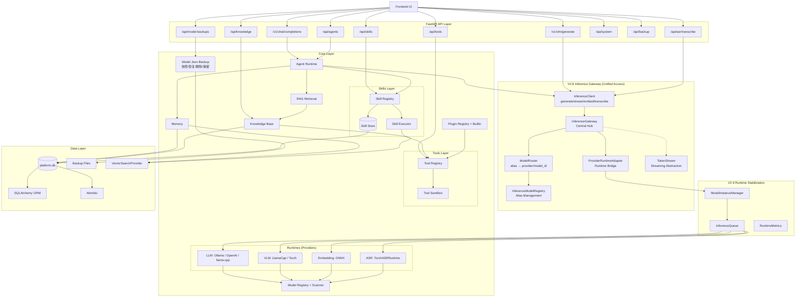
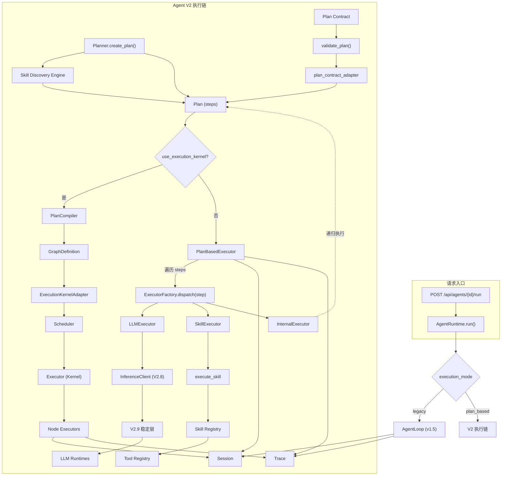

# Backend Architecture

本后端是一个 **本地优先（Local-first）+ 多推理后端 + Agent Runtime + Skill / Tool / Plugin 扩展** 的 AI 应用平台。

本文聚焦 **平台级后端架构**，回答三个问题：
- 后端按什么层次组织
- 核心控制面和执行面如何分工
- 数据、推理、工作流、文生图、Agent 如何协作

如果要看 **Agent 自身的执行机制、版本演进、Planner / PlanBasedExecutor / Skill Discovery 细节**，请转到 `AGENT_ARCHITECTURE.md`。
本文不展开 Agent 内部执行细节的逐版本演进，也不覆盖前端 UI 结构。

核心目标：
- 统一管理多种模型与推理后端（LLM、VLM、Embedding、ASR）
- 支持 Agent（多步推理 / Skill 调用 / 记忆；v1.5 legacy / v2.x plan_based，可选 Execution Kernel；v2.6 事件流可重建；v2.7 旁路优化层；v2.8 推理网关；v2.9 运行时稳定层）
- 支持可插拔的 Skill、Tools、Plugins
- 支持 Workflow Control Plane（Definition/Version/Execution 全生命周期）
- 支持长期演进（v1 → v2 / v2.5 Kernel → v2.6 可重建系统 → v2.7 优化层 → v2.8 Gateway → v2.9 稳定层 → v3）

---

## 一、整体分层概览

```
API Layer
↓
Core Domain Layer
↓
Runtime / Agent Layer
↓
Skill & Tool & Plugin Layer
↓
Data & Infra Layer
```

### 控制面与执行面边界

- **控制面（Control Plane）**：负责定义、配置、路由、治理与可观测性
  - 例如：Inference Gateway、Workflow Control Plane、Image Generation Control Plane、System Settings
- **执行面（Execution Plane）**：负责真正执行推理、工具调用、图调度与状态推进
  - 例如：RuntimeFactory、各类 Model Runtime、Execution Kernel、SkillExecutor、Tool 实现

这条边界很重要：
- 控制面决定“该做什么、如何治理”
- 执行面负责“具体怎么跑起来”

---

## 二、目录结构总览

以下为当前后端目录（按职责分组；不展开逐文件明细）。

```text
backend/                      # 后端服务根目录（FastAPI + 核心引擎）
├── api/                      # API 路由层（chat/vlm/asr/agents/workflows/system/...）
├── middleware/               # 请求中间件（用户上下文、通用拦截）
├── core/                     # 业务核心层
│   ├── agent_runtime/        # Agent 运行时（legacy + v2 plan_based）
│   ├── execution/            # Plan 与 Execution Kernel 的适配层
│   │   └── adapters/         # 编译/桥接适配（Plan → Graph）
│   ├── workflows/            # V3.0 Workflow Control Plane
│   │   ├── models/           # 工作流领域模型（Workflow/Version/Execution）
│   │   ├── repository/       # 持久化仓储层（ORM）
│   │   ├── services/         # 工作流应用服务层
│   │   ├── runtime/          # 工作流运行时与图适配
│   │   └── governance/       # 并发、队列、配额治理
│   ├── inference/            # V2.8 Inference Gateway
│   │   ├── client/           # 推理客户端入口
│   │   ├── gateway/          # 推理网关编排中枢
│   │   ├── router/           # 模型路由与选择
│   │   ├── providers/        # Provider 适配层
│   │   ├── registry/         # 模型别名与注册索引
│   │   ├── models/           # 推理请求/响应数据模型
│   │   ├── stats/            # 推理统计与指标
│   │   └── streaming/        # 流式输出抽象
│   ├── runtime/              # V2.9 Runtime Stabilization
│   │   ├── config/           # 运行时并发/队列配置
│   │   ├── manager/          # 模型实例管理与运行指标
│   │   └── queue/            # 推理队列与调度管理
│   ├── runtimes/             # 各推理后端运行时实现（llama.cpp/ollama/openai/torch/perception）
│   ├── models/               # 模型注册与扫描（registry/selector/scanner）
│   ├── skills/               # Skill 注册、发现、执行
│   ├── tools/                # Tool 抽象与实现（含 yolo/vlm 等）
│   ├── plugins/              # 插件体系（builtin/rag/skills/tools）
│   ├── data/                 # 数据层（ORM + DB 会话 + 向量检索抽象）
│   ├── conversation/         # 会话历史与上下文管理
│   ├── memory/               # 长期记忆模块
│   ├── knowledge/            # 知识库与索引管理
│   ├── rag/                  # RAG trace/store 相关
│   ├── backup/               # DB 与 model.json 备份模块
│   ├── plan_contract/        # Plan Contract 模型与校验
│   ├── system/               # 系统设置与运行参数
│   ├── project_intelligence/ # 项目分析与代码智能
│   └── utils/                # 核心层通用工具
├── execution_kernel/         # DAG 执行引擎（调度/状态机/事件/replay/优化）
│   ├── engine/               # 调度器、执行器、状态机
│   ├── models/               # 图定义与运行时模型
│   ├── persistence/          # 图与执行状态持久化
│   ├── events/               # 事件存储与事件类型
│   ├── replay/               # 回放与状态重建
│   ├── optimization/         # 优化策略与快照
│   ├── analytics/            # 执行分析与效果统计
│   └── cache/                # 节点级缓存
├── alembic/                  # 数据库迁移（versions）
├── config/                   # 配置定义（settings）
├── data/                     # 运行数据目录（platform.db、workspaces、backups 等）
├── log/                      # 结构化日志模块
├── scripts/                  # 维护与运维脚本
├── tests/                    # 后端测试
└── utils/                    # 辅助工具
```

---

## 三、核心模块职责说明

### 1. Agent Runtime（决策与调度）

`agent_runtime` 是平台的能力中枢，负责：

- 运行一个 Agent：多轮 Think → Action → Observation 循环
- 维护 AgentDefinition（含 **enabled_skills**），将「可用能力」以 **Skill 列表**形式注入 Prompt
- 组装上下文：系统提示、对话历史、Skill 描述、RAG 检索结果（`context.build_prompt`）
- 调用 LLM：经 `executor.llm_call` 走模型路由，得到模型输出
- 解析输出：`parser.parse_llm_output` 识别 **skill_call** / tool_call / final，自然语言兜底
- 执行能力：**仅**通过 `executor.execute_skill(skill_id, args)` 与能力交互，不直接接触 Tool
- 记录 Trace：Session 级与 Event 级追踪，便于调试

当前主路径已经从早期的 legacy 循环，演进为：
- **legacy**：适合简单顺序执行与快速原型
- **plan_based**：适合多步骤任务、失败恢复、Skill 语义发现与结构化执行
- **Execution Kernel 集成**：将 Plan 编译为图，由 DAG 执行引擎调度
- **Event-Sourced Runtime / Optimization Layer / Inference Gateway / Runtime Stabilization**：分别负责可重建、旁路优化、统一推理入口与运行时稳定性

这部分的版本演进与内部执行细节不在本文展开，详见 `AGENT_ARCHITECTURE.md`。

> 📖 **详细架构**：完整的 Agent 架构设计请参见独立文档 [AGENT_ARCHITECTURE.md](AGENT_ARCHITECTURE.md)。

### 2. Skill（Agent 可调用的能力单元）

Skill 是 Agent **唯一可见**的能力抽象：

- **SkillDefinition**：id, name, description, input_schema, type（prompt | tool | composite）, definition, enabled
- **SkillRegistry**：内存 + SQLite，Agent 可见能力列表来源；`list_for_agent(agent.enabled_skills)` 过滤
- **SkillExecutor**：校验输入 → 按 type 执行（prompt 渲染 / tool 调用 / composite 先 prompt 再 tool）
- **绑定关系**：v1 为 1 Skill : 1 Tool（或 0 个 Tool）；type=tool/composite 通过 `definition.tool_name` 绑定 ToolRegistry

内置 Tool 启动时自动注册为 Built-in Skill（id=`builtin_<tool.name>`），Agent 通过 `enabled_skills = ["builtin_file.read", ...]` 使用。

### 3. Tools（执行层）

Tools 是原子能力执行单元，由 `core/tools` 定义接口与沙箱，由 `core/plugins/builtin/tools` 提供实现。**仅通过 SkillExecutor 被 Agent 间接调用**，Agent 不持有 tool_id。

v1 内置工具：

| 分类   | 工具 ID        | 作用         |
| ------ | -------------- | ------------ |
| file   | read/write/list/append/delete | 文件读写与目录 |
| http   | get/post       | HTTP 请求    |
| python | run            | 执行 Python（沙箱、超时） |
| sql    | query          | 关系型数据查询（默认只读） |
| system | cpu/disk/memory/env | 系统监控与环境变量 |
| text   | diff/split/truncate/regex_extract | 文本处理 |
| time   | now/format/sleep | 时间与休眠 |
| web    | search         | 网络搜索     |
| vision | detect_objects | YOLO 目标检测（yolov8/yolov11/onnx），支持标注图输出 |

设计原则：Tool 仅提供能力，不感知 Agent/Skill；输入输出有 Schema 校验；通过 `ToolContext` 注入 workspace、权限等。

### 4. Plugins（扩展与内置能力）

Plugins 负责扩展能力与内置实现。内置插件：`builtin/rag`（RAG 检索与增强）、`builtin/tools`（file / python / web / sql 等工具实现并注册到 ToolRegistry，再由 skills 层生成 Built-in Skill）。

### 5. 推理与运行时层（Inference + Runtime）

- **core/agents**：模型代理与路由。将「模型 ID + 请求」映射到具体后端（Ollama / LM Studio / OpenAI 兼容等），不包含 Think-Action 循环逻辑。
- **core/runtimes**：推理执行层，由 RuntimeFactory 统一管理：
  - **LLM**：Ollama、OpenAI 兼容、llama.cpp
  - **VLM**：LlamaCppVLMRuntime（LLaVA 等 GGUF）、TorchVLMRuntime（InternVL/Qwen-VL）
  - **Embedding**：OnnxEmbeddingRuntime（按需创建）
  - **ASR**：TorchASRRuntime（faster-whisper，语音→文本）
  - **Image Generation**：MLXImageGenerationRuntime（Qwen Image）、DiffusersImageGenerationRuntime（FLUX / SDXL）

Agent Runtime 通过 agents 层间接使用 runtimes；ASR 独立于 Agent，由 Chat 页面麦克风 → API → 文本 → LLM 流程使用。

### 5.1 Inference Gateway（V2.8 推理网关）

**core/inference** 提供统一推理 API，实现 Agent/Skill 与模型运行时的解耦：

```
InferenceClient（入口）
    ↓
InferenceGateway（中枢）
    ↓
ModelRouter → ProviderRuntimeAdapter
    ↓
RuntimeFactory → Model Runtime
```

**核心组件**：

| 组件 | 职责 |
|------|------|
| **InferenceClient** | 统一入口：generate()、stream()、embed()、transcribe() |
| **InferenceGateway** | 中枢路由：协调 ModelRouter 与 ProviderRuntimeAdapter |
| **ModelRouter** | 别名解析：alias → (provider, model_id)，支持 fallback 链 |
| **ProviderRuntimeAdapter** | 后端适配：桥接现有 RuntimeFactory，不修改底层 |
| **InferenceModelRegistry** | 别名管理：注册、解析、同步 ModelRegistry |
| **TokenStream** | 流式抽象：统一 token 收集与延迟追踪 |

**支持能力**：
- **LLM 推理**：generate() 非流式、stream() 流式
- **Embedding**：embed() 文本向量化
- **ASR**：transcribe() 语音转文本
- **模型别名**："reasoning-model" → "deepseek-r1"
- **Fallback 链**：主模型不可用时自动切换
- **直通模式**：未知别名直接作为 model_id 使用

**Streaming 支持矩阵**：

| Runtime | 类型 | 说明 |
|---------|------|------|
| llama.cpp | native | 完整 token-by-token 流式 |
| mlx | native | Apple MLX 原生流式 |
| openai | native | OpenAI 兼容 API 流式 |
| ollama | native | Ollama 服务流式 |
| torch | fake | 一次性返回（非真流式） |

**迁移状态**（V2.8）：
- ✅ AgentExecutor.llm_call → InferenceClient.generate()
- ✅ LLMExecutor → InferenceClient
- ✅ NodeExecutor → InferenceClient
- ✅ Embedding/ASR 接入 InferenceGateway

### 5.2 Runtime Stabilization（V2.9 运行时稳定层）

`core/runtime` 位于 Inference Gateway 与 RuntimeFactory 之间，负责在 **不改变现有 Runtime API** 的前提下提升稳定性。

**核心职责**：
- **ModelInstanceManager**：模型实例懒加载、缓存、单模型串行加载、统一卸载
- **InferenceQueue**：按模型维度的并发队列与 Semaphore 控制
- **RuntimeMetrics**：按模型统计请求数、失败数、延迟、tokens、队列长度
- **RuntimeConfig**：统一收敛模型级并发配置与系统级 override

**边界**：
- Inference Gateway 负责“路由到哪个模型 / provider”
- Runtime Stabilization 负责“同一个模型如何稳定跑”
- RuntimeFactory / Model Runtime 负责“真正执行推理”

### 6. Workflow Control Plane（V3.0）

`core/workflows` + `api/workflows.py` 组成 Workflow 产品层，Execution Kernel 仅负责图执行。

**分层职责**：
- **Definition Layer**：Workflow / WorkflowVersion（草稿、发布、历史、diff、回滚）
- **Runtime Layer**：WorkflowExecution → GraphInstance（提交、排队、运行、取消、终态）
- **Governance Layer**：全局并发、单 workflow 并发、队列/backpressure、配额
- **Observability Layer**：节点级状态、timeline、日志、终态 reconcile（轮询 + SSE）

**关键设计**：
- Definition / Runtime 分离：UI 编辑 definition，不直接改 runtime 实例
- 版本化执行：Execution 绑定 workflow_version_id，运行时按版本适配 GraphDefinition
- 多实例安全：并发限制、幂等提交、pending 告警、取消与终态回填
- 分支汇聚治理：Condition/Loop 边触发语义，未命中分支自动 `skipped`，避免 execution 长驻 running

### 7. Image Generation Control Plane

图片生成能力已经独立成控制面，而不是简单复用聊天推理路径。

**核心职责**：
- 统一管理 `/api/v1/images/*` 下的生成、查询、取消、删除、下载、缩略图与 warmup
- 将图片生成任务抽象为 **Job**
- 维护历史记录、结果文件落盘、缩略图与预热状态
- 对不同文生图运行时做统一调度与治理

**当前运行时路径**：
- **MLX**：`Qwen Image`
- **Diffusers**：`FLUX / FLUX.2 / SDXL`

**与其他模块的关系**：
- 与 Inference Gateway 平级，属于独立控制面
- 底层仍依赖 RuntimeFactory 与具体图片运行时
- 与 Agent 的集成通过 `image.*` Tool 完成，而不是让 Agent 直接触碰图片 Runtime

**治理特点**：
- 图片任务有独立队列与并发控制
- 支持取消、历史分页、缩略图、详情页
- 切换图片模型时会主动回收其他图片运行时，以降低显存 / 统一内存压力

---

## 四、Agent / Skill / Tool 关系

```
┌─────────────────────────────────────────────────────────────────┐
│  Agent Runtime（决策与调度）                                       │
│  - AgentDefinition.enabled_skills                                │
│  - 将「可用能力」以 Skill 列表注入 Prompt                           │
│  - 解析 LLM 输出为 skill_call(skill_id, input)                     │
│  - 仅调用 execute_skill(skill_id, input)，不接触 Tool              │
└───────────────────────────────┬─────────────────────────────────┘
                                │ 唯一能力接口
                                ▼
┌─────────────────────────────────────────────────────────────────┐
│  Skill（能力单元）                                                 │
│  - SkillRegistry：Agent 可见能力列表来源                           │
│  - SkillExecutor：按 type 执行（prompt / tool / composite）         │
│  - 绑定：definition.tool_name → ToolRegistry                       │
└───────────────────────────────┬─────────────────────────────────┘
                                │ 内部调用
                                ▼
┌─────────────────────────────────────────────────────────────────┐
│  Tool（执行层）                                                   │
│  - tool.run(input_data, ctx) → ToolResult                        │
│  - 不感知 Agent / Skill；由 SkillExecutor 或 Plugin 调用           │
│  - ToolRegistry：可被 Skill 绑定的能力池                           │
└─────────────────────────────────────────────────────────────────┘
```

| 原则             | 落实方式 |
| ---------------- | -------- |
| Agent 只感知 Skill | AgentDefinition.enabled_skills；Loop 只解析 skill_call 且只调 execute_skill。 |
| Skill 封装 Tool   | Skill.type=tool/composite 时通过 definition.tool_name 调用 ToolRegistry。 |
| Tool 不感知 Agent | Tool 接口无 agent_id/skill_id；仅 SkillExecutor 与 Plugin 调用 Tool。 |

补充说明：
- Plan Contract、Skill Discovery、多 Agent 隔离等能力属于 Agent Runtime 的增强路径
- 它们会影响 Agent 如何选 Skill、如何恢复失败、如何隔离上下文
- 但不会改变 `Agent -> Skill -> Tool` 这一层基础关系

## 五、RAG 插件与数据约定

### RAG Plugin（知识增强层）

- 作为 pre-stage Plugin 在 Agent Loop 前执行
- 通过 `rag_ids` 配置自动检索知识库
- 检索结果自动注入到 Agent 上下文

### 数据约定（v1.5 + v2.3）

- **enabled_skills**：Agent 可见的能力列表，为 **Skill id** 数组（如 `builtin_file.read`、`builtin_research.summarize`、`skill_xxx`）
- **rag_ids**：关联的知识库 ID 列表，RAG Plugin 自动检索并注入上下文
- **tool_ids**：兼容字段，从 `enabled_skills` 推导（仅 builtin_*），不包含自定义 Skill
- **force_yolo_first**：可选，视觉分析 Agent 启用时，上传图片且用户意图含检测关键词，step=0 先执行 YOLO
- **execution_mode**（V2.2）：`legacy`（v1.5 循环）或 `plan_based`（V2 计划执行）
- **intent_rules**（V2.2）：通过 `model_params.intent_rules` 配置关键词与 Skill 映射规则
- **max_replan_count**（V2.2）：重规划次数限制（默认 3）
- **on_failure_strategy**（V2.2）：失败策略（`stop` / `continue` / `replan`）
- **replan_prompt**（V2.2）：自定义重规划提示模板（支持占位符白名单校验）
- **plan_contract_enabled**（V2.3）：开启 RePlan 读取结构化 Plan Contract
- **plan_contract_sources**（V2.3）：RePlan Contract source 优先级（默认 `replan_contract_plan` → `plan_contract` → `followup_plan_contract`）
- **plan_contract_strict**（V2.3）：严格模式；Contract 非法时 fail-fast（不回退 LLM）
- **max_steps**：Agent 单次执行最大步数（默认 10）
- **skill_discovery_enabled**（V2.4）：启用 Skill 语义发现，自动匹配相似 Skill
- **skill_visibility**（V2.4）：Skill 可见性级别（public / org / private）
- **workspace_isolation**（V2.4）：会话级工作空间隔离（系统级，自动启用）
- **use_execution_kernel**（V2.5）：Agent 级是否使用 Execution Kernel；`null` 跟随全局 `USE_EXECUTION_KERNEL`，`true`/`false` 强制走 Kernel 或 PlanBasedExecutor；仅 plan_based 生效。全局开关可经 `POST /api/system/kernel/toggle` 运行时切换
- **EXECUTION_POINTER_STRATEGY**（V2.5）：执行指针写入遇 DB 锁时的策略；`best_effort`（默认）重试后跳过并 log，`strict` 重试后抛异常

### 文件上传与工作目录

- `POST /api/agents/{agent_id}/run/with-files` 支持 multipart 文件上传
- 文件保存到会话工作目录（`data/agent_workspaces/{session_id}/`）
- `file.read` 可通过相对路径访问上传的文件
- workspace 持久化到 Session，同会话后续请求可访问已上传文件
- **绝对路径支持**：`file_read_allowed_roots` 配置项控制允许的绝对路径根目录，默认允许所有目录 (`/`)

### 权限与安全（Local-first）

- HTTP Tools：默认禁用，需通过 `ToolContext.permissions["net.http"]` 或 `settings.tool_net_http_enabled` 开启
- System.env：默认禁用，需通过 `ToolContext.permissions["system.env"]` 或 `settings.tool_system_env_enabled` 开启
- Built-in Skills：不可编辑/删除，保持系统一致性

---

## 六、数据层架构（ORM + VectorSearchProvider）

### 6.1 统一数据存储

平台采用**统一数据库**策略，所有数据存储在 `backend/data/platform.db`（SQLite）：

- **业务数据**：模型注册、Agent 定义、会话、消息、技能、知识库、记忆等
- **Execution Kernel（V2.5）**：图定义、图实例、节点运行时、执行指针、补丁记录等由 `execution_kernel.persistence` 写入同一 platform.db，便于审计与崩溃恢复；节点状态机（StateMachine）使用短事务 session 读写，执行指针更新支持 `EXECUTION_POINTER_STRATEGY`（best_effort | strict）；首次执行前做僵尸实例清理（长时间 RUNNING 且无运行中节点的实例标为 FAILED）
- **Event-Sourced 事件流（V2.6）**：`ExecutionEvent` 表由 `execution_kernel.events` 写入同一 platform.db，仅追加、fire-and-forget；用于 StateRebuilder 重建状态、ReplayEngine 回放与校验、MetricsCalculator 统计；Agent 会话保存 `kernel_instance_id` 以关联 Event API 与 Debug UI
- **优化快照（V2.7，可选）**：`optimization_snapshots` 表由 `execution_kernel.persistence` 的 OptimizationSnapshotRepository 写入，用于持久化 OptimizationSnapshot 历史版本；与 Kernel 调度解耦，仅优化层使用
- **向量数据**：通过 `sqlite-vec` 扩展的虚拟表（`vec0`）存储，与业务表通过 `rowid` 关联
- **Schema 管理**：使用 **Alembic** 进行版本化迁移，替代运行时 `ALTER TABLE`
- **多用户支持**：核心表带 `user_id` 字段，支持逻辑多用户数据隔离

### 6.2 ORM 抽象层（SQLAlchemy 2.0）

**设计目标**：
- 统一数据访问接口，提升代码可维护性
- 为未来切换到 PostgreSQL/MySQL 做准备（CRUD 与基础查询可主要通过修改连接配置完成）
- 保持向后兼容，迁移过程中不影响现有功能

**核心组件**：
- `core/data/base.py`：`Base`（ORM 基类）、`SessionLocal`、`get_db()`（连接工厂）
- `core/data/models/`：ORM 模型定义（`model.py`、`agent.py`、`conversation.py`、`knowledge.py`、`memory.py` 等）
- `backend/alembic/`：Alembic 迁移脚本，统一管理 schema 变更

**迁移状态**：
- ✅ **已完成迁移**：SystemSettingsStore、ModelRegistry、AgentRegistry、SkillStore、AgentSessionStore、AgentTraceStore、MemoryStore、HistoryStore、KnowledgeBaseStore
- ✅ **ORM 模型**：所有 Store 已定义对应的 SQLAlchemy 模型
- ✅ **向量检索**：MemoryStore、HistoryStore、KnowledgeBaseStore 已迁移至 `VectorSearchProvider`

### 6.3 向量检索抽象层（VectorSearchProvider）

**设计原则**：
- 与**关系型库内嵌向量**（sqlite-vec / pgvector / MySQL）兼容：通过 `rowid` 或主键与业务表 JOIN
- 与**专用向量库**（Chroma、Milvus 等）兼容：通过 collection/namespace + 业务主键标识
- 接口契约：`search()` 统一返回 `List[Tuple[float, Any]]`（`(distance, vector_id)`），由各 Store 根据 id 类型自行解析

**当前实现**：
- `SQLiteVecProvider`：封装 `sqlite-vec` 扩展，使用 `vec0` 虚拟表
- 统一接口：`create_table()`、`upsert_vector()`、`search()`、`delete_vectors()`
- 扩展加载：每个连接自动加载 `sqlite-vec` 扩展，在连接生命周期内保持加载

**使用示例**：
```python
from core.data.vector_search import get_vector_provider

provider = get_vector_provider()
# 创建向量表
provider.create_table("messages_vec", dimension=512)
# 写入向量（vector_id = rowid）
provider.upsert_vector("messages_vec", vector_id=rowid, embedding=vec)
# 检索（支持 filters 与业务表 JOIN）
results = provider.search("messages_vec", query_vector=qvec, limit=5, 
                         filters={"user_id": user_id}, 
                         business_table="messages")
```

### 6.4 Store 层架构

**Store 类职责**：
- 封装业务逻辑与数据访问（CRUD、查询、业务规则）
- 使用 SQLAlchemy ORM 模型进行数据操作
- 通过 `VectorSearchProvider` 进行向量检索（MemoryStore、HistoryStore、KnowledgeBaseStore）

**关键 Store**：
- `HistoryStore`：会话与消息管理，向量化历史消息用于语义检索
- `MemoryStore`：长期记忆存储与检索，支持向量检索与关键词检索
- `KnowledgeBaseStore`：知识库 CRUD、文档解析、chunk 存储与向量检索
  - **统一表设计**：`embedding_chunks`（业务表）+ `kb_chunks_vec`（向量表），通过 `knowledge_base_id` 列隔离
  - **双路径兼容**：优先使用统一表，未迁移时回退到 per-KB 表（`embedding_chunk_{kb_id}`）

**数据一致性**：
- 消息写入：先 `INSERT INTO messages` → `commit()` → 再调用 `provider.upsert_vector()`（避免 database locked）
- 向量写入：`provider.upsert_vector()` 内部先 `UPDATE`，若 `rowcount == 0` 再 `INSERT`（避免 UNIQUE constraint）

### 6.5 Schema 迁移（Alembic）

**迁移管理**：
- 所有表结构变更通过 Alembic 迁移脚本管理
- 迁移脚本位于 `backend/alembic/versions/`
- 执行命令：`conda run -n <env> bash -c "cd backend && alembic upgrade head"`

**关键迁移**：
- `c7f1d4d238cc`：为 `messages` 表添加 `user_id` 冗余列（优化查询性能）
- `a1b2c3d4e5f6`：创建统一 `embedding_chunks` 表（KnowledgeBaseStore）
- `d4e5f6a7b8c9`：为 `embedding_chunks` 添加 `metadata_json` 列（可选扩展字段）

### 6.6 数据库连接管理

**连接策略**：
- 统一使用 `core/data/base.py` 的 `get_db_path()` 获取数据库路径
- Store 层仍使用 `sqlite3.connect()`（迁移中），未来统一为 SQLAlchemy `Session`
- VectorSearchProvider 内部创建独立连接并加载扩展

**注意事项**：
- 向量写入前必须先 commit 业务数据，避免 `database is locked`
- sqlite-vec 扩展在连接生命周期内保持加载，不在 `finally` 中过早禁用

### 6.7 逻辑多用户架构

**设计目标**：
- 核心数据表带 `user_id` 字段，支持逻辑多用户数据隔离
- UI 保持单用户体验，底层具备多用户能力
- 为未来完整用户系统预留扩展

**实现方式**：
- **用户 ID 获取**：通过 HTTP Header `X-User-Id` 获取，Header 不存在时 fallback 到 `"default"`
- **用户上下文工具**：`core/utils/user_context.py` 提供 `get_user_id(request)` 函数
- **数据隔离**：Store 层所有 CRUD 方法添加 `user_id` 参数，查询时自动过滤

**已支持多用户的表**：

| 表 | 字段 | 说明 |
|---|---|---|
| `knowledge_base` | user_id | 知识库 |
| `document` | user_id | 文档 |
| `rag_traces` | user_id | RAG 追踪 |
| `rag_trace_chunks` | user_id | RAG 检索块 |
| `sessions` | user_id | 会话 |
| `messages` | user_id | 消息 |
| `memory_items` | user_id | 记忆 |
| `agent_sessions` | user_id | Agent 会话 |

**API 使用示例**：
```bash
# 默认用户（无 Header）
curl http://localhost:8000/api/knowledge-bases

# 指定用户
curl -H "X-User-Id: user_alice" http://localhost:8000/api/knowledge-bases
```

---

## 七、一次 Agent 执行流程

### 7.1 Agent v1.5（legacy 模式）

1. **API**：`POST /api/agents/{agent_id}/run` 或 `run/with-files`（带上传文件），获取或创建 Session，追加用户消息。
2. **Loop 入口**：`agent_runtime.loop` 在 `max_steps` 内循环，传入 `workspace`（上传文件时的会话工作目录）。
3. **上下文**：按 Agent 定义与当前会话组装 Prompt（系统提示、**Skill 列表**（来自 SkillRegistry.list_for_agent）、RAG 检索结果、对话历史）。
4. **LLM 调用**：`executor.llm_call` → 模型路由 → 对应后端 → 返回文本。
5. **解析**：`parser.parse_llm_output` 得到 **skill_call** / tool_call（映射为 builtin_&lt;tool&gt;）/ **final**；支持自然语言兜底。
6. **分支**：
   - **final**：写回助手消息，结束循环，记录 Trace。
   - **skill_call**：校验 skill_id 在 agent.enabled_skills 内 → `executor.execute_skill(skill_id, input, workspace=...)` → SkillExecutor 调 Tool 或渲染 prompt → 将「Calling skill」与「Skill result」写回会话，记录 Trace，步数 +1，回到步骤 3。
7. **结束**：达到 max_steps 或得到 final 或出错，更新 Session 状态并返回。

### 7.2 Agent v2.x（plan_based 模式）

#### 7.2.1 初始执行流程（V2.0–V2.5）

1. **请求入口**：`POST /api/agents/{agent_id}/run`，`AgentRuntime.run()` 根据 `execution_mode` 分流到 V2 执行链。
2. **Skill Discovery 语义发现**（V2.4）：
   - 若启用 `skill_discovery_enabled`，调用 `SkillDiscoveryEngine.search()`
   - 基于用户输入的向量相似度，检索最相关的 Skills
   - Hybrid 排序：70% 语义相似度 + 30% 标签匹配度
   - 权限过滤：根据 `agent_id` 和 `user_id` 过滤可见 Skills
3. **Planner 生成 Plan**：
   - 读取 `model_params.intent_rules` 配置
   - 结合 Skill Discovery 结果，自动匹配 Skill
   - 生成 Plan（步骤序列），支持依赖关系（DAG）
4. **执行引擎选择**（V2.5）：
   - 若启用 Execution Kernel（全局 `USE_EXECUTION_KERNEL` 或 Agent `use_execution_kernel=true`）：首次执行时先做**僵尸实例清理**（`cleanup_stale_running_instances`，RUNNING 且超时且无运行中节点的实例标为 FAILED），再做崩溃恢复；Plan 经 **PlanCompiler** 编译为 GraphDefinition → **ExecutionKernelAdapter** 调用 **Scheduler** 创建图实例 → **Executor** 按 NodeType 调度 **Node Executors**（LLM/Skill/Internal/condition/loop/replan）；**StateMachine** 使用短事务 session 更新节点状态，**ExecutionPointer** 更新受 `EXECUTION_POINTER_STRATEGY`（best_effort | strict）控制；状态落库 platform.db，支持 RePlan 动态扩图（Graph Patch）、崩溃恢复；完成后状态回写 Plan、收集 ExecutionTrace。
   - 否则（或 Kernel 异常回退）：**PlanBasedExecutor** 遍历 steps，经 `ExecutorFactory.dispatch()` 分发到 LLMExecutor / SkillExecutor / InternalExecutor，行为与 V2.0–V2.4 一致。
5. **层级追踪**：
   - 记录每个 StepLog 的 `parent_step_id` 和 `depth`；Kernel 路径下通过 `_collect_trace_with_subgraphs` 保持子图层级。
6. **事件流与可重建（V2.6）**（仅 Kernel 路径）：
   - Scheduler/Executor 向 EventStore 发射 ExecutionEvent；会话完成后写入 `session.kernel_instance_id`。
   - Event API 提供事件列表、replay、validate、metrics；前端 EventStreamViewer 按 `kernel_instance_id` 展示事件流与重建状态，支持断点回放。
7. **优化层（V2.7）**（仅 Kernel 路径，可选）：ExecutionKernelAdapter 按 OptimizationConfig 或 Agent 级覆盖解析出 effective_opt_config，构建 run_policy 与 run_snapshot 传入 Scheduler；仅影响可执行节点排序，不改变图；`GET /api/system/kernel/optimization`、`/impact-report` 等提供状态与效果报告；前端 Optimization Dashboard（`/optimization`）可配置开关、策略与重建快照。
7. **失败处理**（V2.2）：
   - 步骤失败时触发 `on_failure_replan` 配置；Kernel 路径下 RePlan 可编译为 Graph Patch 动态扩图并继续调度。
   - 直连路径：生成 followup_plan，入栈到 `trace.plan_stack`，执行后出栈。

#### 7.2.2 多 Agent 隔离机制（V2.4）

**会话级工作空间隔离**：
- 每个会话拥有独立工作目录 `data/agent_workspaces/{session_id}/`
- 文件上传保存到对应会话目录，同会话后续请求可访问
- 会话结束后可选择保留或清理工作空间

**用户级数据隔离**：
- 核心表（`agent_sessions`, `messages`, `memory_items` 等）带 `user_id` 字段
- Store 层查询自动添加 `WHERE user_id = ?` 过滤
- 通过 HTTP Header `X-User-Id` 识别用户，无 Header 时 fallback 到 `"default"`

**执行级隔离**：
- `SafeShellExecutor` 每会话命令计数限制（默认 100 条），防止资源耗尽
- RAG 缓存键包含 `session_id`，防止跨会话上下文污染
- SQLite WAL 模式 + 忙时重试机制，支持多 Agent 并发访问

#### 7.2.3 RePlan 增强流程（V2.3-V2.4）

当启用 **Plan Contract** 时，RePlan 流程增强：

1. **Contract 提取**：从 `replan_contract_plan` / `plan_contract` / `followup_plan_contract` 读取结构化契约
2. **严格校验**：
   - `validate_plan()`：结构合法性、字段完整性
   - `validate_plan_structure()`：依赖存在性、唯一性、无环检测
   - `plan_contract_strict=True` 时，失败直接 fail-fast（不回退 LLM）
3. **适配器转换**：
   - `plan_contract_adapter.adapt_contract_to_runtime_plan()`
   - 拓扑排序 DAG 步骤 → 串行执行 Plan
   - `_normalize_llm_inputs()`：兼容 `{prompt: "..."}` 和 `{messages: [...]}`
4. **智能路径解析**（RePlan Fix 场景）：
   - `_resolve_replan_fix_source_file()` 识别测试文件（`test_*.py` / `*_test.py`）
   - 推导源码文件（如 `test_app.py` → `app.py`）
   - 基于 cd 命令解析工作目录
   - 错误类型判断：若为测试代码错误（assert/fixture），保持修复测试文件
5. **执行与追踪**：同 V2.2 流程

---

## 八、API 与迁移要点

- **Agent**：Create/Update 使用 `enabled_skills`（Skill id 列表）；兼容旧 `tool_ids` 时映射为 `builtin_<tool_id>`。
- **Skill**：`GET/POST /api/skills`，`GET/PUT/DELETE /api/skills/{skill_id}`，`POST /api/skills/{skill_id}/execute`。
- **Tool**：建议仅对开发者/只读开放（如 `GET /api/tools`），不作为 Agent 配置的能力列表数据源。
- **ASR**：`POST /api/asr/transcribe`，接收音频文件，返回 `{text, language, segments}`；用于 Chat 页面麦克风语音输入。
- **VLM**：`POST /v1/vlm/generate`，multipart（request + image），用于多模态图像理解。
- **Event API（V2.6）**：`GET /api/events/instance/{instance_id}`（事件列表）、`/event-types`（事件类型分布）、`/replay`（状态重建）、`/validate`（流校验）、`/metrics`（执行指标），用于 Kernel 执行事件流查询、状态重建、校验与指标；需会话含 `kernel_instance_id`（即该次执行经 Execution Kernel）。
- **Optimization API（V2.7）**：`GET /api/system/kernel/optimization`（状态）、`POST /api/system/kernel/optimization/config`（更新配置）、`POST /api/system/kernel/optimization/rebuild-snapshot`（重建快照）、`GET /api/system/kernel/optimization/impact-report`（效果报告）；前端 Optimization Dashboard（`/optimization`）提供配置与报告查看。
- **Workflow API（V3.0）**：`/api/v1/workflows`（workflow/version/execution 全链路）；
  - 执行态：`GET .../executions/{id}`、`GET .../executions/{id}/status`、`GET .../executions/{id}/stream`、`POST .../executions/{id}/cancel`
  - 运行页建议：SSE 为主，轮询降级；终态时执行 reconcile，保证列表/详情一致
- **迁移**：启动时对 ToolRegistry 中每个 Tool 若不存在则创建 Built-in Skill（id=`builtin_<tool.name>`）；读 Agent 时若仅有 `tool_ids` 则自动映射为 `enabled_skills`。

---

## 九、架构图（Mermaid）



**V2.8 / V2.9 架构变更说明**：

| 变更项 | 说明 |
|--------|------|
| **V2.8** Inference Gateway 统一入口 | 所有推理调用（LLM/VLM/Embedding/ASR）均通过 InferenceClient |
| **V2.8** 移除 Model Agents 层 | 原 `core/agents` 的路由职责由 Inference Gateway 承担 |
| **V2.8** VLM/ASR API 路由变更 | `/v1/vlm/generate`、`/api/asr/transcribe` 现经 InferenceClient |
| **V2.8** Agent Runtime 解耦 | AgentRT 不再直连 Runtimes，统一走 InferenceClient |
| **V2.8** 别名解析 / Fallback 链 | ModelRouter 支持逻辑别名与主模型不可用时自动切换 |
| **V2.9** Runtime Stabilization | ProviderRuntimeAdapter 经 ModelInstanceManager + InferenceQueue 再访问 Runtimes；按模型并发控制、懒加载、RuntimeMetrics（`/api/system/runtime-metrics`） |
| **Model Json Backup** | `/api/model-backups` 独立于 `/api/backup`（数据库备份）；快照/恢复/删除/保留策略，写入 Backup Files |

### 9.1 Agent V2 架构图（plan_based 模式）

当 Agent 的 `execution_mode` 为 `plan_based` 时，请求经统一入口 `AgentRuntime.run()` 分流到 V2 执行链：Planner 生成 Plan；**若启用 Execution Kernel（V2.5）**，Plan 经 PlanCompiler 编译为 GraphDefinition，由 Execution Kernel（Scheduler/Executor）调度 Node Executors，状态落库、支持 RePlan 扩图与崩溃恢复；**否则**由 PlanBasedExecutor 按步骤执行，步骤类型由 ExecutorFactory 分发。Skill 执行仍复用 v1.5 的 SkillRegistry 与 execute_skill，与 Tool 层关系不变。

**Agent V2.4 / V2.5 / V2.6 / V2.7 特性摘要：**
- **V2.4**：Skill Discovery 语义发现、多 Agent 隔离、Plan Contract 集成、严格模式、LLM 输入规范化、智能路径解析
- **V2.5 Execution Kernel**：可选 DAG 执行引擎（`execution_kernel` + `core/execution/adapters`）；Plan→Graph 编译、Scheduler/Executor、Node Executors（LLM/Skill/Internal/condition/loop/replan）、状态持久化、RePlan 动态扩图（Patch）、崩溃恢复；Kernel 异常时自动回退 PlanBasedExecutor
- **V2.6 Deterministic Event-Sourced Runtime**：Kernel 执行过程写入不可变事件流（EventStore）；StateRebuilder/ReplayEngine 支持事后重建状态与断点回放；Event API + 前端 EventStreamViewer（基于 `kernel_instance_id`）；从「可运行引擎」升级为「可重建系统」
- **V2.7 Optimization Layer**：旁路优化层，可插拔策略与快照、可关闭/回滚；Scheduler Policy 与 Snapshot 可版本化，Replay 保持 deterministic；成功率可量化（impact-report）；快照可持久化；Optimization API + 前端 Optimization Dashboard（`/optimization`）
- **V2.8 Inference Gateway**：统一推理 API（InferenceClient）；Agent/Skill 与模型解耦；ModelRouter 别名与 Fallback。
- **V2.9 Runtime Stabilization**：ModelInstanceManager + InferenceQueue + RuntimeMetrics；LLMExecutor 等经 InferenceClient → V2.9 稳定层 → Runtimes。



| 组件 | 职责 |
|------|------|
| **AgentRuntime** | 统一入口；按 `execution_mode` 分流 legacy / plan_based；按 `use_execution_kernel` 或全局开关选择 Kernel 或 PlanBasedExecutor。 |
| **Planner** | 根据用户输入与 `model_params.intent_rules` 等生成 Plan（步骤序列）。**V2.3**：`_resolve_replan_fix_source_file()` 智能路径解析。 |
| **Skill Discovery（V2.4）** | 基于向量相似度的语义检索，Hybrid 排序（70% 语义 + 30% 标签）。组件：`SkillVectorIndex`、`SkillDiscoveryEngine`、`SkillScopeResolver`。 |
| **Plan Contract（V2.3）** | RePlan 阶段的结构化计划契约。配置：`plan_contract_enabled`, `plan_contract_strict`, `plan_contract_sources`。 |
| **Plan Contract Adapter（V2.3）** | 将 Contract Plan 转为 runtime Plan；`_normalize_llm_inputs()` 兼容多种 LLM 输入格式。 |
| **PlanCompiler（V2.5）** | 将 Plan 编译为 GraphDefinition（nodes/edges/subgraphs），Step 类型映射为 NodeType（含 condition/loop/replan）。 |
| **ExecutionKernelAdapter（V2.5）** | 桥接 Plan 与 Execution Kernel：编译、创建 Scheduler/Executor、注入 Node Handlers、执行后回写 Plan 状态与 Trace；支持 apply_replan_patch。 |
| **Scheduler / Executor（V2.5）** | 图实例调度、并发控制（Semaphore）、节点执行、重试与超时、状态落库 platform.db；RePlan 时 apply_patch、崩溃恢复。 |
| **Node Executors（V2.5）** | Kernel 内按 NodeType 注册：LLM、Skill、Internal、condition、loop、replan；内部复用既有 Agent 的 LLM/Skill/Internal 能力。 |
| **PlanBasedExecutor** | 直连路径：遍历 steps，ExecutorFactory.dispatch；支持 Composite、REPLAN；Kernel 异常时回退目标。 |
| **ExecutorFactory.dispatch** | 根据 step.executor_type 分发到 LLMExecutor / SkillExecutor / InternalExecutor。 |
| **LLMExecutor / SkillExecutor / InternalExecutor** | 执行 LLM/Skill/Composite·REPLAN 步骤；Skill 复用 execute_skill → SkillRegistry / Tool。 |

---

## 十、演进路线

- **v1**：Single Agent + Skill + Tool + RAG + Trace；LLM/VLM/Embedding/ASR 多模态推理；前端含 Skills 注册表、Chat 麦克风语音输入、VLM 图像理解。
- **v2（当前）**：Skill / Plan / ToolChain，技能与智能体编排；1 Skill : N Steps 可扩展。
  * **v2.5**：可选 Execution Kernel（DAG 执行引擎），Plan→Graph 编译、状态落库、RePlan 动态扩图、崩溃恢复，与 plan_based 双路径并存。
  * **v2.6**：Deterministic Event-Sourced Runtime，事件流持久化、可重建与回放、Event API、Debug UI，从「可运行引擎」升级为「可重建系统」。
  * **v2.7**：Optimization Layer，旁路优化层（可插拔策略/快照、可关闭/回滚、成功率可量化、impact-report、Optimization Dashboard）。
  * **v2.8**：Inference Gateway Layer，统一推理 API（LLM/Embedding/ASR），Agent/Skill 与模型解耦，Model Router 别名解析，Provider Adapter 多后端适配，Token Streaming 统一抽象。
  * **v2.9**：Runtime Stabilization Layer，ModelInstanceManager + InferenceQueue + RuntimeMetrics，按模型并发控制与可观测性。
- **v3**：Multi-Agent / Workflow / Agent Graph。

---

## 十一、设计原则总结

- **Agent Runtime** 为平台核心：多轮 Think-Action-Observation，统一解析与 **Skill** 调度，仅通过 `execute_skill` 与能力交互。
- **Skill** 为 Agent 唯一可见的能力抽象：封装 Tool 或 Prompt，由 SkillRegistry 与 SkillExecutor 管理。
- **Tools** 为执行层原子：仅被 Skill 或 Plugin 调用，Schema 校验，沙箱与权限由 ToolContext 注入。
- **Plugins** 为扩展与内置实现：RAG、内置工具等，向 ToolRegistry 注册，并由 skills 层生成 Built-in Skill。
- **Model Agents + Runtimes** 为推理适配层：LLM/VLM/Embedding/ASR 四类运行时，路由到具体后端，与 Agent 循环解耦；ASR 输出纯文本，不侵入 Agent 逻辑。

各层可替换、可扩展，详见根目录 [AGENTS.md](../../AGENTS.md)。
