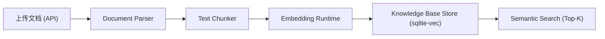

# Knowledge Base (RAG) 技术架构文档

本文档详细介绍了本平台 **本地知识库 (Knowledge Base)** 的技术架构、核心组件及其实现细节。

---

## 1. 核心设计理念

*   **Local-first**: 所有处理（解析、切分、向量化、检索）均在本地完成，不依赖云端服务。
*   **Decoupled Architecture**: 知识库系统与 RAG 插件解耦。知识库负责“生产（索引）”，插件负责“消费（检索）”。
*   **Authoritative Manifest**: 每一个知识库都绑定一个特定的 Embedding 模型，通过 `model.json` 描述其维度信息。
*   **Vector Native Storage**: 基于 `sqlite-vec` 实现高性能的向量检索，利用 SQLite 的事务特性保证元数据与向量的一致性。

---

## 2. 系统架构

### 2.1 业务流程 (Workflows)

#### 2.1.1 索引工作流程 (Indexing Workflow)
该流程负责将原始文档转换为可检索的向量块：
**文档上传** -> **文件存储** -> **文档解析** -> **文本切分** -> **向量化** -> **向量存储（独立表）**

**关键步骤**：
*   系统会根据知识库关联的 Embedding 模型自动创建或验证对应的向量表。
*   如果向量表不存在，系统会根据模型的 `embedding_dim` 创建新表。
*   向量存储到知识库专属的 `embedding_chunk_{kb_id}` 表中。

#### 2.1.2 检索流程 (Retrieval Workflow)
该流程负责根据用户提问检索相关知识并生成回答：
**用户查询** -> **查询向量化** -> **向量搜索** -> **上下文构建** -> **注入LLM** -> **生成回答**

### 2.2 系统架构图 (Pipeline)

### 2.3 核心组件

| 组件 | 职责 | 实现类 / 技术 |
| :--- | :--- | :--- |
| **API Layer** | 提供 REST 接口，管理 KB CRUD 与文件上传 | `api/knowledge.py` |
| **Indexer** | 索引编排器，管理整个 Parse -> Store 生命周期 | `KnowledgeBaseIndexer` |
| **Parser** | 文档解析，支持 PDF, DOCX, TXT, MD | `DocumentParser` (pdfplumber, python-docx) |
| **Chunker** | 文本分块，支持基于 Token 的智能切分与 Overlap | `Chunker` |
| **Runtime** | 提供向量化能力，支持本地 ONNX 推理 | `EmbeddingRuntime` (onnxruntime) |
| **Store** | 向量与元数据存储，提供 Top-K 检索，管理独立向量表 | `KnowledgeBaseStore` (sqlite-vec) |
| **RAG Plugin** | RAG 工作流插件，负责查询向量化、检索和上下文注入 | `RAGPlugin` |

---

## 3. 技术细节

### 3.1 向量数据库 (sqlite-vec)
我们选用了 [sqlite-vec](https://github.com/asg017/sqlite-vec) 作为核心向量引擎。
*   **虚拟表**: 使用 `vec0` 虚拟表存储向量。
*   **独立表设计**: 每个知识库拥有独立的向量表 `embedding_chunk_{kb_id}`，实现数据隔离和维度隔离。
*   **动态维度**: 每个知识库可以根据其关联的 Embedding 模型使用不同的向量维度，互不干扰。
*   **检索方式**: 使用 `MATCH` 操作符进行 Top-K 相似度检索。多知识库检索时通过 `UNION ALL` 合并结果。
*   **数据迁移**: 系统支持从旧的共享表 `embedding_chunk` 自动迁移数据到新的独立表。当检测到新表不存在但旧表有数据时，会自动执行迁移。

### 3.2 文本分块 (Chunking)
*   **策略**: 默认采用 `500 tokens` 的块大小，带有 `50 tokens` 的重叠 (Overlap)。
*   **语义保护**: 切分器会尝试在段落边界 (`\n\n`) 进行切分，以保护语义完整性。
*   **Token 估算**: V1 版本采用 1:4 的字符/Token 比例进行快速估算，未来将接入 `tiktoken`。

### 3.3 存储 Schema
系统在 `platform.db` 中维护以下表结构：
*   `knowledge_base`: 存储知识库名称、描述、关联的 `embedding_model_id` 及**状态** (`status`)。
*   `document`: 存储文档状态 (`UPLOADED`, `PARSING`, `PARSED`, `CHUNKING`, `CHUNKED`, `EMBEDDING`, `INDEXED`, `FAILED_PARSE`, `FAILED_EMBED`) 及文件路径。
*   `embedding_chunk_{kb_id}` (Virtual Table): 每个知识库拥有独立的向量表，存储 `embedding` 向量及其对应的原始文本、`document_id` 和 `chunk_id`。

**表设计优势**：
*   **数据隔离**: 每个知识库的数据完全独立，删除知识库时只需删除对应的向量表，不影响其他知识库。
*   **维度隔离**: 不同知识库可以使用不同维度的 Embedding 模型（如 256 维、512 维、768 维等），互不冲突。
*   **性能优化**: 独立表结构使得单知识库查询更高效，多知识库检索通过 UNION 查询实现。
*   **状态一致性**: 知识库状态自动与文档状态同步，确保状态准确反映实际情况。

---

## 4. RAG 插件集成

RAG 插件作为"消费者"，通过以下步骤增强对话：
1.  **Query Vectorization**: 将用户提问通过知识库关联的 Embedding 模型转换为向量。
2.  **Top-K Retrieval**: 在 `KnowledgeBaseStore` 中搜索最相关的文本块。支持单知识库和多知识库检索。
3.  **Context Injection**: 将检索到的文本块作为 `Context` 注入到 LLM 的 Prompt 中（作为 `system` 消息）。

**多知识库检索**：
*   当用户选择多个知识库时，系统会为每个知识库的向量表执行独立的向量检索。
*   使用 `UNION ALL` 合并所有知识库的检索结果，并按相似度排序。
*   如果不同知识库使用不同维度的 Embedding 模型，系统会发出警告，并使用第一个知识库的模型进行查询向量化。

**上下文 Token 限制**：
*   RAG 插件支持 `max_context_tokens` 配置参数（默认 2000 tokens），用于限制注入的上下文长度。
*   系统会根据字符数估算 token 数（1 token ≈ 4 chars），并在达到限制时自动截断 chunks。
*   这确保了 RAG 上下文不会超出模型的上下文窗口，避免 "Requested tokens exceed context window" 错误。

**运行时 Token 裁剪**：
*   在 `LlamaCppRuntime` 中实现了精确的 token 计数和自动裁剪机制。
*   如果构建的 prompt 总 token 数（包括历史消息、system prompt、RAG 上下文）超过模型的 `n_ctx`，系统会：
    1.   优先删除最旧的历史消息（保留第一个 system 消息）。
    2.   如果还不够，截断 system 消息内容（包括 RAG 注入的上下文）。
*   这确保了所有请求都能在模型的上下文窗口内成功执行。

---

## 5. 数据生命周期管理

### 5.1 知识库创建
*   创建知识库时，系统会记录知识库的元数据（名称、描述、关联的 Embedding 模型 ID）。
*   知识库初始状态为 `EMPTY`（无文档）。
*   向量表会在首次插入数据时自动创建，使用知识库关联模型的维度。

### 5.2 知识库状态机
系统实现了完整的知识库状态机，自动管理知识库的整体状态：

**状态定义**：
*   `EMPTY`: 知识库无文档
*   `INDEXING`: 有文档正在索引中（处于 `UPLOADED`, `PARSING`, `PARSED`, `CHUNKING`, `CHUNKED`, `EMBEDDING` 状态）
*   `READY`: 所有文档已成功索引（所有文档状态为 `INDEXED`）
*   `ERROR`: 有文档索引失败（存在 `FAILED_PARSE` 或 `FAILED_EMBED` 状态的文档）

**状态转换规则**：
*   `EMPTY` → `INDEXING`: 创建第一个文档时
*   `INDEXING` → `READY`: 所有文档索引完成时
*   `INDEXING` → `ERROR`: 有文档索引失败时
*   `ERROR` → `INDEXING`: 重新索引失败文档时
*   `READY` → `INDEXING`: 上传新文档时
*   `READY` → `EMPTY`: 删除所有文档时

**自动状态更新**：
*   系统会在以下时机自动更新知识库状态：
    1.   创建文档时
    2.   更新文档状态时（`update_document_status`）
    3.   删除文档时
    4.   获取知识库信息时（如果状态为空，自动计算并更新）

**状态计算逻辑**：
*   系统根据知识库下所有文档的状态计算知识库状态：
    1.   如果存在任何处于索引中的文档 → `INDEXING`
    2.   如果存在任何失败的文档 → `ERROR`
    3.   如果所有文档都已索引 → `READY`
    4.   如果没有文档 → `EMPTY`

### 5.3 文档索引
*   文档上传后，系统会异步执行解析、切分、向量化和存储流程。
*   每个文档的状态会实时更新（`UPLOADED` -> `PARSING` -> `CHUNKING` -> `EMBEDDING` -> `INDEXED`）。
*   如果过程中出现错误，状态会更新为 `FAILED_PARSE` 或 `FAILED_EMBED`。

### 5.4 知识库编辑
*   支持更新知识库的名称和描述信息。
*   通过 `PATCH /api/knowledge-bases/{kb_id}` 接口进行更新。
*   编辑操作不会影响已索引的文档和向量数据。

### 5.5 知识库删除
*   删除知识库时，系统会：
    1.   删除知识库对应的向量表 `embedding_chunk_{kb_id}`（物理删除）。
    2.   删除所有关联的文档记录（级联删除）。
    3.   删除知识库元数据记录。
    4.   删除知识库目录下的所有原始文件。
*   **数据安全**: 由于每个知识库使用独立表，删除操作不会影响其他知识库的数据。

### 5.6 磁盘使用量计算
*   系统提供 `get_knowledge_base_disk_size` 方法，用于计算知识库的实际磁盘使用量。
*   计算包括：
    1.   **原始文件大小**: 知识库目录下所有原始文档的总大小。
    2.   **向量表大小**: 估算的向量数据大小（chunk_count × embedding_dim × 4 bytes + 元数据开销）。
    3.   **元数据大小**: 数据库中的文档记录大小。
*   总大小 = 原始文件大小 + 向量表大小 + 元数据大小。
*   通过 `GET /api/knowledge-bases/{kb_id}` 接口返回 `disk_size` 字段。

### 5.7 数据迁移
*   系统支持从旧的共享表 `embedding_chunk` 自动迁移数据到新的独立表 `embedding_chunk_{kb_id}`。
*   迁移触发时机：
    *   当执行向量检索时，如果检测到新表不存在但旧表有数据，会自动触发迁移。
    *   迁移完成后，数据会从旧表复制到新表，但旧表不会被删除（保留备份）。
*   迁移过程：
    1.   检查旧表是否存在且包含该知识库的数据。
    2.   如果新表不存在，根据旧表中第一个 chunk 的 embedding 维度创建新表。
    3.   从旧表读取所有相关 chunks 并插入到新表。
    4.   记录迁移的 chunk 数量。

---

## 6. RAG 配置参数

RAG 功能通过 `RAGConfig` 进行配置，支持以下参数：

| 参数 | 类型 | 默认值 | 说明 |
| :--- | :--- | :--- | :--- |
| `knowledge_base_id` | `string?` | - | 单个知识库 ID（向后兼容） |
| `knowledge_base_ids` | `string[]?` | - | 多个知识库 ID 列表 |
| `top_k` | `int` | 5 | 检索的 chunk 数量（1-50） |
| `score_threshold` | `float?` | 1.2 | 距离阈值（L2距离，小于此值才返回，默认1.2，范围0-2） |
| `max_context_tokens` | `int` | 2000 | RAG 上下文最大 token 数（100-10000），用于截断 |

**使用建议**：
*   对于较小的上下文窗口（如 4096 tokens），建议设置 `max_context_tokens: 1500`。
*   对于较大的上下文窗口（如 8192 tokens），默认 2000 tokens 通常足够。
*   `score_threshold` 可以根据实际效果调整：
    *   值越小（如 0.6-0.8）：更严格，更精确，但容易出现 0 chunks
    *   值越大（如 1.0-1.5）：更宽松，召回更高，但可能注入不相关内容
    *   默认 1.2 是一个平衡值，适合大多数场景

---

## 7. 依赖说明

*   `sqlite-vec`: 核心向量搜索引擎。
*   `onnxruntime`: 运行本地 Embedding 模型。
*   `pdfplumber`: 高质量 PDF 文本提取。
*   `python-docx`: DOCX 格式支持。
*   `jsonschema`: 插件系统配置验证。